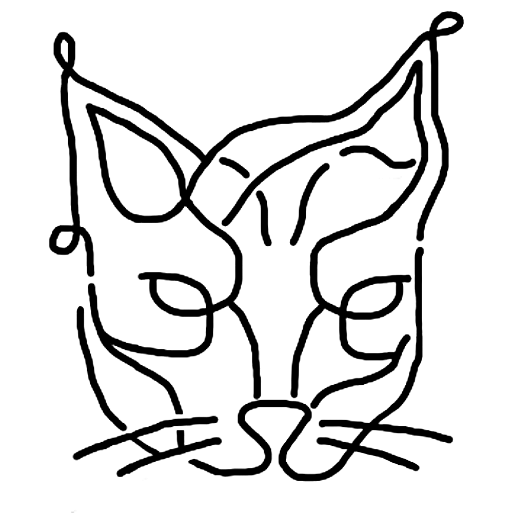

<div align="center">
  


<h3><i>Tool for registry and connection between Needs and Contributions with free scope.</i></h3>

</div>

# Table of Contents
- [Installation](#installation)
- [Disclamer](#disclamer)
- [About](#about)
- [License](#license)

# Installation
Have <a href="https://nixos.org/download/">Nix</a> installed. After cloning the repo, to run Lince, just enter it and type:
```bash
nix-shell
```
# Disclamer
This is a non-profit project. Crowd funding is the source of development compensation: [apoia.se/lince](https://www.apoia.se/lince), [GitHub Sponsors](https://github.com/sponsors/lince-social) and [Patreon](https://www.patreon.com/lince_social). The tasks are inside the app, run it and you shall see them.

It is important to highlight that Lince is responsible for facilitating the connection between people and resources, transforming needs and contributions into data. The gains and losses related to the interaction, such as transportation, production and services themselves, remain the responsibility of the parties involved.

# About
You can model goods and services with a Quantity, if it is below zero, it is a Need (N), if higher than zero, it is a Contribution (C). After the modeling is complete, it is possible to change the Quantity, be it through human trades or donations. Alternativelly the user can also automate it, with the app's several functionalities, to get the most value out of the technology. Below are a few examples of what can be modeled:

## Needs:
- Basic and personal, such as: water, electricity, sanitation, health, education, housing, food, clothing, habits, nature, community, etc.
- Services, such as: transportation, technical support, nursing, gardening, culture, entertainment, tourism, automation, etc.
- Other consumer goods, such as: appliances, work tools, internet, computing, machinery and raw materials, etc.

## Contributions:
- Products.
- Services, including: classes, technical support, installations, development, consulting, etc.
- Social assistance, community work, donation items, etc.
- Information, infrastructure, financing, presence, etc.

Today many apps are developed with a specific segment of human interaction in mind. This project's goal is to allow any type of human interaction that can be best managed by technology to exist without an extra need of app development. Many hours of human work are saved with the technological development concentrated in a single system. Such concentration is possible with the flexibility and decentralization of the application. Large companies that do not participate in the operational process, but receive a portion of the resources of workers for offering the platforms will no longer be necessary. Existing economic relations and phenomena may migrate to a technology with direct interactions between people if desired or indirect through agencies that centralize and validate the identity of professionals in an area.

Currently, large companies and conglomerates have the advantage of being able to develop and dominate digital and supply networks that people use to exchange resources. With this, they receive the largest possible share of the income, participating minimally in the costs of the operations. With a decentralized application, which allows direct contact between people (developed by a non-profit organization that makes the open source code available) Big Tech platforms will no longer be necessary and workers will keep a larger share of the income.

The exchange of information about needs in real time has the potential to reduce the "bullwhip effect" in supply networks. This effect occurs when an expected purchase does not happen, accumulating losses and generating inefficiencies. With a significant number of registered users, demand forecasts become unnecessary. If overproduction and failure to meet demand due to incomplete and outdated information occurs, Lince can be a solution, consulting registrations of needs in real time.

Aiming for greater flexibility of use, Lince can map and organize various interactions. From providing support after natural disasters to planning events, organizational and personal tasks, selling products, etc. We want to minimize unmet needs, align demands and distributions, and understand what we need to work on, and when we dont need to work anymore.

# License
This project is licensed under the GNU GPLv3 license. See the [LICENSE](LICENSE) file for details.
