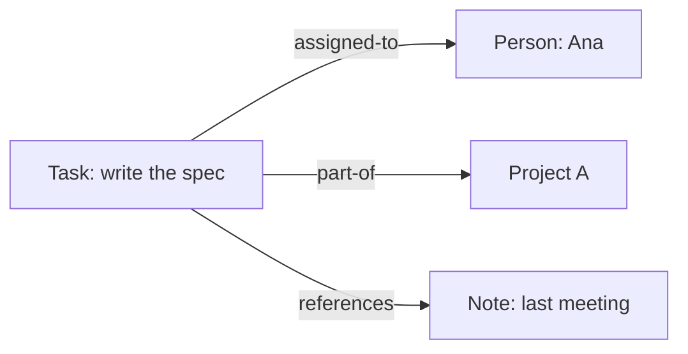
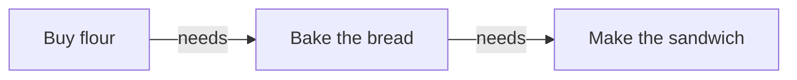
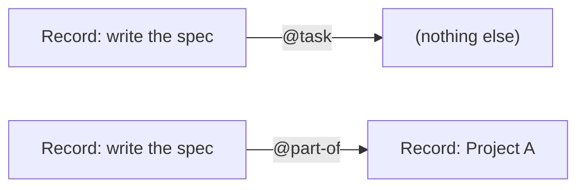
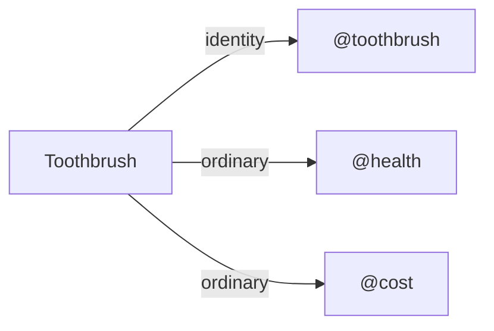
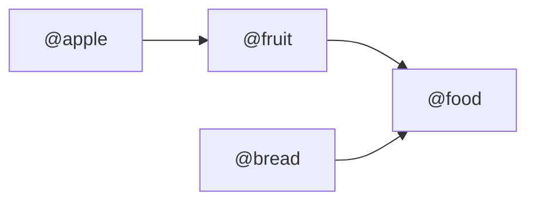

Assertion (@assertion: 0, is #chapter, #instinct, #part-of @ontology, #done) { r_ZKE1WSJ0KH3SA6N99KMR8BN0QR

# Assertion

Records get useful when they point at each other, and an **Assertion** is the
arrow between them — the same shape whether it reads as a tag, a link, or a
fact somebody stated.

## Assertion: a statement about Records

An **Assertion** applies one Concept to a subject Record and optionally names
an object Record:

```text
assertion
    subject: Record
    predicate: Concept
    object: Record?       optional
```

```text
Brush teeth @task
Brush teeth @task [Morning routine]     ← binary: subject → object
Brush teeth @health
```

Tag and link are useful interface words for unary/binary assertions; neither
is a separate storage model. Canonical table:

```text
record_assertion
    uid, subject_uid, predicate_uid, object_uid?
    role                ordinary | identity
    quantity?, unit_uid?
    asserted_by?, created_at, retracted_at?, retracted_by?
```

- [x] Retraction, not in-place edit: a replacement is a new statement with a
  new uid, preserving the old one's provenance.
- [x] Identity assertion: at most one per Record, unary, unquantified —
  the constrained answer to "what kind of thing is this?" when specialized
  behavior needs one. A Record with no identity is valid when its domain
  permits it.
  - example: `Toothbrush @toothbrush` (identity), `Toothbrush @health` and
    `Toothbrush @cost` (both ordinary, coexisting).
- [x] Invariants: subject/predicate always exist; identity is unary and
  unquantified with at most one active per Record; an active unary
  `(subject, predicate)` or binary `(subject, predicate, object)` occurs at
  most once; direction is always subject→object (incoming is a query view);
  missing object means genuinely unary; missing unit means unspecified, not a
  wildcard.
- [x] Operations: `assert(subject, predicate, object?, quantity?, unit?,
  role?)` (idempotent for an existing active tuple), `retract(assertion_uid)`,
  `set_identity(subject, predicate?)` (atomically replaces old identity,
  promotes a matching unary assertion instead of duplicating it).
- [x] `refine` helper: atomically turn `A @task` into `A @task [Project K]`
  under the same predicate (`store::assertions::refine`, `RefineAssertion`
  Action) — a transactional wrapper over retract+assert, not a new operation;
  idempotent if the binary tuple already exists.

## Link

One record is a fact about the world. Records get useful when they point at each other. A **link** is a labelled arrow from one record to another, and the label — the **kind** — is what carries the meaning.



_Three links out of one record, each meaning something different._

A record can have **as many links as you like**, which makes them the right tool for membership, ownership, dependency and grouping. Nothing about a link is special storage: it is one _statement_ about a record, of the same sort you will meet in the next chapter. Here the statement happens to name a second record.

The kind is not a loose string — **a link kind is a concept**, the same kind of word as `@task` or `@apple`. That is why one autocomplete can offer them together, and why this chapter and the next are really about one mechanism rather than two.

## Making one

Open a record in the **Record** sand and use its **Links** section: type a kind, type a target, press **Link**. The **Relations** sand does the same thing graphically — shift-drag from one node to another to link them, and click an edge to select it, then press **Delete** (or the ✕ in its toolbar) to unlink. Ctrl+Z undoes either.

Link kinds need no setup. The first time you use `tag`, the word is created for you. That is why the autocomplete in the Data panel only offers kinds you have already used at least once.

## Reading them back

In a Protein the filter is called **Relation** — the Data panel's word for the same thing the Record sand calls a link. It takes a **kind**, a **direction** and a target.

- **outgoing** — this record points at the target. "Tasks tagged Project A".

- **incoming** — the target points at this record. Ask _Project A_ which tasks name it.

- **either direction** — you care that they are connected, not who pointed first.

Direction matters because a link is always stored one way, subject → object. Incoming is not a second link you have to maintain; it is the same arrow read from the other end.

**Assignee** is the same filter with the kind `assigned-to` filled in for you, and a person picker instead of a free-text box. Turning on the **links** include makes the links themselves travel with the rows, which is how a kanban card can show who a task belongs to without a second query.

## Order is a link too

Some kinds describe sequence rather than membership — `needs`, `before`, `part-of`. Sort a Protein by **graph order** on such a kind and you get a dependency chain instead of a list:



_Read it as "bake needs buy". Graph order turns this into the sequence to actually work through._

Because ordering kinds imply a direction, Lince checks them for loops. If you link things into a cycle — A needs B needs C needs A — the save still happens, but you get a warning naming the records in the loop. A cycle in an ordering kind is almost always a mistake in how you described the work, and you are the only one who can tell.
} r_ZKE1WSJ0KH3SA6N99KMR8BN0QR

Concept (@concept: 0, is #chapter, #instinct, #part-of @ontology, #done) { r_Y5J0YQN2V309GD84HQXYX3EX81

# Concept

Records get their meaning from the Concepts applied to them. One statement is a
tag or a link depending only on whether it names a second Record, and the
vocabulary of Concepts grows a structure of its own.

## Concept: a named meaning

A **Concept** is the predicate vocabulary for assertions and the unit
vocabulary for quantities: stable uid, multilingual names, optional origin,
many-parent DAG.

```text
@bug is-a @task
@task is-a @work-item
```

- [x] Parentage means widening, not exclusive taxonomy — both `A @bug` and
  `A @bug [Project K]` answer `@task` queries. A Concept may have many
  parents (`@food` under both `@substance` and `@cost`). Inherited assertions
  resolve at query time, never copied into storage.
- [x] Concept equivalence joins dialects explicitly (distinct from parentage,
  broader/narrower mapping, or resemblance) without claiming shared history.
- [x] Units are Concepts. Conversion is explicit, exact, and valid only within
  a shared ancestor dimension: one authoritative rational factor per
  unordered pair, reverse by inversion. Lince never silently converts to make
  an expression type-check.

## Applying a Concept

A **concept** is a word with a stable meaning, written with an `@`: `@task`, `@apple`, `@expense`. On its own a concept says nothing. It becomes information when you **apply** it to a record — and that single act is the one mechanism underneath everything in this chapter and the last one.



_Apply a concept and stop: a tag. Apply it and name a second record: a link. Same statement, one optional half._

That is the whole model. A statement about a record always has a concept; whether it also names a _second_ record is what makes people call it a tag in one breath and a link in the next. Lince does not store them differently.

## How many can a record have?

As many as are true. A record can be `@urgent` and `@billable` and `@health` at once — these are ordinary statements and they do not compete.

One statement is special. A record may have at most one **identity** — the constrained answer to "what kind of thing is this?", used where something needs exactly one answer to work with. Setting a new identity replaces the old one. Everything else accumulates.



_One identity, any number of ordinary statements. Having an identity does not stop a record being other things too._

Records without an identity are perfectly valid. Reach for one when some feature needs a single stable answer, not as a habit.

## Concepts know how they relate

Concepts are not a fixed list handed to you. They are a vocabulary you grow, and they record how they widen into each other:



_An apple is a fruit; a fruit is food. Nobody had to say an apple is food._

So a Protein filtered on **Concept** `food` returns your apples and your bread, because it walks that graph for you. Ask a broad question, get everything underneath it; ask a narrow one, get only that branch. You never maintain the "is also a" list by hand, and a concept may widen into more than one parent — `@food` can sit under both `@substance` and `@cost`.

Widening applies to links too, because a link's kind is a concept. A statement naming a specific project still answers a query for the general kind — you do not need to add a redundant tag beside it.

## Tag or link?

Since both are the same statement, the question is only ever: _is there a second record worth naming?_

## Leave it unary

- The word alone is the whole point: `@urgent`, `@billable`.

- There is nothing on the other end you would ever open.

## Name the object

- The other end is a real thing: a project, a person, another task.

- You want to open it, count what points at it, or ask it what it owns.

If you find yourself creating `@project-a`, `@project-b`, `@project-c` as separate words, that is the signal to make Project A a record and link to it instead. Vocabulary that grows one word per _thing_ is a sign the thing wanted to be a record.

## Where you set them

The **Record** sand's Links section makes statements that name a second record. The **Ontology** sand is where you work with the vocabulary itself: apply a concept with no object (leave the object as "no object — tag"), set a record's identity, retract a statement, and connect concepts so one widens into another.

One subtlety worth knowing before you write reporting queries. Filtering on **Concept** asks about the record a change happened _to_. There is a separate question — what the change itself was classified as — and the two are kept apart deliberately: "what did I spend on food" selects records by `@budget` but changes by `@food`. Collapsing them is how a query quietly answers something other than what you asked.
} r_Y5J0YQN2V309GD84HQXYX3EX81

Query (@query: 1, is #chapter, #instinct, #part-of @ontology, #done) { r_E29DFJ940F3ADWS6AZD9N9KNVT

## Query and projection

One assertion query surface replaces the old split between concept and
relation filters:

```text
@task                       predicate matches; object may be absent or present
@task []                    predicate matches; object is absent
@task [Project K]           predicate and object match
incoming @task [Project K]  Project K is the object
identity @task              identity assertion only
```

- [x] Concept matching widens through the DAG; results dedupe Records when
  several assertions match; a targeted assertion already satisfies a general
  predicate query (no redundant unary tag needed).
- [x] Binary assertions project as directed graph edges: depth, incoming/
  outgoing views, topological order, cycle warnings, and relationship
  quantities apply only to this projection. Several predicates may connect
  the same pair; an order-like predicate may loop (retain the valid assertion,
  warn the ordering view — mutual non-order assertions are ordinary).
- [x] Protein exposes Records, Assertions, Concepts, and Linguas, filtered/
  included by predicate, object, direction, hierarchy, and graph depth (hop
  carried on included binary assertions). Sands may call these views "tags,"
  "links," "dependencies," or "relations" — no second model underneath.
} r_E29DFJ940F3ADWS6AZD9N9KNVT
