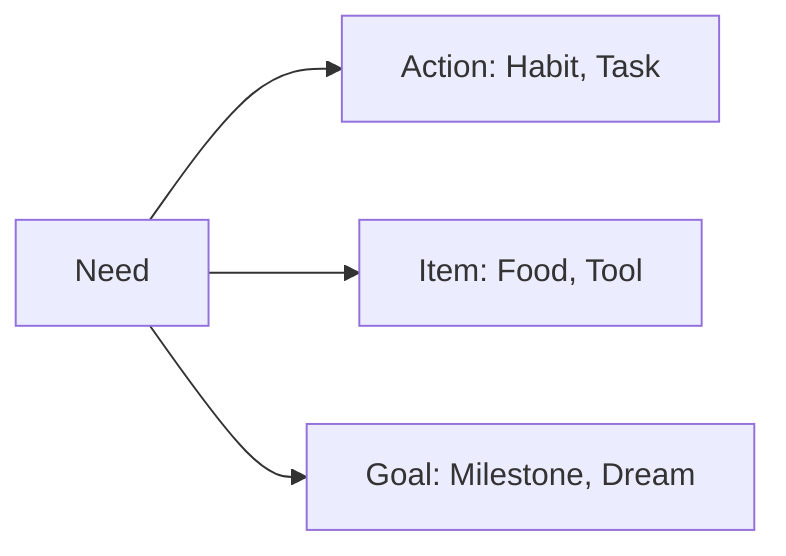
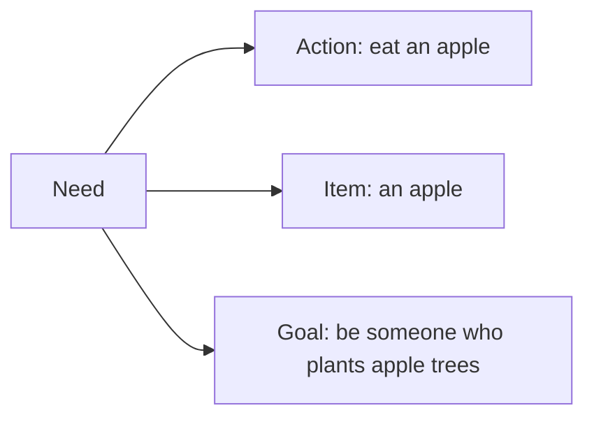
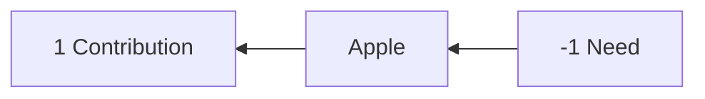
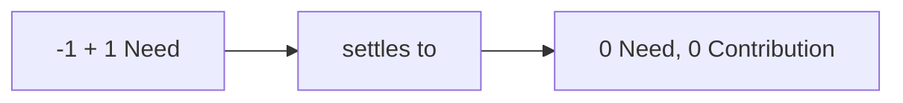
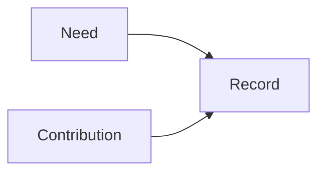
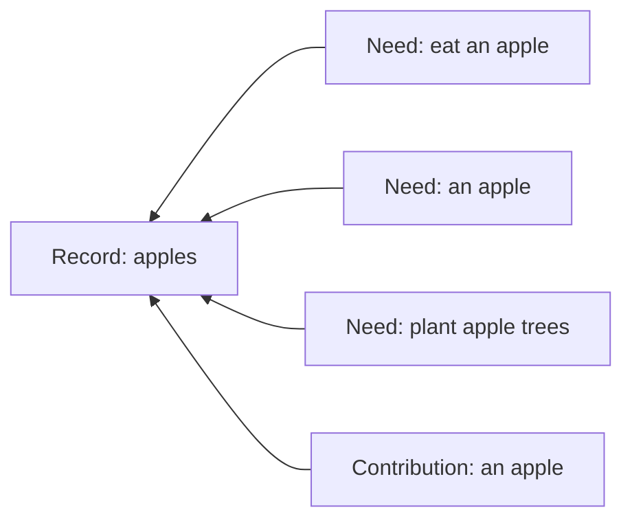
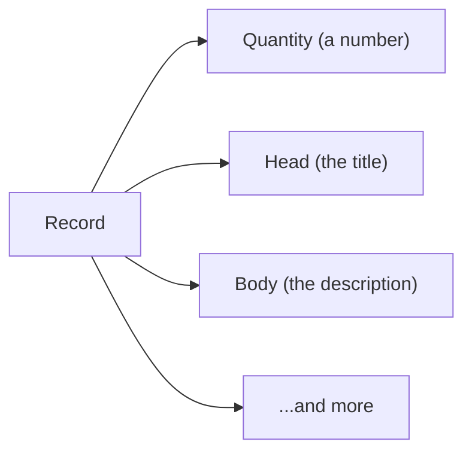
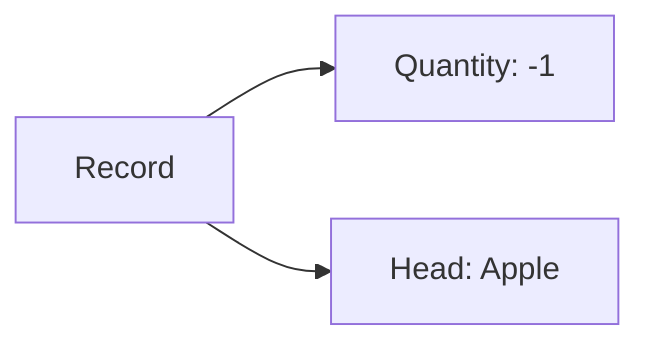

# Record

A **Record** is one thing that matters to you: a task, a project, a person, a message, a tool, a place, a transfer, a rule, a note, a saved query. Lince has no table for tasks and another for invoices and a third for contacts. It has this. What makes one Record a task and another an invoice is what has been said about it — never a column, and never a schema you had to choose correctly before you knew what you were doing.

Giving up the schema sounds like giving up too much, and it is the opposite. A fixed shape is precisely what makes software refuse the thing you actually want to track. Once every thing is the same kind of thing, a rule that watches your pantry and a rule that watches your workload are one rule pointed at two subjects; a board of chores and a board of purchases are one board pointed somewhere else. The variety moves out of the database and into your hands, which is where it was always going to end up anyway.

A Record carries a **head** and a **body** for you to read, and a **quantity** for the machine to work with. The quantity is the part that moves — the part rules read, transfers change, and history remembers — and its sign is meaning rather than bookkeeping: negative is a Need, positive is a Contribution, zero is neither.

The parts below take those in turn: why a Need is where the model starts, why a Need and a Contribution are the same number, and what a Record is actually made of underneath.

## Every Need is one Record

Lince starts from a claim that sounds too simple to be useful: everything you might want software to help you with is a **Need**. And a Need always shows up in one of three shapes.



Take one apple and all three appear at once:



_A habit, a thing, and a life direction — the same subject at three scales._

Most software picks one shape and builds an app around it: a to-do app for actions, an inventory app for items, a goal tracker for goals. Then your apples live in three places that cannot talk to each other. Lince refuses the split. Every Need becomes one thing:


## The other half: contribution

A Need on its own does nothing. Something has to meet it — and whatever meets it is a **Contribution**. Between the two sits the thing being moved.



_Before: someone is short one apple, someone else has one spare._

Watch the numbers. A Need is a **negative** quantity — something missing. A Contribution is a **positive** one — something available. Meeting the Need is just the two moving toward each other:



_After: both sides are zero. Nothing is missing and nothing is spare._

Which means Need and Contribution are not two different concepts at all. They are the same concept with opposite signs — two sides of one coin:



So instead of an app about apples, you get a record that everything about apples hangs off:



## What a Record actually holds



The **head** and **body** are for you — they carry the human meaning. The
**quantity** is for the machine: it is the state, and it is the part rules can
read and change.



_"I am one apple short." That is a complete, working record._

A number is deliberately unopinionated. The same field can mean stock, debt,
need, budget, progress, votes, hours, or responsibility. That is what lets one
kind of record carry every workflow you have, instead of a new table per
feature.

Every change to a quantity is recorded as a **fact** — who changed it, when,
and why. Nothing moves invisibly. Turn on "history (facts)" in a Protein and a
sand can show you the whole trail.

### The whole of it

The three fields above are the ones you handle. This is everything a Record
carries:

```text
Record
    uid                 stable global identity; never inferred from a title
    slug?               optional local, human-friendly alias
    kind                small operational shape; `plain` by default
    head                short title
    body                canonical Markdown content
    quantity            exact cached current level
    unit?               Concept naming the quantity's unit
    place?              place reference
    origin Organ?       where this Record originated
    created_at, updated_at
```

The **uid** is the identity and nothing else is. A slug is a local convenience
you can rename or drop without consequence, and a title is not identity at all
— two people will name the same thing differently and one person will rename it
twice.

**Kind is operational only, not a category.** It is not how you'd tell a task
from an invoice — that split lives in Concepts and assertions, the same way
everything else about what a Record *means* does. A new kind earns its
existence only when a Record needs code to behave differently for it: a
distinct state machine, extra tables it joins to, or validation nothing else
needs. If the only thing you'd gain from a new kind is an easier filter, it
isn't one — tag it with a Concept instead.

A Transfer is the clearest example. It isn't a different concept from an
ordinary Record — Record.md's own opening line lists "a transfer" alongside
task, project, and note as one of the things a Record can be. What makes it
earn `kind = transfer` is that a Transfer's proposal → agreement → settlement
lifecycle needs its own sidecar tables (`transfer`, `promise`,
`transfer_occurrence`, and friends) and its own validation on creation — real
distinct machinery, not a label. Concretely, creating a Transfer inserts one
`record` row with `kind = "transfer"` and then a matching `transfer` row
alongside it (`crates/store/src/transfers.rs`).

The full list of kinds today (`crates/nucleus/src/record.rs`), each earned the
same way:

```text
plain          the default — no special behavior
rule           a Rule's condition/action machinery
signal
transfer       Transfer's proposal/agreement/settlement lifecycle
decision
device
organ
person
protein
sand
conversation   one relationship, one grant — Threads/Messages live inside it
thread
message
thread-invite  a pending conversation request, before anyone has agreed to
               one; deliberately NOT a conversation, so it can be declined
               without ever having synced anything
program
frequency
grant
call-session   one occupancy of a conversation's audio/video room
```

Most things you'll ever create — a chore, a grocery item, a goal, a saved
query — never need a kind of their own. They stay `plain` forever, and
everything that makes them distinct from each other lives in their head, body,
and Concepts, exactly as the sections above describe.

The operations that touch a Record directly are deliberately few — create it,
edit its text, set its slug, unit or place, set or add to its quantity, attach
an extension, deactivate or delete it. Everything about what a Record *means*
— its identity, its tags, its relationships — happens through assertions
instead, so meaning never becomes a column somebody has to migrate.

**Facts are the ground truth and the quantity is their fold.** It is an exact
decimal sum of a hash-chained series of signed deltas, not a float and not a
SQL `SUM()` computed on demand, so two Organs replaying the same history reach
the same number to the last digit. Undo is therefore never an erasure: it
appends the inverse Fact and lets both movements stand in the record. Editing
metadata appends a zero-delta annotation so the trail still shows a hand
passing through, and replaying a Fact that has already been seen does nothing
at all — which is what lets sync be careless about delivering something twice.

Deactivating a Record sets its quantity to zero and leaves everything visible:
it is finished, not hidden. Deleting is a hard tombstone — gone from ordinary
reads, its slug released for reuse — but the row and its chain of Facts stay,
because a history with a hole in it cannot be verified by anyone who was not
there.

When a workflow needs a shape Lince has no word for, a Record can carry a
**namespaced extension**: a small JSON sidecar, one per namespace, versioned so
a reader can refuse a version it does not understand. Task work data lives here
— `{ start, due, estimate_min, logs: [...] }` — because those are properties of
the task rather than movements of its quantity. It is an escape hatch and it is
meant to be temporary: a shape that many people end up using is a shape that
should be promoted into something shared, and an extension that never gets
promoted is a private vocabulary nobody else can read.
} r_5JKQH7BM9ZQ474YF869AFE4T2N

Ledger Facts (@ledger-facts: 0, is #chapter, #instinct, #part-of @ontology, #done) { r_9NQJ2VK53ZSRT0NXV11V3VB19G
Facts are an append-only log of what happened to a Record. We save in the Fact what made the Record change, who did it.

- [x] Example: a flour Record has identity `@flour` (what the Record is)
  while one `-500 g` Fact is classified `@bread` (what that movement was),
  using the same Concept vocabulary.

## Exact numbers

**Purpose:** Fix the small vocabulary every other section spends, so a number
means one thing everywhere.

**How it works:** One decimal type on every durable path and no binary floats in
any decision. Probability and confidence are different types, because a
likelihood that something recurs and a confidence in an estimate are different
claims. Time atoms are signed integer milliseconds. There is no money type: a
currency is a Unit Record, so `12.50 @brl` is a `Quantity`.

**Interacts:** Rule arithmetic, this Ledger and replay all depend on these being
exact and canonical.

**Implementation:** `nucleus::DecimalValue` stored as `(mantissa TEXT, scale
INTEGER)`, summed in Rust as `i128` at a common scale and never in SQL.
`fact.delta` and `record.quantity` are an exact pair with `REAL` removed. One
named lossy inbound door, `NewFact::quantity_f64`.

- [x] **Declared precision survives sync**, and the exact pair is inside the
      hash preimage, so two Cells agree on the bytes and not merely the value.

}# Ontology — AI notes

Companion to `Ontology.lingua`. Not a Record: `anicca/` ingests `.lingua`
only, so nothing here reaches Instinct. The `.lingua` beside it is the owner's
and is the higher truth; this file is the agent-side explanation of what is
actually built, how it works, how to use it — and, at the end, what is left.

Minimized 2026-08-24. What was cut: the blow-by-blow of bugs found and fixed,
migration numbers, file:line references, and which test pinned which claim.
What was kept: the invariants, and the reason a later reader would otherwise
reintroduce the bug. Nutrition moved to `anicca/Nutrition.md`.

## Lince today, in one read

**What it is.** Lince is a program a person or a group runs on their own
machines to keep the things they care about — what they have, what they need,
what they owe each other, what they know — and to share those things directly
with the people they choose. There is no server in the middle that owns the
data. An **Organ** is one of those sovereign holders: a person, a household,
a collective, an institute. Everything an Organ holds is a **Record**, and
everything said about a Record is an **Assertion** — a subject, a predicate, an
optional object, and an optional exact quantity with a unit. **Concepts** name
the meanings the predicates use, and a **Lingua** is a shared vocabulary that
several Organs agree on without anyone ruling over it. Five tables carry
everything; a "tag", a "link", a "task" and a "chapter" are conventions over
those tables, not new machinery.

**How it works.** An Organ runs on one or more **Cells** — devices. A Cell
holds a key it uses online; the Organ's **root key** stays offline and signs a
**roster** naming the Cells, what each may do, and where its mail may be left.
That signed roster is the whole membership statement, so nothing has to be
asked of an authority: you verify a peer by chaining to a key you already
hold. Cells reach each other over QUIC with iroh — identity is a key, never an
address — through four doors: ordinary sync, a live door for reading someone's
Record through to their machine, a thread door for reaching somebody before
you fully trust them, and a hello door that never changes version so a device
one release behind can say so.

Every local change writes an **op** into a log, stamped with the writing
Cell and a hybrid logical clock, and the log is what travels. Peers catch up
by exchanging a version vector — "here is what I already hold from each of
your devices" — so nothing depends on a shared cursor or a shared clock.
Scalar fields merge by last-writer-wins on that clock; collaborative text is a
Loro CRDT and merges character by character. What a contact may see of you,
and what you accept from them, is a **Protein** — one predicate language used
in both directions — and anything that arrives outside what you accepted is
quarantined rather than applied, so a bad op never fails a whole batch.

**What it is for.** The point is that useful shared life — a stock of food, a
rota, a set of promises, an accounting of who did what — can be run by the
people living it, on hardware they control, without a company between them
and each other. Around the core sit the things that make that concrete:
**Transfers** (things moving between Organs, with custody and receipts),
**Karma** (rules that fire on a schedule or a change, in the Organ's name),
**File Sync** (Records projected into a folder of files, edited either side),
**sands** (the small applications a person actually opens), and **threads**
(conversations that carry references, read live, rather than copies).

The whole system is offline-first by construction: nothing waits on a server,
and two Cells that never meet still converge when they eventually do.

**The four shapes.** Ontology stopped being a vocabulary and became the floor:

> **Records model things. Assertions model what is said about them. Concepts
> name those assertions. Lingua lets different Organs share or translate their
> meanings.**

Everything else is a projection of those four, a constraint on them, or a
convenience over them. Protein is a way of reading them. Sync is a way of
moving them between Organs. A Transfer is a promise about them; a Karma rule
is arithmetic over them. When something new is proposed, the first question is
which of the four it already is — and a genuinely fifth shape has not been
needed yet.

---

# The model

## 1. Record: a modeled thing

A **Record** is one thing that matters to an Organ: a task, project, person,
message, tool, place, transfer, rule, note, or saved Protein. Meaning comes
from assertions, not from a fixed taxonomy.

```text
Record
    uid                 stable global identity; never inferred from a title
    slug?               optional local, human-friendly alias
    kind                small operational shape; `plain` by default
    head                short title
    body                canonical Markdown content
    quantity            exact cached current level
    unit?               Concept naming the quantity's unit
    place?              place reference
    origin Organ?       where this Record originated
    created_at, updated_at
```

`uid` is identity; a slug is disposable local convenience. Create a new `kind`
only for a distinct lifecycle or sidecar, never just to make a Record
filterable.

Direct operations are deliberately small — identity, tag and relationship
changes go through assertions (§3), not through Record columns:
`create_record`, `edit_record_text`, `set_slug`, `set_unit`, `set_place`,
`set_extension`, `set_quantity`/`add_quantity`, `deactivate`/`delete_record`.

- **Quantity is an exact decimal fold of hash-chained Facts**, never a float
  column or SQL `SUM()`: negative is a Need, positive a Contribution, zero
  neither. Facts are ground truth; a quantity change appends a signed-when-
  possible delta.
- **Deactivation** (quantity zero) keeps the Record and history visible.
  **Deletion** is a hard tombstone: hidden from normal reads, slug released,
  row and Fact chain kept for verifiable history.
- **Undo is compensation** — append the inverse Fact, never erase one.
  Metadata edits append a zero-delta annotation Fact. Replaying a known Fact
  UID is a no-op.
- **`record_extension`**: namespaced JSON sidecar (`record_uid`, `namespace`,
  `version`, `fds`), at most one per `(record, namespace)`, ops logged per KEY
  so two Cells editing one namespace never clobber each other. An escape hatch
  for a new workflow, not a substitute for shared meaning — promote a
  widely-used shape to a typed, versioned namespace that can refuse a version
  it does not understand. Example: task work data as
  `{ start, due, estimate_min, logs: [{start, end}] }` — a property of the
  task, not a quantity Fact.

## 2. Organ and Cell

The prose that used to sit here is now the Organ chapter of `Ontology.lingua`
and is not copied — the Record is authoritative and a second copy is what
drifts. In short: a **Cell** is one running Lince and its local data; an
**Organ** is the social boundary a Cell represents, is itself a
`kind = organ` Record, and owns its Records, structure, policy, credentials
and private Lingua. Every Record carries its origin Organ, preserved through
relaying.

Contacts live in `organ_contact`: `trust` (unknown/known/blocked), numeric
`proximity` (local-only, never exported), independent `sync_out`/`sync_in`
policy, per-direction field scopes, and a NodeId. `blocked` is terminal
everywhere — import, discovery, export and delivery all reject, and the
connection closes before the ALPN split. Organ identity is transport and
trust; it is never permission for one Person to act or sign for another.

## 3. Assertion: a statement about Records

An **Assertion** applies one Concept to a subject Record and optionally names
an object Record:

```text
assertion
    subject: Record
    predicate: Concept
    object: Record?       optional
```

```text
Brush teeth @task
Brush teeth @task [Morning routine]     ← binary: subject → object
Brush teeth @health
```

Tag and link are useful interface words for unary/binary assertions; neither
is a separate storage model. Canonical table:

```text
record_assertion
    uid, subject_uid, predicate_uid, object_uid?
    role                ordinary | identity
    quantity?, unit_uid?
    asserted_by?, created_at, retracted_at?, retracted_by?
```

- **Retraction, not in-place edit**: a replacement is a new statement with a
  new uid, preserving the old one's provenance.
- **Identity assertion**: at most one per Record, unary, unquantified — the
  constrained answer to "what kind of thing is this?" when specialized
  behavior needs one. A Record with no identity is valid when its domain
  permits it. Example: `Toothbrush @toothbrush` (identity), with
  `Toothbrush @health` and `Toothbrush @cost` coexisting as ordinary.
- **Invariants**: subject and predicate always exist; identity is unary and
  unquantified with at most one active per Record; an active unary
  `(subject, predicate)` or binary `(subject, predicate, object)` occurs at
  most once; direction is always subject→object (incoming is a query view);
  missing object means genuinely unary; missing unit means unspecified, not a
  wildcard.
- **Operations**: `assert(subject, predicate, object?, quantity?, unit?,
  role?)` (idempotent for an existing active tuple), `retract(assertion_uid)`,
  `set_identity(subject, predicate?)` (atomically replaces the old identity,
  promoting a matching unary assertion instead of duplicating it), and
  `refine` — atomically turn `A @task` into `A @task [Project K]` under the
  same predicate, a transactional wrapper over retract+assert, idempotent if
  the binary tuple already exists.
- **Cross-root links are refused**: two different replica roots would widen
  both conversations, and a general-feed subject with a private object would
  carry a private uid onto the general feed. A private subject pointing at a
  general-feed object is allowed — it takes the subject's root, so nothing
  widens.

## 4. Concept: a named meaning

A **Concept** is the predicate vocabulary for assertions and the unit
vocabulary for quantities: stable uid, multilingual names, optional origin,
many-parent DAG.

```text
@bug is-a @task
@task is-a @work-item
```

- Parentage means **widening, not exclusive taxonomy** — both `A @bug` and
  `A @bug [Project K]` answer `@task` queries. A Concept may have many parents
  (`@food` under both `@substance` and `@cost`). Inherited assertions resolve
  at query time, never copied into storage.
- **Equivalence** joins dialects explicitly, distinct from parentage,
  broader/narrower mapping, or resemblance, without claiming shared history.
- **Units are Concepts.** Conversion is explicit, exact, and valid only within
  a shared ancestor dimension: one authoritative rational factor per unordered
  pair, reverse by inversion. Lince never silently converts to make an
  expression type-check.

## 5. Lingua: shared vocabulary, not a global ruler

A **Lingua** is an identifiable collection of Concepts an Organ uses
privately, shares with peers, publishes, or adopts from elsewhere — common
ground between ontologies, not a required global schema.

```text
lingua
    uid, name, owner Organ?
    visibility          private | shared | public
    Concepts            adopted by membership
```

- Adopting a foreign Concept **preserves its uid and lineage**; re-adoption is
  a no-op. An unknown precise Concept may fall back to the nearest known
  ancestor while the original is retained.
- Usage spans a private personal Lingua, a small shared one between peers,
  Institute-published defaults (non-ruling), an adopted or mapped external
  vocabulary, or genuinely unknown meaning left unknown rather than falsely
  normalized.
- Concepts needed to interpret synchronized assertions travel with the data:
  ordinary assertions carry when subject and object are both included, and
  identity travels with the Record seed. An assertion arriving before its
  Concept creates a stub row that the Concept's own op resolves.

## 6. Query and projection

One assertion query surface, replacing the old split between concept and
relation filters:

```text
@task                       predicate matches; object may be absent or present
@task []                    predicate matches; object is absent
@task [Project K]           predicate and object match
incoming @task [Project K]  Project K is the object
identity @task              identity assertion only
```

- Concept matching widens through the DAG; results dedupe Records when several
  assertions match; a targeted assertion already satisfies a general predicate
  query, so no redundant unary tag is needed.
- Binary assertions project as **directed graph edges**: depth,
  incoming/outgoing views, topological order, cycle warnings, and relationship
  quantities apply only to this projection. Several predicates may connect the
  same pair; an order-like predicate may loop (retain the valid assertion, warn
  the ordering view — mutual non-order assertions are ordinary).
- Sands may call these views "tags", "links", "dependencies" or "relations".
  There is no second model underneath.

## 7. Ledger Facts: a separate assertion domain

Record assertions describe standing truths about a Record. A **Fact
classification** describes what one append-only Ledger movement meant — its
own signing and provenance rules, never merged with Record assertions.
Example: a flour Record has identity `@flour` (what the Record is) while one
`-500 g` Fact is classified `@bread` (what that movement was), using the same
Concept vocabulary.

## 8. Design checklist: constraints belong above the core

Not every predicate fits every Record pair. A Lingua, Sand, or protocol may
constrain expected subject/object identity, direction, cardinality, units,
permissions, or cycle behavior — those are constraints over assertions, never
new per-feature link tables. Before adding a field, sidecar, relation, or
transport message, ask:

1. What things are Records?
2. What standing or relational statements are assertions?
3. Which Concepts name them, and which Lingua owns or shares them?
4. Is this universal Record state, a typed extension, a Fact, or an assertion?
5. Which constraints belong to the feature or protocol rather than the core?

## 9. Federation and Blood: talking to other systems

Keep transport, shape translation, and semantic translation as separate
layers:

```text
external transport or document
        ↓
named adapter: identity, shape, provenance
        ↓
Lingua mapping: external meaning ↔ Lince Concept
        ↓
local Records, Facts, assertions, and extensions
```

Blood carries and validates the envelope; Ontology explains the Records and
assertions it expresses; Lingua says which meanings are shared; policy decides
what the Organ accepts, reveals, trusts, or acts upon. An adapter must
preserve external identity, source version and context, the original payload
where appropriate, and anything untranslatable — interpretation never silently
becomes local authorship.

**One outward layer, many formats.** The machinery that turns a Lince event
into an integration event for another system is the *same* machinery that
writes a file in somebody else's format. A protocol adapter and a file writer
differ only in the transport at the end. **Markdown is one output format among
many, not the special case it currently looks like** — File Sync is an early,
hard-coded instance of Blood. The design test for any new export work: does
adding `.csv` next to `.md` mean writing a mapping, or rewriting a subsystem?
If the latter, the seam is in the wrong place.

This is a **direction, not scheduled work** — recorded so the next person to
touch File Sync does not build a second hard-coded exporter beside the first.

## 10. Protein: the read contract

Protein is the single read surface. A sand reads through Protein and nothing
else; a contact receives through the same language.

- **Six sources, one JSON shape**: `record` (state vector, all predicates and
  includes), `promise` (`state_in`), `decision` (open Decision Queue, never
  exported to remote subjects), `fact` (the Ledger — `at_since`,
  `cause_kind_eq`, `record_eq`, `concept_in`), `concept` (Lingua vocabulary),
  `transfer` (bundles with derived status, parties, promises, balance). Plus
  `nearby` — Organs currently visible on the local network, a Cell's own
  runtime view, gated exactly like `decision` so a remote subject gets an empty
  list.
- **Predicates**: nested `all`/`any` groups with condition-level `not` (10
  indentation levels), `quantity_lt/lte/gt/gte/eq`, `uid_eq`, `kind_eq`,
  `slug_eq`, `concept_in` (DAG-aware), generic directional assertion,
  `text_contains`, Record `work_date`, `state_in`, `near`.
- **Includes**: `facts` (provenance), `promises`, binary assertions
  (predicate, direction, depth + hop), `threads` (nested messages),
  `extension`, `availability`, `contact`, `projection` (`{at:"+7d"}` folds
  agreed and active promise deltas — full rule simulation is the engine-side
  `project`/`snapshot` pair).
- **Columns**: `Protein.fields` names which Record columns come back. `None`
  means every column; `uid` and `kind` always survive. **Name what you want,
  never what to hide** — a column added six months from now stays home until
  some Protein names it, where a deny-list would have leaked it by default. An
  excluded field is **ABSENT, never blank**: `undefined` means withheld and
  `""` means genuinely empty.
- **Aggregation** (`sum`/`count` by concept or kind on records, by cause_kind,
  day or concept on facts) — the visibility gate applies BEFORE aggregation, so
  hidden rows cannot leak through sums.
- **Saved Proteins are Records** (`kind='protein'`) referenced by slug — the
  old "view" concept, done right.
- **Maneirisms**: wire `where` is a JSON array = implicit `all`; fact-source
  predicates do not nest (flat list) in v1; `at_since: "30d"` resolves against
  wall-clock now, so use absolute RFC3339 for reproducible reads; remote
  subjects see only whole-row visibility grants — the Decision Queue and
  concept-level promises never leave a Cell through Protein.
- **Liveness**: subscriptions recompute off the fact bus. Ephemeral sources
  (like `nearby`) emit no Facts, so the session re-runs them on a short tick
  and pushes a snapshot only when the result CHANGED — quiet when nothing
  moves, and indistinguishable from a reactive source.

---

# How it works today

Everything in this part is built and reachable from the running app.

## Transport: iroh, and four doors

Two Organs reach each other over iroh: QUIC with an ed25519 keypair as the
node identity, address resolution by DNS/pkarr/mDNS, hole punching, and relay
fallback. Identity is a key, never an address: dialing a NodeId reaches that
keypair or nothing, and nothing flows until the far side proves possession of
the private key.

```
lince/sync/2     known contacts only — op batches, catch-up, roster
lince/thread/2   unknown NodeIds — Introduction, invites, enrolment, references
lince/live/2     live sessions relayed to a host Cell
lince/hello/1    one integer: which epoch this Cell speaks. NEVER bumped.
```

The accept policy is **default closed** (`lince.discovery.accept_unknown =
false`). `known` means `trust='known'`, not merely "a contact row exists" — a
row with `trust='unknown'` gets the thread door like any stranger, and
`add_contact` defaults to `unknown`. Frames are bounded per connection (except
on the live door, where a cap would hang up on someone mid-sentence), and a
batch/peer mismatch answers `Refused { code }` — a security event,
distinguishable from an ordinary import failure.

**Wire changes land in epochs.** An ALPN bump hard-cuts every peer on an older
build, by design: no side-by-side serving, no fallback branch, no field kept
alive so an old build can still read it. All ALPNs bump together.
`lince/hello/1` is the exception that must never change, because from the
dialing side a Cell one release behind and a Cell that is switched off are the
same silence — and only one of them is something a person can fix.
`Wire::stale_siblings()` surfaces what the last pass found, and the Devices
panel reads *this device needs updating*, naming the Cell.

**Fail closed.** `WireRequest`/`WireResponse` are internally tagged
(`#[serde(tag = "op")]`), so an unrecognised verb from a newer peer fails to
deserialize and is answered with an error rather than misread as a
neighbouring variant. A newer Organ degrades against an older one; it never
widens.

**Node key ≠ identity key.** The **node key** authenticates a live connection
— its public half IS the NodeId, it is per Cell, generated at first boot,
never leaves the device, cheap to rotate. The **identity key** authenticates
durable bytes: it signs op batches, facts and the roster, and answers "who
wrote this" a year later from a backup with no connection in sight. Fusing
them would mean compromising any running Cell forges that Organ's history
forever. What gets shared is still ONE string, the NodeId; the Organ key and a
signature binding it to that NodeId arrive over the already-authenticated
connection.

Transport auth answers "who is on this socket"; payload signing answers "who
wrote this op". Only the first is iroh's, which is why op-batch signatures
survive even though the old HTTP `peer_auth` layer is deleted.

## Identity: root offline, operational keys online

If an attacker obtains an Organ's identity key they can BE that Organ to
everyone holding the public key, and there is no authority to report it to.
No design removes that; designs only change who has to be fooled. So: **make
the catastrophic case rare.**

- The Organ **root key** signs two things only — the Cell roster and key
  successions — and lives OFFLINE: a hardware token, a printed or drawer-kept
  drive. It is on no running Cell.
- Each Cell holds an **operational key** (`ed25519:cell:<cell_uid>:v1`) used
  for everything routine, so compromise of a device is compromise of one
  revocable credential. An operational key can never validate a roster: the
  chain walk is filtered to ROOT key ids, or a stolen phone could sign itself
  more devices.
- **The signed roster IS the certificate.** A roster entry names a Cell, its
  operational key, its NodeId and its capability set; the roster carries a
  monotonic version and a not-after expiry. Being listed is what certifies;
  being dropped from the next one is what revokes.

```
roster (root-signed, monotonic version, not-after expiry)
  version:  7
  organ:    o-eduardo
  not_after: 2026-09-03T00:00:00Z
  members:
    - cell: c-laptop  op_key: ed25519:…  node_id: …  label: "laptop"
    - cell: c-phone   op_key: ed25519:…  node_id: …  label: "phone"
    - cell: c-vps     op_key: ed25519:…  node_id: …  label: "vps"  always_on: true
  sig: <root key over the above>

identity_succession  (old_key, new_key)   -- the chain a contact walks
```

Three implementation rules that are load-bearing:

- **The root key is created at most ONCE, ever.** No file AND no roster means
  first boot; no file WITH a roster means the root is deliberately elsewhere,
  and the Cell simply cannot enrol or revoke until it returns. Everything else
  keeps working.
- **Detach verifies the copy byte-for-byte before deleting**, and export
  refuses to overwrite — a file already at the destination might be another
  identity's root, and there is no authority to appeal to.
- **Republishing preserves the other members.** Dropping a name from the
  roster IS revocation, so it must never be a side effect of a reboot. The
  re-sign decision compares the whole member set, order-insensitively.

**Rotation and revocation.** `POST /organ/identity/succession` signs "this old
root endorses this new one"; contacts pull it over `FetchSuccessions` and
adopt it only if it chains from a key they already hold. Order in the pass is
deliberate: revocations first (so a dead key cannot endorse a live one in the
same pass that learns it is dead), then successions, then the roster. The
chain walks forward transitively, so a contact offline across two rotations
still validates. A revoked key does not chain, so a thief cannot endorse a
successor. A **pre-signed revocation certificate** is written at key creation
beside the root, so the drawer trip that fetches the root also yields the thing
that kills the old key.

**Capabilities.** Three exist: `write` (log ops and sync outward), `karma`
(run rules in the Organ's name), `represent` (speak for it to contacts).
`relay_capabilities()` is the empty set. `Engine::cell_may` is the one
evaluation point and degrades safely at every unknown — no roster, no entry,
or no capability set all answer `false`. The refusal for `write` is a DATABASE
TRIGGER, below every client, because a property you can defeat by pointing a
second client at the same store is not a security property.

**Revocation is EVENTUALLY CONSISTENT**, and the UI says so out loud: a
revoked device stops being admitted by each Cell as that Cell learns the new
roster, not the moment the root signs it. Removing a device reads "Your other
devices apply it as they sync", never "Removed." The split behind it: the
roster governs ADMISSION live (may this Cell connect, may it write in the
Organ's name), while durable artifacts — envelopes, receipts, transfer history
— verify from stored `identity_key` rows, because a device losing membership
today does not unmake last week.

## Cell Record vs Organ Record

Each Cell's database holds TWO `kind=organ` Records, and this is where bugs
will live:

- The **Cell Record** — this device. Fixed slug `local-cell`, inserted RAW so
  it logs no op and never travels. Its uid is stamped as `sync_op.actor_cell`
  on every op written here. Local-only settings (discovery, executor flags)
  belong on it.
- The **Organ Record** — the person across all their devices. Holds the
  published identity key, the roster and the profile, and is what
  `record.organ_uid` points at, so a Record reads as coming from *you*, not
  from *your laptop*.

**Cells MUST NOT share a uid.** `(actor_cell, hlc)` is UNIQUE and is both the
op identity and the import idempotency key; an HLC is a per-process counter,
so two Cells under one uid would mint the same identity for different ops —
and because import dedupes on that key, the collision does not fail loudly, it
swallows a remote op as already-seen. With per-Cell uids, Cells are ordinary
full-trust peers of each other over the existing op log.

`record.organ_uid` is required, enforced by trigger at write time. The op
carries both identities and they are not interchangeable: deriving the Organ
from the Cell would make one person with three devices look like three
different Organs to everyone else.

Both identities are minted by `Store::open`, not by a later bootstrap step, so
there is no such thing as a local write that fails to become an op.

## Adding a device, and meeting a person

**Enrolment is pairing with yourself.** An `EnrolmentInvite` carries the
enroller's NodeId and addresses, the Organ uid, the root public key and a
single-use short-lived token, under its own `lincecell1|` prefix — separate
from `lince1|`, because a pairing code adds a CONTACT and an enrolment code
adds a DEVICE TO YOUR IDENTITY, and the two are shown in the same shape and
scanned by the same camera.

The **order is the security property**: the joining Cell mints the operational
key it intends to be known by, sends `Enrol`, and rewrites its local identity
only once a roster comes back that is for the offered Organ, signed by the
offered root key, and actually naming this Cell. A refused enrolment leaves
the device exactly as it was. Joining is refused on a Cell that already holds
Records of its own or has published an identity. First boot's own ops are
PURGED rather than re-stamped — they have never been sent anywhere.

**The enrolment window IS the door policy**: the thread door opens while an
issued token is unused and unexpired (minutes), admitting nothing but `Enrol`.
Adding your own phone must not require switching on "accept unknown Organs".

Surface: the Devices panel shows the whole code plus a server-rendered QR, and
carries the other end ("Join another Organ") with paste and scan, because
whichever device you are holding is the one you will look at.

**First contact with a person**, ranked strongest first, because only the
ACQUISITION of a NodeId is ever at risk:

1. **QR code in person.** The visual channel cannot be relayed and you can see
   who you are handing it to. It also solves blocked mDNS (guest wifi, hotels)
   by embedding NodeId AND current addresses.
2. **Paste into a messaging app you already trust.** Equally strong: that
   channel is already authenticated to that human.
3. Discovery plus conversation alone — weakest; a live relay passes it.

**Say what dialing actually proves.** Both paths end at `trust='known'`, and
dialing does NOT prove more about WHO someone is — handed the wrong NodeId,
the handshake authenticates the wrong person flawlessly. What dialing adds is
their true identity fields and proof of reachability. The UI says so rather
than implying that having connected constitutes verification.

A contact added from a pasted code is marked `pending_introduction` and is
reconciled at the top of every sync pass over the thread door — the pending
peer holds no row for us, so their sync door is shut to this Cell by design.
The root key was trust-on-first-use'd from the code, so if the Organ answering
presents a DIFFERENT root key, reconciliation refuses and a human looks at it.
Offline adding works: the row waits, and the surface says "not connected yet".

**Scanning**: the CHROME owns the camera, never the sand. A sand calls
`H.scanCode()` and receives a STRING; the host opens the stream, shows the
preview, posts frames to `POST /organ/qr-decode` (backend rqrr decode) and
stops the tracks on every exit path. So `media_capture` grants "read a code the
user pointed at", never "watch the room". A scan FILLS THE FIELD and stops —
it is a strong story about where a code came from, but still a story, so the
human presses Add.

**Verification codes are retired from all normal flows.** The derivation still
exists as an optional "verify this contact" panel for remote pairing, but
under iroh the address IS the key, so the residual threat is only
misdelivery — which a conversational challenge does not defeat and a QR
scanned in person does, completely.

## Being findable

Three independent switches, all on the CELL Record (they describe a machine,
not an identity), edited in the Organ sand's Discovery panel:

- **`local`** — mDNS on the LAN. **Defaults OFF**, and turning it on is
  TIME-BOUNDED: the panel offers an hour, eight hours, a day, or until
  switched off, and says when it lapses. The thing about a room is that you
  leave it. An unparseable expiry counts as expired.
- **`internet`** — reachable at all. Defaults to **relay-only**: `Reach::Relay`
  removes every IP transport, so there is no direct path to publish and none is
  published. `Reach::Local` publishes nothing; `Reach::Internet` adds direct
  addresses and holepunching.
- **`direct`** — publish this machine's own addresses. Defaults OFF.

The defaults are reversed from what shipped first, on one argument: **a
default describes a fresh install on a café network**, not an Organ that has
decided to be reachable. What relay-only costs is latency and someone else's
bandwidth; what it buys is that being findable no longer tells every key
holder roughly where you are and when you are awake.

Everything public is gated on the ENDPOINT's reach, not on config, because
`Reach` is fixed when the endpoint is built and re-reading config later can
disagree with what is actually being served. `LINCE_DISCOVERY_INTERNET=0` is
the first-boot off switch, for air-gapped installs and for every test that
boots a real Cell.

Changing discovery REBINDS the endpoint live rather than demanding a reboot,
reloading the node key from the same file so the NodeId survives — a Cell whose
NodeId changed when a setting was toggled would strand every contact who saved
it.

**The public directory record.** `engine::directory` publishes this Organ's
front doors under its identity key via pkarr — a phone book whose lookup key
is your public key. `Wire::dial` resolves a contact by that key when every Cell
it knows of has failed, which is what makes "one key is all they save" true.

- **There is no second signature layer**: the packet is signed by the keypair
  it is addressed BY, which is the root key. A resolver still checks that the
  `organ_uid` inside matches the one it expected for that key.
- **Publishing needs the root; republishing does not.** Signed bytes are
  stored and re-broadcast verbatim on an hourly timer, re-verified off disk
  first. Re-signing each time would quietly require the root online forever.
  The same content signs to the same bytes, so a root-holding Cell and a
  keyless republishing Cell do not race on pkarr's embedded timestamp.
- **Relays, not a DHT client** — a DHT client is a second network stack
  in-process for a few hundred bytes an hour. `lince.discovery.relays` on the
  Cell Record names which pkarr relays this machine publishes through; empty
  means the public defaults.

**Two tiers of publishing**, which the byte cap forced rather than suggested:
a real `CellEntry` is ~520 bytes of JSON, so five Cells do not fit in a
1000-byte DHT packet.

```
public tier   (the DHT record, readable by anyone holding the key)
    → the front-door Cell only: the always-on machine. One address.
      A stranger who finds the key on a website learns that one
      machine exists and nothing else.

contact tier  (shared over an already-authenticated connection)
    → the full roster, so contacts reach personal devices directly
      for speed instead of always paying the front-door hop.
```

The untiered version would leak how many devices an Organ has, each one's
current IP, and which are online right now — a movement profile, and a
daily-pattern leak to the entire internet. Cost to accept: if the front door
is down, a stranger cannot reach the Organ at all; existing contacts still can.

**The front door.** A stranger's `Introduce` reaching a Cell without
`CAP_REPRESENT` is HELD in `door_request` and answered `held_for_owner` — an
honest "your request is waiting for one of their devices" rather than a
decision it may not make. A Cell that can decide collects it over
`FetchDoorRequests` on the ordinary sibling pass and releases it with
`ReleaseDoorRequests`; fetch and release are separate verbs so a Cell that dies
between reading and binding finds the requests still waiting. The queue is
LOCAL, never in the op log — a queue in the log would require the door to write
into the identity, and "the front door holds no signing material" would stop
being a structural fact. A thread offer is held the same way; the offer itself
is not preserved, because the door never promised to carry a conversation, only
not to lose the knock.

**Dialing is a RACE.** Every known candidate starts together — the saved
`node_id` and every Cell in the roster we hold — staggered by 150ms so
preference still means something, and the first to answer wins. LAN-local Cells
go first. The directory is a SECOND ROUND: only once every known candidate has
lost do the front doors it resolves race among themselves, because the lookup
costs a round trip and buys nothing for a contact whose laptop is simply on.

**The nearby list** renders announced Cells with a NodeId fingerprint beside
the untrusted display name, and offers Chat / Add known per row. Three
tooltips carry the honest parts: the fingerprint is DISAMBIGUATION and not a
security check; adding by code is TOFU, so where you got it from is the whole
of the security; and publishing means anyone holding your key can resolve where
you are and when you are online, while nobody can read your data or forge your
signature either way. An empty list says WHICH empty it is — LAN discovery off,
a shut door, or nobody around.

## Sync: the op log

The unit of sync is the **op**, not the row. Every local write becomes a
field-level operation stamped with an HLC and appended to a local log.

```
sync_op(seq, tbl, uid, field, kind, value, hlc, actor_cell, organ_uid)
  UNIQUE (actor_cell, hlc)          -- op identity AND import idempotency

hlc: one packed 64-bit INTEGER — 48 bits wall-clock ms + 16-bit logical
     counter; native int compare/sort/index. One clock per Cell, advanced
     past any imported HLC and past the log's max at boot.
```

Syncable tables: `record`, `record_extension`, `concept`, `record_assertion`,
`record_fact`. `organ_contact` never leaves a Cell.

The op kinds are a **closed set**, in two places that cannot disagree (the
`OpKind` enum and a `CHECK` on the column). An unknown kind quarantines rather
than being ignored.

```
set        field value
tombstone  delete record / assertion / extension-key
fact       existing signed fact rows — they join the log rather than a
           parallel channel. No payload: the signed row lives in `fact`
           and is hydrated at serve time.
crdt       a binary Loro update for one record-doc, cumulative since the
           WRITING CELL's last snapshot; commutes by construction
snapshot   a full Loro snapshot of one record-doc, asserted by the Cell
           that compacted it. Logged and served, never queued.
```

Two mechanisms keep replicas converged, and neither ever rescans a table:

1. **Reactive deltas.** Appending an op enqueues it to every `sync_out`
   contact in the same statement flow, so sync IS the write path, not a
   pipeline beside it. The outbox is bounded: at most one queued op per
   `(contact, tbl, uid, field, kind)`, so a burst of typing while a peer is
   offline queues one op, not thousands. `kind` is part of that key because a
   tombstone and a crdt op sharing a slot would let an edit resurrect a
   deleted Record for one contact.
2. **Catch-up is a VERSION VECTOR.** `FetchOpsSince { vector, limit }`: the
   client sends what it already holds of that Organ's ops keyed by the Cell
   that wrote each — `actor_cell → max hlc` — and the server returns the rest.
   Converged means an empty answer. The vector names ONE Organ's Cells, never
   our whole log, because sending everything would disclose which Cells of
   OTHER Organs we sync with. The difference is computed in SQL as a range
   scan, not loaded and filtered in memory.

**Relaying is OFF, on both push and pull.** An imported op is stored and still
served on a catch-up feed, but never pushed onward, and a batch is inadmissible
unless `op.organ_uid == batch.from_organ`. Together those make attribution the
authenticated connection itself and delete the whole forgery class without any
op signatures. The availability case relay was meant to serve is covered
better by an always-on Cell in your OWN roster: your Cell, your key, no
unconsented disclosure.

The gate also refuses an op whose `actor_cell` is not in the sender's roster —
otherwise a peer free to invent a Cell uid could pre-insert
`(your_cell, future_hlc)` and make your real op be dropped everywhere as an
already-seen duplicate.

**Clocks are bounded.** `MAX_CLOCK_DRIFT_MS` is five minutes; the importer
quarantines anything stamped past it rather than clamping, so a broken or
hostile clock is visible instead of silently absorbed. Only the FUTURE is
bounded — a stamp from the past is ordinary. `next()` saturates, so a packed
stamp can never wrap negative.

**Imports are serialized** by `Engine::import_lock`, held for a whole batch and
by every other entry point that logs an op or compacts. Without it, two
contacts importing concurrently could each read the same prior HLC, each
believe it won, and leave the LOWER value materialised while the log correctly
keeps the higher one — correct log, wrong screen, and it does not self-heal.
The lock is IN-PROCESS ONLY (see What is left).

**Quantity is ADDED on import, never assigned.** Exactly one `quantity` op
exists per Record — the one creation logs — so it IS the opening value, and
everything after it is a signed fact. Assignment made the result depend on
arrival order: a peer that received the facts first held the sum, and the
creation op then overwrote it with the opening value, silently discarding every
change the Record had ever seen.

## Merge: Loro record-docs and the homebrew ledger

Merge intelligence is split along one line.

**Record TEXT** lives in one **Loro doc per record** — `head` and `body` as
Loro text containers, character-level concurrent editing, `engine::collab` the
only module that may import Loro. **SQLite always holds the materialized
current values**, so Protein, queries, File Sync and Archive read ONLY SQLite:
if Loro vanished tomorrow the data is plain rows and only concurrent merging
degrades.

**The ledger** — facts, assertions, record tombstones — stays homebrew:
signed, hash-chained, individually inspectable rows with HLC ordering, which
is accountability semantics no CRDT register can give. **Quantity must never
become a CRDT value**: LWW would silently drop one of two concurrent payments.

Scalar columns and extension namespaces stay on per-field LWW, and **a Loro
map for them is rejected**: those fields already carry their own HLCs, and a
map beside that creates a second authority over one value whose only ability
is to disagree, silently. **Movable lists are not needed** either — card order
comes from Protein, which is exact and total, so there is no per-card position
for two people to move concurrently. A kanban move BETWEEN columns changes
quantity and/or @concept: ledger and assertion territory, never doc state.

Deletes are tombstone ops that replicate like any write, which is what makes
catch-up unable to resurrect deleted data. A record tombstone freezes its doc
(crdt ops skip apply but still relay); undelete would be a newer lifecycle op,
which does not exist yet.

## Retention, compaction, audit and repair

**Only SUPERSEDED ops are prunable** — an op is droppable only when a NEWER op
exists for the same `(tbl, uid, field)` on the same channel and of the same
kind. That one rule is what makes **replica bootstrap need no protocol at
all**: the log always retains, for every live field, the op that established
its current value, so the surviving log IS current state plus recent history
and a contact added long after a prune builds a complete replica by replaying
from zero. Growth is bounded because history is what accumulates: a field
rewritten ten thousand times keeps one op, so the log is O(live state).

It also keeps LWW memory honest — import asks "is this op older than what I
hold?" by reading the highest HLC for that field out of this same log, so
pruning a field's newest op would erase that memory and let a stale value
overwrite current data.

The **retention floor** is `peer_acked_seq`: how far each contact has received
OUR log, derived from what they demonstrably hold (their catch-up vector, a
push they accepted), never from the head of the batch just served. A gap in
the middle means everything after it is unconfirmed. Blocked contacts are
excluded so a dead peer cannot freeze retention forever. **A Cell with no
contacts never prunes anything, ever** — there is no floor to be safe against,
which is correct and invisible, so somebody will eventually go looking for a
bug in the predicate. It is not there.

Siblings are deliberately NOT in the floor: a sibling has no acked-seq row, so
an offline second device holds nothing down. That is safe ONLY because the
predicate removes just superseded ops — what a returning sibling loses is
intermediate values LWW would have discarded anyway. **Whoever widens
`PRUNABLE` beyond supersede owns that paragraph.**

**Order within the pass matters: compact, then prune.** Compaction puts a
`snapshot` above a record's crdt tail, and a crdt op is prunable only once one
exists. `compact_stale_docs` runs beside pruning and does not care whether
anyone has the doc open, because a doc edited heavily and then abandoned would
otherwise grow forever. Snapshot ops are logged and served but **never
queued** — a peer keeping up already holds every op the snapshot folds
together, and a from-zero peer picks it up from the catch-up feed.

A peer's arriving snapshot is not written into `record_doc` and does not
trigger local compaction, or two Cells volley whole documents at each other
forever.

**Audit and repair** live in `engine::rebuild`, and only make sense together —
a detector with no repair leaves you knowing you are broken, a repair with no
detector never runs.

- `audit_read_model` compares the read model against the log and changes
  neither.
- `rebuild_read_model` replays the log in HLC order — stamp order, not arrival
  order — so LWW IS the replay sequence and every op applies unconditionally.
- `Materialise` is the shared apply step, called by both import and rebuild, so
  the two cannot drift about how a field applies.
- **A rebuild replays; it never truncates**, so the repair can never become
  the thing that loses data it failed to reconstruct. `fact` and `quantity`
  ops are skipped: the first has no payload in the log and re-folding a correct
  chain corrupts the Ledger, and the second is additive and the column already
  holds the fold.
- **Cross-Organ audit**: `FetchVector` asks a contact what they hold of OUR
  ops; comparing summaries says which side lacks what while moving no ops. It
  REPORTS rather than repairs — a disagreement is not obviously anyone's bug,
  and silently re-sending would hide the one case worth seeing. Surface: a
  "Check we agree" button per contact, which says plainly that being
  unreachable is NOT a disagreement.

## Quarantine and storage budget

**Quarantine** is a bounded per-contact ring (200 entries, oldest dropped,
trimmed by rowid). Per contact, not one global cap, and that is the
security-relevant part: a peer flooding a shared cap could evict the evidence
of what a DIFFERENT peer did, which is exactly what someone would do to hide a
real attack behind noise.

Surfaced on the panel for the contact it accuses, with three states — not
loaded, nothing refused, and a list — because an empty box would read as a
broken feature in the case that is actually the good one. The payload goes in
as TEXT, never markup: it is a rejected op written by a peer and therefore the
least trustworthy string on the page. **Out-of-scope ops are dropped silently,
not quarantined** — that is our own policy working, and listing it would fill
the ring on the first sync with any contact wider than our acceptance.

**Storage budget**: one ceiling per Cell (`storage_budget_bytes`, 2 GiB
default, `0` meaning unlimited), divided into fixed shares — media 70, Facade
25, quarantine 5, integer percentages summing to 100. **Only the total is
configurable**: how much disk Lince may use is the owner's call, how Lince
divides it internally is Lince's, and three sliders nobody understands turn a
budget into an unanswerable question. Per-area shares exist because a single
cap does not allocate, it races: importing photos would silently empty the
quarantine ring.

It is the Cell's number, never the Organ's — it lives on the configuration row
and does not sync, because a phone and a VPS have no reason to agree.
`store::budget::evict_plan` is one pure function taking entries newest-first
and a quota: the newest survives, an entry larger than the whole quota is
dropped rather than permanently occupying an area budgeted for many, and a
corrupt length evicts instead of wrapping into apparent free space.

**The remainder is reported, never evicted.** The database and published DNA
packages are the owner's own work rather than a cache of somebody else's, and
appear as `unbudgeted` — a reported total that does not match the owner's file
manager is how a budget surface loses their trust the first time they check it.

Surface: the Configuration sand's Storage page (`GET /host/storage`,
`POST /host/storage/budget`), each area's used-of-allowed with a bar. The
Facade row reads **"not built yet"** rather than `0 B`, because a zero from an
absent consumer must not look like a zero from an empty cache.

## Visibility: what leaves this Cell

Login to an Organ plus `read record` permission grants full visibility of the
sync feed; pairing and switching `sync_out` on IS the grant. Hiding is the
EXCEPTION list on top of that, and it works per-Record **and per-field**.

**Per-record hiding.** `hide-record-from-contact` writes a `visibility_rule`
row at `grant_level = 'hidden'`, resolving a slug or uid (a uid naming no
Record would store a rule that hides nothing while reading as applied). An op
belongs to a Record even when it names another table:
`visibility::records_of_op` is the one mapping, and an Assertion is withheld if
EITHER endpoint is hidden, because a link to a hidden Record discloses its uid
and its relation. An unknown table returns no governing Record and is
therefore withheld, so adding one is a visible change rather than a silent leak.

**Per-field scoping.** `organ_contact.scope_fields` is a JSON array in the same
vocabulary `Protein.fields` uses, applied when the feed is SERVED and nowhere
else — no per-contact state on the write path, which is what lets one log serve
every contact differently. It covers BOTH delivery paths (pull and the outbox
drain); a narrowing that holds on one of two is not a narrowing. Withheld rows
are DELETED from the outbox rather than left queued, or they retry forever and
hold the retention floor down.

`NULL` is unnarrowed and is deliberately NOT the empty list: an empty list is
a real and different answer — nothing but deletes — and conflating "not
configured" with "configured to nothing" is how a migration silently stops
someone's sync.

**The empty `field` is a real value and never a wildcard**, per table:

* `record` — a tombstone always rides (withholding a delete strands the
  Record forever); `crdt`/`snapshot` ride when the scope names `head` or
  `body`; `set` rides when the scope names its column.
* `fact` — answers for `quantity`. A fact logs under an empty field because
  the fact's own uid is the identity, which is not the same as being
  field-less.
* `record_assertion` — a relationship BETWEEN Records, which the column
  vocabulary cannot name, so a narrowed contact receives no links at all.
  Fail-closed: letting links through would disclose the shape of the graph.
* `record_extension` — names a real `namespace.key`, so it follows the
  ordinary column rule, which in practice withholds extensions from every
  narrowed contact.
* `concept` — shared vocabulary rather than anyone's content; a narrowed
  contact gets none, and a column holding a concept uid arrives opaque exactly
  as a withheld column arrives absent.

Splitting `head` from `body` is not expressible and is refused where the scope
is SET rather than silently honoured at serve time — configuration is the only
place with somebody to tell. Name both or neither.

**Widening reaches back; narrowing does not.** Adding a column queues the
DIFFERENCE for that contact — an op is queued iff `op_in_scope` says the NEW
scope permits it and the OLD one did not, so the repair asks the same predicate
the drain will ask and the two cannot disagree. Narrowing stops sending; it
does not retract, and a contact who already holds text keeps it, frozen.

**Unhiding replays by identity**, not by snapshot. A contact who was never to
have this Record holds NONE of its ops, so its own history is exactly what they
are missing, and replaying under the original `(actor_cell, hlc)` invents
nothing and moves their vector not at all. A synthesized op would have stamped
ABOVE every real op of ours and handed them coverage of ops they had not yet
received. The bounded outbox compacts the replay for free.

**A scope that will not parse reads as UNNARROWED, and SAYS so.** The raw text
survives to the surface as `scope_unreadable` / `accept_unreadable` (separate
values, because the two directions are separate settings), the panel says the
setting is being ignored and what that MEANS, and saving the panel is the
repair. Failing closed here would silently stop a contact's sync with no error
at all.

Surface: the contact panel carries direction, both scopes, trust, proximity,
rename, forget, the "Never send" hide list with its own save, and the
quarantine list. The scope selector offers THREE states — everything they can
already see / only these columns / nothing but which record it is — because a
single text box has two states for a setting that has three, and the collapse
runs the unsafe way.

**Revoke is local and that is the whole feature.** Revoking stops every future
op: hard, local, guaranteed. The remote still holds what it already saw, and
no instruction can change that — their Cell runs their code and promised us
nothing. A `forget` op was specified and DROPPED: if you want somebody to
delete something you ask them, in the conversation you already have with them.
What survives is the rule about language — "Stopped sharing" is true,
"Deleted from their device" never is.

**Inbound uses the same language.** `organ_contact.accept_fields` is applied at
`import_ops`, which covers pull and push together. The two directions share ONE
predicate (`op_in_scope`) — they are different policies (outbound is a privacy
control, inbound an integrity one) but the same question, and deriving it twice
means deriving it differently; the second copy would be the one that leaks, and
nothing would fail until it did. Inbound has no re-snapshot and cannot have
one: we cannot ask a peer to re-send what we chose not to take.

**How Jazz differs, deliberately.** Jazz attaches permission to the DATA
(Groups, roles, encryption), so permissions travel and survive a dishonest
server. Lince attaches permission to the SERVE PATH, so it needs the serving
Cell to be honest, but costs no crypto and makes per-field narrowing nearly
free. Jazz's revocation states the same limit honestly: future data is
protected, data already read stays read.

## Individual replica: conversations, threads, references

**A thread is not a subsystem. It is Records synced with exactly one peer.**
Sharing IS granting that peer sync access. That axis — **individual replica**
— is distinct from the whole-Organ `sync_out`/`sync_in` feed: the visibility gate asks whether
a contact may see the feed at all, this asks which Records leave the Cell for
whom. Both run; neither substitutes for the other.

```
Record (kind='conversation', shared with one contact)   <- replica_root, the grant
  └─ threads   (Records, replica_root inherited)
       └─ messages (Records, replica_root inherited, ordered by created_hlc)

a `with` Assertion binds the conversation to the contact's Organ Record
```

Adding a second thread later needs no new grant, no new pairing, no new sync
setup, because it is inside a Record already being synced.

**The grant cascades via `replica_root`, a denormalized column**, stamped at
CREATION and never on every enqueue. The three enforcement points — outbox
enqueue, feed serve, import gate — become the same indexed equality check
instead of three graph traversals that must agree. No depth limit, no cycle
handling, no accidental oversharing through an Assertion nobody thought of as a
containment edge.

Three guards, without which this is a regression: `replica_root` is LOCAL-ONLY
and IMMUTABLE and never a settable synced field; on import the root comes from
the CHANNEL, not the payload; and ONE root per Record. Import ENFORCES that
immutability rather than merely stamping — a Record arriving that exists in a
different root or on the general feed is quarantined, because that is a
grantee re-scoping one of your uids through a channel that does not govern it.

**Messaging is NOT collab.** Sending a message is appending a Record; it is not
two people typing into one string. Messages are ordinary Records synced as
`set` ops, ordered by `record.created_hlc` — denormalized at creation, carried
from the ORIGIN on import, because a local wall clock would sort a peer with a
slow clock into the past forever and read as a rendering bug. Concurrent sends
do not conflict; editing a sent message is LWW. Rendering a thread is a SELECT
of the last N messages on an index, so a ten-year conversation costs the same
to open as a new one. Collab's role is exactly this small: if both parties open
the same message Record, its body behaves like any other collab-edited body.

**Consequence to accept:** one Record, one grant, so all threads inside are
shared with that contact. The escape hatch is a different Record.

**Revocation is at the conversation.** Reach closes when either party blocks
the other, or when either party deletes the individually-synced Record. Both
sides hold the same switch and neither needs the other's cooperation. Deleting
emits NO tombstone — a tombstone is a synced op kind, so deleting the ordinary
way would delete THEIR copy too, and nobody agreed to that. `delete-conversation`
is local removal PLUS revocation: revoking alone leaves it in the list,
removing alone leaves their ops welcome so it repopulates on the next sync.
The op rows go with the Records (they could only ever be served on this root's
grant channel), and read receipts inside it go too.

**Replica sync requires consent from BOTH parties**: `OfferGrant` records
`offered` and never `accepted`, the outbox fans out only to `accepted` grants,
and `import_grant_batch` refuses a channel without one.

**Message Records never ride the ordinary feed**, enforced structurally: every
general-feed query carries `replica_root IS NULL`, and a message is born inside
its root.

**Invites.** An invite is not a thread: `kind='thread_invite'`, one pending per
Organ (a UNIQUE on `from_organ` in SQL, because an Organ is several Cells and
its laptop and VPS can offer at the same moment). Written with plain SQL, never
`records::create`, or creating one would push "Bea is asking to talk to me" to
everyone you know. The grant row and the invite are kept SEPARATE:
`replica_grant` is the mechanism, the invite is the surface a person answers.
Two exits only and no "dismiss" — accepting grants, declining REVOKES, and
clearing without answering would leave the sender waiting while the slot stayed
occupied. A repeat offer gets the same answer as a first one; telling a sender
their offer was dropped would tell them whether the last was declined or merely
unanswered.

Surface: pending invites are projected through `/host/notifications` with a
toast, and the active notification button keeps the board's rail open until
answered — a first-contact request is attention that must survive the
Conversations sand being closed. What is rendered is the Organ uid the
CONNECTION proved; there is no claimed display name on an invite at all.

**Mentioning a Record REFERENCES it and reads it live; it does not copy it.**
The message carries a POINTER, and opening it reads through to the owner's Cell
over the thread door. The property this buys is the one the rest of the system
cannot offer: **revocation becomes real** — stopping a share means the next read
fails, because there was never a copy. There is no cache, here or anywhere on
this path, and there must not be one.

`FetchReference { root, record }` runs three checks in a FIXED order: the asker
holds an accepted grant on `root`; a message inside that root actually
references `record`; then the ordinary visibility gate. Reversing the first two
would answer "does this uid exist on your Cell" to anyone who guessed one.
**Withheld, retracted, never-mentioned and deleted-since return the SAME
refusal** — distinguishing them would turn a conversation into a way to probe
another Cell's uids one guess at a time, and from the reader's side all four
mean the same thing. `403` reads as the owner's answer; anything else reads as
temporary, because collapsing them would show "they stopped sharing this" to
somebody whose friend closed their laptop.

**Reading a reference is a read receipt to its owner**, and both sides are told
— the reader BEFORE pressing Read, the owner in an "Opened by" panel. The read
is observable whether or not anyone records it, so the alternative to recording
it is an invisible side effect, not privacy. Three narrow decisions inside it:
the Organ, never the Cell; a count and a last-read time, not a row per read; and
a refusal is not a read, because logging refusals builds a record of who
ATTEMPTED what. `reference_read` is local only, and writing it must never fail
the read. The panel is ABSENT rather than empty when nobody has opened it.

Nothing is displayed until the reader presses Read: drawing contents before
anyone asked would make the receipt a lie and blur the line between a pointer
and a copy.

**"Send a copy" is a separate, explicitly irreversible act.** It creates a NEW
Record inside the conversation with the source's head and body. The new uid is
load-bearing: reusing the source uid would make copy and original the same
Record to every later merge, which is a shared document nobody agreed to. It is
permissioned as `record:create`, not as an update on the source. Surface: its
own button beside Post — never one control with a mode — with the confirmation
naming the DIFFERENCE and stating the alternative (write `@its-slug`) at the
point of choosing.

**Key exchange IS the promotion step.** A message containing a `lince1|` code
renders an "Add as known" control; it does NOT parse the code, because
`add-known-organ` decodes it and that judgement belongs in exactly one place.
**The name field is never prefilled** — a sender's claimed label is a string
they chose, and prefilling would quietly promote an untrusted label into a
name. Submitting it empty is refused with the REASON. One Action does the whole
promotion — writes the contact, adopts the key, sets `trust='known'` — so there
is no half-added state to be stranded in.

## Live mode, logins, and acting on someone else's Cell

`live` is an in-memory session against a REMOTE Organ: zero local rows, the
remote is authoritative, and the sand renders data streamed into memory that is
never persisted. `replica` is a local persistent copy. **The mode is about
WHERE THE DATA LIVES**, not about holding a connection open.

Live sessions ride `lince/live/2`. A guest's browser opens an ordinary
websocket to its OWN Cell on localhost — no certificate, no hostname, nothing
to configure — and that Cell relays frames to the host over iroh. The only leg
crossing a network is authenticated by KEY rather than address, so there is no
hostname to go stale, and QUIC migrates the path under a connection that stays
open: change network mid-sentence and the session continues.

**There is ONE human reference: the Person.** `app_user` and `Person` were two
identities for one human joined by a bijection, and the split cost real
behaviour — a session's `subject` meant a numeric id on one driver and a Person
uid on the other, which is why a live guest could read but never write.
`person_credential` (username, password hash, role) is merely a way to prove
you are one of them over HTTP, and is LOCAL AND NEVER SYNCED: Person Records
travel to contacts, password hashes must not.

**You can see what you made.** `visible_targets` gates every read and held only
explicit grants, so turning auth on made a Cell look EMPTY to the person using
it. Creators are now included intrinsically. Records committed with NO actor
(made while auth was off) deliberately stay invisible: on a personal Cell
showing them is obviously right, on a shared one it would disclose everything
predating the first account — a real policy question, not one to answer
silently.

**A login is a BINDING, not a credential.** `organ_login` has no password: the
handshake already proved which Organ is on the connection. What the login
decides is which PERSON that Organ acts as, and every read is then gated by
that Person's visibility — so granting one grants a named identity, not a door,
and a fresh login sees nothing until something is shared with that Person. It
requires `trust='known'`. Revoking is one row deleted: local, immediate, not a
request the other side may decline.

**The board can BE the guest.** `setLiveOrgan(uid)` repoints the board's single
socket at the relay, carrying every subscription, Action, lane and collab doc
with it, because the remote Cell speaks EXACTLY the frames our own does. It is
ONE value for the whole board, deliberately: a board where some panels were
theirs and some were yours would be a trap. Frames queued for our Cell are
dropped on a switch, since flushing them into the next socket would apply a
half-sent Action to a different Organ's store.

A live guest acts by walking the same path a browser walks — take the server's
challenge, prove possession of an Ed25519 key for its Person, send a signed
envelope — and the write lands on the HOST, attributed to the bound Person.

**`lince --server` is a Cell that hands nobody a board.** Server mode drops
`/`, every `/board/*` asset, `/sand/{*path}` and the static trees, keeping
`/api/auth/login`, `/host/transport/ws` and the `/organ/*` peer endpoints. The
UI routes live in ONE contiguous block behind the mode check, so a board route
added later cannot silently appear on a hardened box. It FORCES local auth on
per invocation and never writes that back to `lince.toml` — persisting it would
strand the operator who merely TRIES the flag. It REFUSES TO START when the
store has no admin and there is no terminal to make one on, rather than booting
a login wall with zero accounts and reporting itself healthy;
`--initial-admin-password-file` provisions one non-interactively.

The two auth systems stay separate: local users gate the HTTP surface, while
the iroh ALPNs authenticate CONTACTS by Organ key and never pass through HTTP
at all. What server mode drops is the GUEST half (`/live/{organ}/connect`) — a
headless box has no local browser to relay.

## Collab: the reusable binding

Three layers, none of which may leak into the others: (1) op sync; (2) the Loro
engine — vendored library, `crdt` op relay, snapshot compaction; (3) the collab
binding, one reusable client element that gives ANY sand surface multiplayer
editing, with `record_editor` as the rich UI on top. Relation graphs, kanban
cards, notes and table CRUD must never own CRDT logic — they mount the binding
and pass a Record context.

**Vendoring**: Rust `loro = "=1.13.9"` pinned, all calls confined to
`engine::collab`; browser `loro-crdt@1.13.9` (the SAME release) vendored under
`crates/web/src/sand/collab/vendor/` and served with its MIT licence beside it.
Upgrades bump both pins together.

**One binding for every editable field.** `attachField` takes a `path` and
returns one object regardless of the kind of field: `head`/`body` route through
the record-doc (character-level CRDT, because two people typing into one string
is a real conflict with a real answer), while `<namespace>.<key>` routes through
the ordinary extension write, which is already a per-key LWW op carrying its own
HLC. A table cell should not have to know which kind it holds. Only the edited
KEY travels on the LWW path.

**Presence lives IN the binding**, which is what makes it reusable rather than
a record-editor feature: `createCollabEditor` owns the lane room, the throttled
emit, peer expiry and idle; `bindPresence` wires one input's selection to it.
What travels is `{id, field, anchor, focus, idle}` — a selection RANGE, because
"they are about to replace this" is what a bare caret cannot say, and `field`
because every surface on one Record shares one lane room. Consumers render and
decide nothing. Idle dims rather than disappears. A viewer sees a name only if
they may read that Person; the sand never decides whose name it may show.

**Acks, not sends.** A delta is exported relative to the version the client
believes the Cell holds, so advancing that on SEND would exclude an update lost
to a dropped socket from every future export — the text stays on the author's
screen and exists nowhere else, which looks exactly like success. The client
tracks a confirmed version separately from an optimistic one, and on reconnect
re-exports from the last ACKED version. Re-sending something that did land is a
no-op, which is the safe direction to be wrong in. **Save state is reported from
the ack**: "saved" means the Cell CONFIRMED the write.

"Instant save" is a UI behavior, not a mechanism: the binding commits through
the normal write path after ~200–500ms of no keystrokes and the fanout does the
rest. No save button, no separate unsaved-state layer.

Fan-out rides the fact bus: any fact touching a joined record pushes
`collab_change` with the merged snapshot — the same signal covers a sibling
session typing AND a peer Organ syncing in, and client imports dedupe by version
vector, so over-delivery is harmless.

## Sibling sync: your own devices

Two Cells of one Organ converge, which is what makes an enrolled device useful
rather than merely listed.

**The roster is the sibling list**, and it has to be: `organ_contact` is keyed
by the contact's Organ uid, and a sibling's is OUR OWN. `Wire::sibling_organ`
resolves a peer NodeId against our own signed roster at the point the contact is
resolved, because the ALPN arms close the connection before any verb is read.

`CAP_WRITE` is the bar, not membership — a relay Cell holds no capabilities by
design and has no ops of its own to give. Nothing is exempted from the import
gate: a sibling's ops carry our own Organ uid, which is exactly what the batch
check demands. **Roster EXPIRY is deliberately not consulted for siblings**: the
only path to a fresher roster runs through a sibling, so refusing a stale one
inbound would cut the exact connection that repairs it.

**Siblings are PULL-ONLY.** The outbox is keyed by contact, so a reactive push
would need a second queue keyed by Cell. The cost is immediacy between two
devices that are both awake; what it does not cost is the case the design is
for — "edited on the phone all day, walk in the door, laptop converges" — which
is catch-up by definition.

## Scheduling across Cells

Three Cells means three of everything scheduled, and they cannot dedupe by op
identity because identity is per-Cell. **The axis is not recurring vs
reactive** — reactive rules fire more often, since every Cell sees every
change. What divides them is whether the consequence is **local** (recompute a
view: safe everywhere) or **externally observable** (creates a Record,
schedules a Transfer, sends a message: must happen exactly once).

Two independent axes, per `Karma.md` §14.1: *is the Rule synced?* (ordinary
per-Record sync) and *does THIS Cell execute it?* (a local per-Cell per-rule
flag that never travels, because executing is a property of a machine).

**Axis 2 is built.** `karma_program_execution` holds one Cell's answer for one
Program, filtered in `freeze_next_epoch` at the moment the turn's member list is
frozen — excluded there, a Program is never evaluated, consumes no fuel and
touches no Program state. Filtering later would let a dormant rule advance its
own state on a Cell that is not supposed to run it. **Absence means execute**,
and the table stores deviations only: an Organ that never opens the setting
behaves as it always did, and a row lost to a restored backup fails toward
running (visible in the Ledger) rather than toward a rule that quietly stopped
(visible nowhere).

**The lease is a VALUE, not a lock.** `lince.schedule.executor` is a Record
extension naming one Cell, so it syncs and converges LWW and needs no renewal.
The run path tests it beside the local flag and **the two are BOTH VETOES,
ANDed** — either can withhold this Cell, neither can compel it, and there is no
precedence to get wrong. Designating names the Cell you are sitting at, because
that is the only uid the surface can be sure of; moving it means going to the
other Cell and pressing it there. The cost is stated at the moment of
designating: if that Cell is off, the rule does not run. That silence is
visible; duplicates are not.

**Why not a heartbeat.** Automatic failover, exactly-once, and a transport where
Cells are routinely unreachable cannot hold together. In the shape this project
has — an always-on Cell plus a laptop offline half the time — heartbeat-and-
expiry makes the laptop take over WHENEVER IT MERELY CANNOT SEE the VPS, which
is most of the time, producing duplicates precisely in the steady state. The
existing `karma_schedule_cursor` lease is SQL compare-and-swap inside one
database and must never be extended across Cells; reusing the word would leave
the next reader believing it is handled.

**Which schedulers take the designation**, decided on one test — what does a
SECOND Cell doing this work cost someone else?

- **Pruning: no.** A Cell prunes its own disk, and the floor is computed from
  what THIS Cell's contacts confirmed. Designating it would shrink one log and
  grow every other without bound.
- **Organ polling: no**, more strongly — each Cell polls to receive its OWN
  ops, so a designated poller would leave the others simply not syncing.
- **Transfer delivery retries: yes.** This is the one where a second Cell
  reaches OUTWARD. `drain_envelopes` asks `store::executor::runs_here` and SKIPS
  rather than fails, because a Cell that is not the designated one has nothing
  wrong with it and marking it failed would burn the attempt budget belonging to
  the Cell that is supposed to send. The designation sits on the Transfer, so it
  is one answer for the whole conversation with a recipient.

The namespace is `lince.schedule.executor` in `store::executor` — the shared
answer that syncs — while `karma::execution` keeps the local per-Cell flag.

**Surfaces**: "Where rules run" in the Karma sand lists every Program this Cell
holds as "runs on this Cell" or "held here, runs elsewhere"; "Delivering Cell"
sits in the Transfer's social delivery panel. Both wordings are pinned by
selftest against "disable", "pause" and "turn off", which describe the RULE or
the TRANSFER, and someone reading them would expect their other Cells to stop
too. `is_externally_observable` is answered from the frozen AST (`Act` is the
line) and rides the Protein `karma` row from the ACTIVE revision, so the panel
can say "acts outside this Cell — if another Cell also runs it, it acts twice".

## File Sync

`Engine::file_sync_tick` mirrors every Record whose origin is a given Organ to
`{head}.md` (collisions disambiguated `{head} -- {uid}.md`) in a directory,
both ways, on a 2s tick. Config is the `lince.file_sync` extension (`enabled`,
`path`, `filter`) per Organ Record, so the local Organ mirrors to `mydir/` while
a replicated remote Organ mirrors to `work/`.

Disk edits return through the normal `EditRecordText` action. Disk wins on a
same-tick conflict, and a missing file deletes its Record only after two
consecutive misses — a debounce against atomic editor saves. A live supervisor
starts and stops watchers when config toggles, reacting to `SetExtension` facts
on the bus rather than requiring a reboot.

**Selection**: `configured_filter` reads one `Predicate` from
`lince.file_sync.filter` and ANDs it with the Organ origin. **Origin is not
configurable and cannot be** — mirroring a Record whose origin is somebody
else's Organ would put their writing in this owner's folder, where editing the
file edits THEIR Record. The extra filter can only narrow.

Surface: a picker for the three shapes people actually want (a Concept tag, a
Record kind, a text match) plus "a filter I write myself". A filter the picker
cannot express is shown as itself rather than flattened to the nearest option,
because flattening and then saving would silently delete it. An unreadable
filter stored on disk is IGNORED and said so; a NEW filter that is already
broken is refused at the surface.

The identity Records are excluded by slug — renaming `this cell.md` in a notes
folder would otherwise edit the identity.

## Deployment

`services.lince.mode` is desktop | server | board | **relay**. A relay is a
mode rather than a boolean because almost nothing about it is a server with a
switch flipped: no board, no admin password (a matching assertion refuses a
relay that is given one), and its own systemd limits. **What makes a Cell a
relay is not the module** — it is the Organ's signed roster giving that Cell no
capabilities, which the database enforces. The module only shapes the unit
around that fact, which is why a relay still passes `--server`: the difference
is authority, not UI.

`iroh-relay` has its own module OUTSIDE the Lince namespace — it is not Lince,
it is a dependency Lince can use, and putting it under `services.lince` would
imply shared state. Its own system user, `ProtectHome`, no permission to read a
Cell's store. `package` is deliberately not defaulted, because silently picking
a relay version is how you end up running one nobody chose.

Both relay jobs coexist on one VPS as separate processes, ports, system users
and state directories. Four blurrings REFUSE to deploy rather than being
discouraged: a shared user, a shared group, a port collision, a shared state
directory. Neither may read the personal Cell's store, which is why the personal
Cell belongs on a different machine entirely.

**What a relay actually does**: both Cells hold a standing connection to it, so
it is a mailbox that is always reachable; the first frames go through it while
both sides exchange observed addresses and fire probes that punch a return path,
and when those meet the connection UPGRADES to direct and the relay leaves the
data path. Against a symmetric NAT the punch never lands and traffic keeps
flowing through it — a rendezvous AND a fallback. It cannot read anything
(QUIC is encrypted end to end) but it observes that A dialed B at a given time.
On the LAN no relay participates at all.

**Running Lince does NOT make you a relay**: a relay must be publicly reachable
at a stable address, which is exactly what a node behind NAT is not.

**What to run on a donated VPS, ranked** — the intuitive answer is wrong. A
Lince relay Cell is worth the most by a wide margin, because iroh relays already
exist in reasonable numbers and Lince relay Cells number approximately zero.
`iroh-relay` is second. Publishing via pkarr is a client action, not a
contribution. **Running a full Mainline DHT node is where the recommendation
turns negative**: millions of nodes make the marginal contribution a rounding
error, while the cost is a public UDP service with a long history of being
conscripted into traffic amplification. Never in a Lince process.

**Two kinds of always-on box, and the difference is whether it can READ your
data.** A **full Cell on the VPS** (`mode = "server"`) is a member of your
roster holding your keys and plaintext data — maximum capability, and whoever
controls that box has your data. A **blind mailbox** (`mode = "relay"`) holds
SEALED envelopes it cannot read, is in no roster, holds no keys, and converges
nothing. The second is the one case where encrypting op payloads earns its cost,
precisely because a third party carries the bytes.

**A relay Cell is infrastructure; a townsquare is a place**, and they must not
become one concept even on one VPS. A townsquare Organ is an ordinary Organ many
people keep as a contact, with a moderator and a membership. Compare
`user@mastodon.social`: there the server HOSTS the identity, so the address dies
with the server. In Lince identity is the user's own key, so a townsquare cannot
host anyone — joining does not change your address and leaving costs a contact
row. Nothing new is needed to support it: a townsquare needs no protocol, only a
posting policy.

**A per-peer connection cap ships from the first deploy** (conservative at 8,
refused with a closed connection rather than a punishment — redialing is cheap).
PER PEER rather than global, because a global cap is precisely what would let one
noisy contact lock everyone else out.

**The operator statement ships in the Discovery panel**, where the person who
runs the box will read it: a relay cannot read anything passing through it, it
does observe addresses, connection times and who dialled whom, that is exactly
the trust this design elsewhere says nobody should have to extend, and the only
honest mitigations are to not log it and to say so. Lince keeps no record of
relayed connections. It is in the product rather than in a README because a
README is where such statements go to not be read.

## Current security posture, stated so nobody has to infer it

**Encrypted, authenticated and FORWARD-SECRET in transit** via iroh's QUIC/TLS
1.3 — and **PLAINTEXT AT REST** on both ends, including thread bodies. That
second half is a deliberate decision, not an oversight.

---

# Decided against

Kept so nobody re-proposes them. Each is a decision with a date, not a task.

- **At-rest encryption of record bodies and op values** (2026-08-03). Every
  READER would have to decrypt — query, Protein, search, export, File Sync — and
  a missed one fails quietly as garbled text. It defends a database copied out
  through a backup or a pulled disk, not anyone executing as your user, and
  full-disk encryption covers that better for no code. If revived,
  `replica_root IS NOT NULL` is the exact scope, and the cipher was to be
  XChaCha20-Poly1305 with a 32-byte key in a 0600 file beside the database.
- **Store-and-forward through a THIRD Organ** — not planned, and the only
  scenario that would reintroduce message-layer sealing. If ever wanted, sealing
  returns as a real ratchet (`openmls` or an audited Double Ratchet crate),
  never hand-rolled.
- **The verification code in normal flows** (2026-08-02/03). Under iroh the
  address IS the key, so it defends a case that no longer occurs, and a security
  step users are taught to click past is worse than no step. Kept as an optional
  panel for remote pairing.
- **Time-locked key succession** (2026-08-03). Requires peers to agree about
  time and the victim to be online during the window, for a case the pre-signed
  revocation certificate already handles immediately.
- **M-of-N social recovery** (2026-08-03). Every recovery path is also an attack
  path; a quorum scheme buys convenience in a rare event at the cost of
  permanent attack surface. What remains: publish the revocation certificate,
  then re-establish through the channels that worked the first time.
- **One shared node key across devices** (2026-08-02). iroh publishes NodeId →
  addresses, so two endpoints with one NodeId overwrite each other, and it forces
  the Organ private key onto the VPS.
- **A dual `url | node_id` address kind** (2026-08-02). Scaffolding for contacts
  made before the refactor; local dev databases are expendable.
- **A Loro map for scalar and extension fields** (2026-08-07). A second
  authority over one value can only disagree, silently.
- **Movable lists as a CRDT** (2026-08-06). Order comes from Protein; a movable
  list's only job would be to disagree with it.
- **A bootstrap/snapshot wire protocol** (2026-08-07). Dissolved once retention
  became superseded-only. It would have had to invent op identities, and a
  collision there swallows a real op as already-seen.
- **A `forget` op** (2026-08-18). It buys nothing a sentence in the conversation
  does not, and its honest button label is "sent a request that may be ignored".
- **Identity verification badges** (2026-08-09). A `lince.txt` on your website
  proves a domain holder asserts a key, which is not the claim being made, and
  the checkmark is earned just as easily by copying a real profile wholesale.
- **Merging sync and transfer generally** (2026-08-09). Opposite guarantees,
  lifetimes and failure costs; sync is idempotent and endless, Move is
  exactly-once with an acknowledgement. What DOES merge: the consent handshake,
  the retry scheduler and the delivery-status surface.
- **Trimming the profile as a privacy fix** (2026-08-09). Position and presence
  leak through the TRANSPORT, not the profile: an empty profile with a published
  key leaks exactly as much as one with a header photo.

---

# What is left

Live work. Each box says what it is, why it exists, how it would work, and how
a person would reach it. Dependency-ordered within each group.

## Sync and the log

- [ ] **A database-level guard for the import sequence, across PROCESSES.**
  *Why:* `Engine::import_lock` serializes read-compare-append-materialise
  in-process, but two Cells sharing a database in separate processes (which is
  what happens whenever the CLI touches the store while the web Cell runs, and
  WAL mode permits it) can still interleave and leave a lower-HLC value in the
  read model while the log keeps the higher one. It does not self-heal.
  *How:* a conditional `UPDATE … WHERE field_hlc < ?` on the materialise step,
  so the database refuses the stale write rather than the process remembering
  not to make it. *How used:* invisible when right; when wrong, `audit_read_model`
  is what reports it. It needs the multi-process harness to be tested, which now
  exists (`tests/multi_process.rs` + `cell_worker`) — writing it without a way to
  test it would be guessing.
- [ ] **Per-contact rate limiting on the reject path.** *Why:* the quarantine
  ring bounds storage, but a hostile contact can still make us do the work of
  refusing, every pass, for free — and an empty version vector legitimately means
  "send me everything", so a peer sending one every pass makes us serve the whole
  log repeatedly. *How:* a per-contact budget on refused ops and on full-log
  serves, backing off the contact rather than the queue. *How used:* the contact
  panel already shows what a contact got refused; this adds "and we are now
  answering them less often", with the reason.
- [ ] **`contact.mode` is unused — wire it or drop it.** *Why:* the column
  distinguishes `replica` from `live` and nothing reads it; live sessions are
  opened explicitly rather than chosen per contact. A field that lies about
  being a setting is worse than no field. *How:* either delete the column, or
  make the contact panel's direction selector offer live-as-default and have
  session opening consult it. *How used:* one row in the contact panel, or
  nothing at all — and deciding which is the whole task.

## Live sessions

- [ ] **Live sessions do not resume.** *Why:* QUIC migrates a path under a
  connection that stays open, which is what makes roaming work — but if the
  connection is genuinely lost (laptop asleep, peer restarts) the browser socket
  simply ends, and the guest is dropped mid-sentence with no reconnection.
  *How:* a session id issued at open, plus an explicit decision about what a
  client may replay on resume (collab re-exports from its last ACKED version
  already; subscriptions would re-run). *How used:* the board reconnects itself
  and says "reconnecting…" rather than emptying.
- [ ] **The ordinary HTTPS login path** (hostname, certificate, reverse proxy).
  *Why:* it is no longer on the critical path — live-over-iroh replaced it for
  the workflow that motivated it — but it remains the only way a browser reaches
  a Cell that is not its own, and it is what closes the off-LAN camera gap:
  `getUserMedia` needs a secure context, so QR scanning does not work over plain
  HTTP to a LAN hostname, which is exactly how a second device reaches this Cell.
  *How:* a documented reverse-proxy deployment with a real certificate, and the
  Cell knowing its own external name. *How used:* the chrome stops saying "camera
  needs a secure context" and the scan works from the phone.

## Karma across Cells

- [ ] **Axis 1 has no transport: sync a Program's active revision.** *Why:*
  `op_in_scope` enumerates the tables that sync and no `karma_*` table is among
  them, so "Karma NOT synced" is not a second mode waiting to be supported — it
  is the only mode that exists, and it is the default by accident. Everything
  axis 2 says about an always-on Cell holding the common Karma describes an
  arrangement that cannot be reached yet. *How:* carry the AST as
  `record_extension` ops on the Program's Record — namespace
  `lince.karma.program`, key = the revision hash in hex so it survives the
  `rsplit_once` field split, plus one LWW key naming the active hash. That is an
  append-only set plus a pointer, which converges by construction, reuses the op
  path and the scope filter, and arrives content-addressed so the receiver can
  verify a hash it already has a function for. **Key on the ACTIVE hash only** —
  extension ops have no snapshot to become prunable under, so keying per revision
  would carry fifty ASTs forever for a rule edited fifty times. Revision history
  stays local to the Cell that authored it. *How used:* a rule written on the
  laptop appears on the phone and the VPS, and the "Where rules run" panel stops
  describing an arrangement nobody can reach.
- [ ] **An arriving Program from a CONTACT must never become executable.**
  *Why:* code arriving over a socket that runs on receipt is the failure mode.
  *How:* only Programs whose ops arrived in a batch AUTHENTICATED AS THIS
  ORGAN'S OWN Cell materialise into `karma_program` — never those whose Record
  merely carries our `organ_uid`, which is a column the sender filled in. A
  peer's Program extension is stored and displayable and nothing else, through a
  DEDICATED importer rather than the ordinary `karma::programs` writers (which
  would re-log ops and re-derive hashes locally). The freeze query joining
  `karma_program` is the only place that decides. *How used:* a contact's rule is
  visible as text in the Karma sand and cannot run.
- [ ] **Karma sync is a per-Organ default (ON) that any single Rule may
  override.** *Why:* the axes are independent and the useful cases are mixed —
  all Cells running the same Karma, one Cell running the common Karma while
  others hold it, each Cell running different private Karma over shared Records.
  *How:* the override suppresses emission, so it is a decision at CREATE time:
  ops already sent cannot be recalled, and a rule switched to private after the
  fact would be private here while still running elsewhere. *How used:* a "keep
  this rule on this Cell only" checkbox at rule creation, refused afterwards
  with the reason.
- [ ] **Make single-executor the DEFAULT for outward rules.** *Why:* the
  designation is built but nothing defaults to it, and the obvious
  implementation — designate the activating Cell — picks the WRONG Cell and does
  it without consent, since rules are authored on the laptop, whose being offline
  half the time is why the heartbeat was rejected. **Blocked on a Cell having a
  ROLE to be defaulted to** (an always-on Cell, or the reachability hint), not on
  the lease. *How:* a per-Organ default executor read as a FALLBACK at freeze
  time, never copied onto each rule at activation — a fallback writes no op, so
  it has no ordering race, and changing it moves every un-pinned rule rather than
  only future ones. It must apply to OUTWARD rules only, or it silently stops
  non-outward rules everywhere else. `is_externally_observable` is an AST
  property the freeze SQL cannot see, so it must first be stored on the revision
  at the single place revisions are written, or the freeze needs a Rust-side
  second pass. *How used:* one "which Cell runs outward rules by default" setting
  per Organ. Until then the warning on the row is the whole of it: a person is
  told, and chooses.
- [ ] **Rule-produced ops carry provenance.** *Why:* enough to say which rule
  produced them — provenance exists to ATTRIBUTE and COUNT, and breaking a cycle
  is a policy on top of it that the author selects, including "let it run".
  **Blocked on intent dispatch**, not on design: today a run emits a candidate, a
  person accepts it, and the resulting Fact is correctly stamped
  `CauseKind::Action` with the review's request id. `Cause::rule(program_uid)`
  exists and has exactly one caller, a unit test. *How used:* the Ledger says
  which rule caused a movement, and the Karma sand can list what a rule has done.
- [ ] **A generation counter on rule-triggered ops, plus a per-rule budget over a
  window.** *Why:* cycles are a FEATURE and get bounded rather than forbidden,
  but an unbounded cycle writes an op every iteration and every op enters the
  log, the outbox and the feed of every contact — freedom for the author,
  unbounded cost to third parties. **Also blocked on dispatch**: with nothing
  dispatching, a runaway loop produces local candidate rows and no ops at all, so
  the third-party cost does not exist yet and the counter would be built against
  a guess about how dispatch attributes its writes. *How:* same shape as the
  gossip TTL and seen-set, applied to rules — a converging cycle finishes well
  inside the budget and nobody notices; one that does not hits the ceiling,
  PAUSES, and says which rule and which cycle. **The budget is not a per-contact
  tunable**, because an unbounded loop harms the network rather than only its
  author. *How used:* a paused rule appears with its cycle named and a resume
  button — visible and resumable, never silently killed and never silently
  infinite.
- [ ] **Surface: which Cell holds the designation, and what fired where.**
  *Why:* none of the boxes above are done until that view exists, and it must
  cover the three non-Rule schedulers too. *How:* one page reading the executor
  extension per Record plus the local per-Cell flags, and the Ledger for what
  actually fired. *How used:* "this rule runs on the VPS, last fired there at
  09:00; delivery retries for this Transfer run on the laptop".

## Identity and devices

- [ ] **A stolen phone can be NARROWED as well as revoked.** *Why:* losing a
  device should not require reissuing an identity, and narrowing is the humane
  version of revocation. **The mechanism is built** — `CellEntry.capabilities`
  is signed into the roster and `cell_may` evaluates it — but the act of editing
  one Cell's capabilities is exposed nowhere. *How:* a capability editor on the
  Devices panel that republishes the roster (which needs the root, like every
  roster change). *How used:* "this phone may no longer write, but stays in the
  roster" as one control, beside Remove.
- [ ] **Close the no-roster gap in the Cell check.** *Why:* when we hold no
  roster for the sending Organ, the op is admitted, because refusing would drop
  every contact paired before rosters travelled. Until then, the dedup-poisoning
  attack (pre-inserting `(your_cell, future_hlc)` so your real op is dropped
  everywhere as already-seen) is open against exactly those contacts. *How:*
  make roster exchange part of pairing, then refuse an op from an Organ whose
  roster we do not hold. *How used:* nothing visible when it works; the contact
  panel would say "no device list yet" for a contact still on the old path.
- [ ] **Per-Cell surface config still lives on the Organ Record.** *Why:*
  `baseUrl`, `aliases` and `local` describe a machine, but they sit on the Organ
  Record, which SYNCS — so one device's local URL can travel to every sibling.
  It is written raw during enrolment so it cannot travel from there, which is a
  patch over the wrong home rather than a fix. *How:* move them to the Cell
  Record beside the discovery settings, which are already there for this exact
  reason, with a read fallback to the old location. *How used:* invisible; it
  stops a laptop's `baseUrl` appearing on the phone.

## Cleanups that are real

- [ ] **Two names for one act: `create-message` and `send-message`.** *Why:* the
  Record sand posts with one and the Conversation sand with the other. Both are
  correct — both inherit `replica_root` through `create_in_root`, and
  `create-message` additionally carries parent/references and tolerates a thread
  with no root — but two names for one act is worth collapsing before a third
  appears. *How:* keep `create-message`, which is the superset, and repoint the
  Conversation sand. *How used:* no visible change.
- [ ] **`file_sync.rs`'s module doc claims Protein selection is not
  configurable.** *Why:* it has been configurable since 2026-08-14, and this is
  the only thing left in the tree that says otherwise — and source files carry no
  comments at all. *How:* delete it. *How used:* no visible change.
- [ ] **Byte accounting for the relay bandwidth cap.** *Why:* the per-peer
  CONNECTION cap ships, which is the half enforceable without counting bytes; a
  relay operator who needs a hard bandwidth ceiling currently has to set one at
  the machine. *How:* count bytes per peer against a configurable ceiling in
  `services.lince.relay.*`. *How used:* the operator sets one number in the Nix
  module, and the Devices/Discovery panel says when a peer is being throttled.
- [ ] **The absent-not-blank rule needs a renderer sweep — when there is
  something to sweep.** *Why:* `row.body || ""` collapses "withheld" and "empty",
  so a sand that draws a missing `assignee` as unassigned draws a permission
  boundary as data. Deliberately not swept today: **no shipped sand narrows**
  (every `Protein.fields` is `None`), so there are zero live instances and a
  sweep would be a large diff against a hypothetical. *How:* when the first sand
  narrows, render `undefined` as "withheld" and `""` as empty at every site.
  *How used:* a narrowed view says which fields you are not being shown.

## Deployments (need a second machine)

These are five deployments, not five features. They belong with Resenha's
scenarios — see `anicca/Resenha.md`.

- [ ] **`iroh-relay` on the VPS.** *Why:* from then on the Organ's own machine
  carries its own connection metadata instead of n0's boxes, and self-hosting is
  what moves the relay operator's view of your IP and hours to you. *How:* a
  public IP, a DNS name and TLS (the relay speaks HTTPS/WebSocket to nodes);
  point the Cells at it as their configured relay. The module exists. *How used:*
  `lince.discovery.relays` names it, and the Discovery panel's "where this Cell
  is reachable from" line becomes true.
- [ ] **A Cell on the VPS as a member of the Organ roster.** *Why:* the always-on
  device is what makes offline delivery work without either laptop being up, and
  it is what makes the front door and the two-tier directory record mean
  anything. *How:* `mode = "server"`, enrolled like any device, on a different
  machine from the relay's user and state. *How used:* "edited on the phone all
  day, walk in the door, laptop converges" without both being awake at once.
- [ ] **Then: relay-only mode costs nothing that matters**, because the relay
  being depended on is your own. *Why:* it is the conclusion that turns the safe
  default into a free one. Depending on your own machine is not a dependency
  problem.
- [ ] **The blind mailbox (`mode = "relay"`) actually deployed.** *Why:* it is
  the one shape where a box holds your traffic and cannot read it, and it is the
  only case where sealing op payloads earns its cost.
- [ ] **"Where this Cell is reachable from" in the Discovery panel.** *Why:* a
  Nix module with no way to see whether it is working is a config file, not a
  feature. *How:* name the relay, whose it is, and state plainly what relay-only
  costs. *How used:* the operator can tell at a glance whether the box they set
  up is the one carrying their traffic.

## Design work with no code yet

- [ ] **Tree sync and the Move verb.** *Why:* it absorbs "move a selection of my
  data to live in a chosen Organ" and lands the old Karma synctree idea where it
  belongs — in sync, configured with Protein rather than a bespoke bundle format.
  *How:* the unit that travels is a **Record tree from a root**, plus the
  aggregate rows keyed by record uid that come along without being enumerated. A
  Protein selects what within that tree travels — the same selector used for
  per-contact narrowing, so there is one language for "what a sand shows", "what
  a contact receives" and "what a tree carries". A single Record is the
  degenerate case. Anything not expressible as a tree from a root is OUT of
  scope rather than a reason to invent a bundle table: the point is that it needs
  no new tables. **Copy is an incoming sync of a tree and is nearly free; Move is
  the genuinely new and dangerous verb** — exactly-once with an acknowledgement,
  where delivering twice means two copies and losing the ack destroys or
  duplicates data, and it never self-heals. It must NOT be folded into machinery
  whose every reflex assumes at-least-once is harmless. *How used:* "place this
  project in the family Organ" as a consented offer the other side accepts.
- [ ] **One consent handshake, three surfaces.** *Why:* thread invites, replica
  agreement, accepting a tree and transfer acceptance spell the same handshake
  four ways — an offer lands, it sits pending, the receiver accepts or refuses,
  nothing moves before, and a refusal is remembered. *How:* unify the handshake,
  the retry/backoff scheduler (today the transfer delivery worker and the outbox
  drain are two schedulers with two policies and two chances to mishandle an
  offline peer), and the "did it arrive?" surface (today receipts and checkpoints
  answer one user question two ways). **Keep the delivery semantics and the
  domain objects apart.** *How used:* one pending-offers list, one honest
  delivery state, wherever an offer comes from.
- [ ] **A per-contact predicate on the feed.** *Why:* speculative rather than
  blocked. The concrete need — "keep these Records from this contact" — is
  already met by the hide list. Closing it honestly needs three things nothing
  asks for: a per-contact predicate, evaluating it per Record per op on the serve
  path, and a **served-set table** so a Record CROSSING the predicate can be told
  from one that always matched — crossing detection is the whole point, and
  without stored state a serve pass cannot know whether a match is new. The
  hazard it must answer: a Record entering is a grant and one leaving is a
  revoke, both fired by a change nobody meant as an act of sharing, so a rule must
  answer "what are you sharing right now" BEFORE it can be switched on. Live
  references and Karma rules both put predicates near the serve path; either will
  say what shape this actually wants. Building it first would be guessing at an
  interface with no caller.
- [ ] **Naming links in a scope.** *Why:* `record_assertion` is a relationship
  BETWEEN Records, which the column vocabulary cannot name, so a narrowed contact
  currently receives no links at all — fail-closed and correct, but it means
  narrowing costs the whole graph. *How:* a vocabulary extension for the scope
  language, rather than a reserved word smuggled into the column list. *How
  used:* "share the head and the `@part-of` links" as a scope.
- [ ] **AniccaDB: a Lingua prelude in synced Markdown.** *Why:* a file-synced
  note should carry a small readable view of the Record's Lingua state before its
  text, giving zettelkasten `[[other note]]` ergonomics without a second
  database. *How:* File Sync writes `generated prelude + blank separator +
  record.body`, where each prelude line is Lingua syntax, NOT YAML:

  ```markdown
  ---
  @task [[Project A]]
  quantity: 12 @hour
  ---

  Write the project brief.
  ```

  Links keep a stable uid in machine-owned metadata so renames and duplicate
  titles cannot change identity. Quantity renders the cached level with its unit
  Concept and remains a projection of the Fact fold — editing it from disk uses
  the normal quantity action, which appends a Fact, never overwriting the column.
  The generated header must be DETERMINISTIC (configured order, then stable uid
  order) so a no-op tick does not churn files, and tracked separately from the
  body hash, or the watcher reads its own rewrite as a user edit. On import the
  parser removes the prelude first; the rest goes through `EditRecordText`. If
  `disk_editable`, valid changed prelude lines become assertion/identity actions;
  otherwise a prelude edit is a conflict and is regenerated. Ambiguous titles,
  unknown Concepts and duplicate links must NEVER silently create or retarget
  Records: keep the file, report the error, leave state unchanged. *How used:*
  opt in per Organ in the File Sync config, naming which predicates project,
  their order, link style, and whether the prelude is editable from disk.
- [ ] **A mention in a body becomes a link.** *Why:* `[[Title|uid]]` in body
  text is how a person actually writes a link. Two rules, both about the op log:
  the **uid is authoritative and the title is decoration**, and renaming a Record
  must NOT rewrite the bodies that mention it — a rename that rewrote bodies
  would be an op storm across every peer for a cosmetic change. *How:* first
  mention of each other Record per file becomes a link, later mentions stay plain
  — a rule for whoever GENERATES the text, never for the parser. *How used:*
  typing `[[Project A]]` in a body makes a real assertion-backed link.
- [ ] **Instinct ships Records, not pages.** *Why:* the chapters work as reading
  material either way; what changes is that a reader can take the subject matter
  into their own store, which is what lets a later Karma chapter populate Karma
  and let them watch it run. *How:* an explicit "put these in my Lince" that
  imports the bundle as a Trail, through a normal consented import. *How used:*
  the same view says what it is about to add before it adds it.
- [ ] **`Undelete` and `Restore`.** *Why:* deletion today is a hard tombstone
  with no way back, and a record tombstone freezes its Loro doc. *How:* a newer
  lifecycle op above the tombstone, landing before edits resume on a frozen doc.
  The lifecycle action does not exist yet. *How used:* a deleted Record can be
  brought back from the Record sand rather than only from a backup.
- [ ] **Exact multiply and divide.** *Why:* quantities are exact decimals and
  arithmetic over them must not acquire a float's habits. *How:* multiplication
  states its result scale, division states its rounding, scale overflow is a
  publish-time refusal and a zero divisor a runtime one. Unit algebra is
  explicit, never inferred. *How used:* a Karma expression multiplying a rate by
  hours either states its scale or refuses to publish.
- [ ] **Every new public wire type extends the golden fixture in the same
  commit.** *Why:* a type that ships without one is how the format drifts. *How
  used:* a failing test at the moment of the omission, not months later.
- [ ] **The release train.** *Why:* wire changes were to be held and released as
  one numbered epoch per train so a hard cut happens on a schedule people can
  plan around. The protective half is built (`lince/hello/1`). What is deferred
  is the SCHEDULING, and it buys nothing yet: nobody is running Lince, there is
  no stale peer to strand and no app store review to wait out, and a cut costs
  one rebuild. It becomes real the day someone else's device depends on this one.

---

# Not planned for now

Nothing below is scheduled. It is the pool to draw from: move an item up into
"What is left" when it becomes worth doing. Items are compressed to their
decisions — the full reasoning for the profile tiers, gossip and the Facade was
written 2026-08-09 and is recoverable from git history of this file.

## Parked directions, not tasks

- **Blood adapters.** Schema.org mapping to a Lingua; a Nostr adapter
  (identity, addressing, signatures, relay delivery); an ActivityPub adapter
  (delivery, addressing, signatures). All optional and none the default — a
  normal Organ stays native Organ-to-Organ with no relay and no foreign
  identity.
- **Nearness — NOT `proximity`.** PARKED 2026-08-09, and the reason is not
  technical: the owner's position is that Lince should not tell people who is
  physically close. `organ_contact.proximity` is a BOND score you set yourself
  and nothing may compute it; if physical nearness is ever built it takes its
  OWN column named `nearness`. Signals, weakest first: same-network sighting
  (free, desktop-capable), BLE beacons (mobile-first; ~10–100m, RSSI as
  immediate/near/far BUCKETS and never metres), UWB time-of-flight
  (centimetres, rare, always a bonus). It would apply to contacts you ALREADY
  know — matching needs a fingerprint you hold, unknown beacons are ignored, BLE
  never introduces anyone — the score never leaves the Cell, and nearness decays
  while a bond does not.
- **A Recipe origin stamp**, display-only: a "came from Organ X's DNA of Y, at
  this time" note a Record may carry, the way a photo carries EXIF. Not lineage,
  not a package, not tracked for dedup or re-import. Worth doing only once a good
  place for it is found — a `record_extension` namespace is the obvious
  candidate.
- **Mirage: Lingua as a database language.** A far-future ground-up Lince could
  make `.lingua` the primary declarative way to program a Cell's data, or even
  the storage representation, rather than a projection kept in step with one.
  Nothing in this document scopes current work toward it. (The grammar itself is
  no longer an exploration: `crates/anicca/src/grammar.rs` is a `rust-sitter`
  grammar and the sole syntax authority, explained in `Lingua.lingua`.)

## The Organ Profile in three tiers

The largest thing left. It needs the identity floor under it (built) and
somewhere always-on to run (a deployment). **Richness is the Organ's publishing
choice, never a function of distance** — the tiers are cut by SIZE, because a
245-byte mDNS record and an HTML page are different budgets, not different
audiences. A stranger three hops out must never see MORE because they are far
away. **Surface, whenever it lands:** a profile editor per tier showing what
each tier reveals and to whom, BEFORE anything is published; its whole risk is
people publishing more than they meant to.

Defaults and consents:

- [ ] **The two-tier roster is not a setting.** No configuration lists more than
  the front door in the public tier; the movement profile it prevents is too
  large a loss to leave to a checkbox someone can be talked into.
- [ ] **Gossiping your card is opt-in, per tier.** T0 announcement, T1 card
  propagation and T2 Facade availability are three separate consents and none
  implies the next. A card that has travelled cannot be recalled, so this is the
  consent hardest to undo and must be the most explicit.
- [ ] **Coarse area defaults to unset**, and when set defaults to its COARSEST
  granularity, so finer is always a deliberate step down.
- [ ] **The seen-set, the per-source budget and the age expiry are mandatory,
  not tunables.** A relay that forwards without dedup harms the whole network,
  not only itself.
- [ ] **Publishing into a directory is a separate explicit act** from gossiping,
  and joining one is never automatic on discovering it.
- [ ] **The invite door stays default-closed** — making yourself describable is
  not making yourself contactable.

The tiers:

- [ ] **T0 — the announcement. 245 bytes, text only, forever.** iroh's
  `UserData` caps there and today carries a bare clipped display name; it must
  instead carry a structured pair, display name and profile version. No image
  ever reaches this tier.
- [ ] **The published organ key must NOT ride T0.** The Cell's NodeId is exposed
  by mDNS as a matter of how mDNS works and that is unavoidable; the ORGAN key
  is additive and avoidable, and it is the value linking every one of your Cells
  to each other and to your public profile. Broadcast on café wifi, a passive
  listener who needed no connection and no permission keeps a permanent handle
  that resolves your addresses anywhere afterwards. The key arrives AFTER
  connect; the cost is that a nearby row shows no card until then, consistent
  with the rule that the nearby list renders claims only.
- [ ] **The T1 card DOES carry the key, and the difference is consent, not
  readability.** A gossiped card is more widely readable, not less. What
  separates them is that gossiping is opt-in and time-unbounded by nature, while
  mDNS was incidental to standing in a room. The key must also stay in T1 or the
  card signature has nothing to verify against.
- [ ] **T1 — the card. A few KB, and the only tier that gossips.** Name,
  description, organ key, coarse area if set, and a SMALL inline avatar (128px
  webp, 4–8KB). Over long-range low-bandwidth radio even this is large, so the
  card must degrade to its text half rather than fail to send.
- [ ] **T2 — the Facade. An HTML page, fetched on demand, never gossiped.** A
  person builds a sand describing themselves from their real data, exports it,
  and that file IS the Facade. `board/archive.js` already exports a workspace as
  one self-contained file with a four-layer no-network guarantee.
- [ ] **"JavaScript disabled" is not the property that makes this safe.** Plain
  scripts-off HTML still beacons through ``, CSS `url()`, `<link>`,
  webfonts and form actions, and every one tells the AUTHOR who opened their page
  and when — the online-times leak pointed at whoever was merely curious. The CSP
  and the empty sandbox are what close it.
- [ ] **SANITISE ON RECEIPT, not on export.** A hostile author simply does not
  use the exporter and hand-writes the HTML with scripts intact, which voids
  every export-side guarantee. The receiving Cell must run the strip/inline/
  neutralise pass itself, treating the sender's file as raw untrusted input. **A
  Facade that fails sanitisation is refused, not cleaned** — rendering the
  stripped remainder turns a partial-strip miss into a live bypass.
- [ ] **Rendering a STRANGER's Facade is a threat model `archive.js` was never
  built for.** Its layers are anti-exfiltration, not anti-deception: sandboxed
  static HTML can still imitate Lince's chrome and phish a password. A Facade
  renders inside a bounded card that visibly belongs to someone else — never
  fullscreen, never chrome-shaped, never able to present anything reading as a
  Lince prompt.
- [ ] **Fetch only on an explicit click.** A Facade pulled because its card
  scrolled into view is a passive beacon in everything but name.
- [ ] **Links inside a Facade are INERT by default**, rendered as visible URL
  text that does not navigate — navigation out reaches the author's server with
  timing and referrer, which is the read receipt returning by hand.
  Click-to-confirm showing the full URL is an explicit per-viewer setting.
- [ ] **Who serves T2, decided for the private answer:** fetched BY HASH from any
  holder, and **never from the origin Organ, not even as a fallback**. An origin
  fetch offered on a cache miss would be taken almost every time a Facade is new
  — precisely when the author most wants to know who is looking. **A cache miss
  renders nothing and says so.** Bound the storage instead: a per-Facade size cap
  shown before the fetch, and relay-side eviction.
- [ ] **Render-side leakage is solved; fetch-side remains.** A rendered Facade
  cannot phone home, so its author learns nothing — provided the fetch was
  content-addressed from whoever happened to hold the bytes. What cannot be
  hidden is the fetch from whoever SERVES it. The mitigation is not anonymity, it
  is choosing a server who already knows you: fetch through the relay you already
  use for everything else.
- [ ] **Sign the card with the organ key — for integrity, not identity.**
  Without it any relay can rewrite your description or swap your photo before
  passing it on. A valid signature is a precondition for DISPLAYING the card,
  never a mark drawn beside it: a card whose signature fails is dropped silently,
  because a badge that can be absent is a badge, and a badge is the verification
  checkmark coming back through the side door.
- [ ] **Content-address every image and every Facade.** A relay that already
  holds it re-forwards for free, two Organs using one picture store it once, and
  fetching by hash does not tell the author you looked.
- [ ] **A version number and a card TTL** (monotonic, highest-wins, so an edit
  supersedes rather than races; the TTL stops relays re-spreading forever), plus
  **cache eviction as a SEPARATE lifetime** — a content-addressed image outlives
  the card that referenced it unless its eviction is specified on its own, and
  the deleted-photo-returns-forever problem otherwise survives the fix aimed at
  it. Plus **a last-updated timestamp**, so a stale card visibly looks stale.
- [ ] **Card fields worth having:** pronouns and language as first-class fields
  (tiny, and genuinely what a stranger needs to decide whether to speak to you);
  a **reachability hint** (direct / relay-only / an always-on Cell exists — it
  says a door exists, never names the Cells behind it); and **what you are
  offering or looking for**, which is the actual reason to gossip and whose
  payload is OPEN promises.
- [ ] **A self-declared coarse area, and nothing finer** — country, region, city
  or neighbourhood, the Organ's choice, NEVER derived from IP geolocation or GPS.
  The transport leak is involuntary and precise; this is voluntary and as vague
  as its owner wants, and a "precise location" default-on would collapse the two.
- [ ] **Stays OUT of every tier:** the Cell roster (device count and online-time
  leak), the contact list, and any link rendered as anything other than plain
  unverified text.
- [ ] **Reach defaults, restated for this work:** relay-only stays the default
  and mDNS stays OFF and time-bounded. Both are built; they are listed here so
  the profile work does not quietly reverse them.

## Multi-hop discovery, gossip and the directory

Everything built finds a peer you already hold a key for, or one within
mDNS/BLE range. Neither answers "there is a Need three hops away that I could
meet, and I have never heard of that Organ."

**Gossip cannot reach the world, and the TTL is not the reason why.** A flood
with no hop limit means every participating Cell eventually stores every profile
and every OPEN promise on Earth; that is arithmetic, not policy. The TTL exists
first to keep the network from melting and only second to limit exposure —
reading it as a privacy knob invites someone to raise it "because I don't mind
being seen", which is the one change that breaks everyone else's storage.

- [ ] **OPEN promises are already the payload.** `GET /organ/open-promises`
  already exports what a subject may publicly see; the missing piece is letting
  it propagate past direct contacts, hop by hop, with a TTL and a per-hop
  visibility check so a hop never sees more than the Organ that sent it allowed.
  Gossip here means OPEN promises spreading through willing relay Cells — not a
  new message type.
- [ ] **A seen-set matters more than the TTL.** Dedup on the card's content hash
  and drop anything already forwarded. TTL bounds DEPTH, not fan-out
  multiplicity: in any graph with cycles the same card arrives by many paths and
  is re-forwarded each time, so cost explodes well inside the hop limit. TTL
  alone is the classic Gnutella flood failure.
- [ ] **Forward to a random subset, not to everyone.** Epidemic/push-pull gossip
  converges with dramatically less traffic than full flooding.
- [ ] **A per-source rate budget**, or one Organ republishing in a loop is
  indistinguishable from an attack and costs every relay downstream.
- [ ] **Age-based expiry independent of remaining hops**, or a slow corner of
  the network keeps thirty-day-old copies alive forever.
- [ ] **Hop count is sender-spoofable and nothing may depend on it.** A sender
  chooses the counter's starting value, so "three hops away" is a claim, not a
  measurement. A relay drops anything past the limit IT chose rather than the
  limit the sender asked for. Hop count is a network-topology fact, never a
  nearness claim and never a closeness one — it, `nearness` and `proximity` are
  three different things and none may be conflated in the UI.
- [ ] **A directory Cell** — a relay keeping a QUERYABLE INDEX an Organ
  publishes into and others search, instead of forwarding in the hope the right
  person is downstream. Push versus pull, and the reach an index gives is the
  reach the wish was actually asking for.
- [ ] **The directory's trust story is its own, and it is worse.** A forwarding
  relay sees what passes through it; an index sees every QUERY — who is looking
  for what, when, from where. That disclosure lands on the SEARCHER, and it must
  be stated on the surface where someone searches. Several independent
  directories are the mitigation; one blessed directory is a naming authority in
  everything but name.
- [ ] **Searching an area resolves against the self-declared coarse area and
  nothing else.** A search never asks a Cell where it is, never derives an answer
  from IP geolocation, and never returns anything finer than the Organ published.

## Relay Cells

A relay and a townsquare must stay separate in configuration and in the
interface, so an operator never believes moderating a townsquare gives them
power over what a relay forwards. There is no middle option — a box that holds
plaintext "just to help" is a full Cell with none of a full Cell's
accountability. The choice is readable-and-yours, or unreadable-and-anyone's.

The first box is the new role; the rest are shaped by it and cannot land first.

- [ ] **Relay Cells, not just `iroh-relay`.** `iroh-relay` only rendezvouses and
  falls back for two Cells that already know each other's NodeId. A discovery
  relay is a different role: a Cell willing to carry OTHER Organs'
  discovery/gossip traffic onward over the internet. New infrastructure, not a
  mode switch.
- [ ] **Consent to relay is explicit per Cell** — a Cell opts in to spending its
  own bandwidth and battery carrying a stranger's traffic. Test: a Cell that
  never opted in forwards nothing.
- [ ] **Relay mode uses `relay_capabilities()`.** The empty set exists and is
  enforced by `cell_may`; nothing yet publishes a Cell with it. Test: a published
  relay Cell is refused capabilities outside that set.
- [ ] **A relayed batch carries a SIGNED BATCH envelope** from the original
  author, verified on arrival and passed along intact — one signature per batch,
  never per op. Per-op signing is the version that hurts: a burst of keystrokes
  is a burst of `crdt` ops, and a signature on each puts asymmetric crypto in the
  typing path. Batch signing is invisible (~50µs sign, ~100µs verify, amortised
  over a drain). This belongs with relay work, never as a tax on ordinary sync.
- [ ] **Relaying a contact's ops is a per-contact setting defaulting to the quiet
  way.** Forwarding a contact's ops to your other contacts is a disclosure nobody
  in that chain consented to, independent of whether it is cryptographically
  sound. Test: the default forwards nothing.
- [ ] **A relay over long-range low-bandwidth radio**, for the case with no
  internet at all. **LoRa is its own transport, not a variant of iroh/QUIC** — its
  own framing, a tiny payload budget, and almost certainly store-and-forward
  rather than a live connection, closer in spirit to the durable outbox than to a
  socket. Its own transport adapter from the start.

## The public face of an Organ

- [ ] **The public face is an Organ you share a subset with**, and its narrowing
  is the outbound per-field scoping, which is built. What it still waits on is
  the Facade it serves.
- [ ] **A published-subset view**: what the public Organ actually holds, shown as
  data rather than promised in a settings screen — the same honest-empty-state
  rule as everywhere else, applied where the consequence of getting it wrong is a
  disclosure rather than an awkwardness.
- [ ] **The Facade is generated by the PUBLIC Organ, not the internal one**
  (2026-08-15). Not a deployment preference: a generator running where everything
  is visible is TRUSTED to omit the right things, while one running on a box that
  only ever received the published subset cannot leak what it does not have. This
  is why the public face is a separate Organ rather than a Cell.

## Transport, deferred

- [ ] **IPv6: prefer it wherever available.** NAT exists only because IPv4 ran
  out; with IPv6 every device can have a globally routable address, so there is
  no translation layer to defeat. iroh already binds dual-stack and races v4/v6,
  so the Lince-side work is only to not get in the way — bind both, publish v6
  addresses in discovery, hardcode no v4 assumptions. The remaining gate is
  outside Lince: the ISP must hand out IPv6 and the router must enable it, and
  most routers still keep a stateful inbound firewall, so punching is still
  needed — but punching a firewall pinhole is far more reliable than traversing
  address translation. IPv6 shrinks the relay's job; it does not remove it. No
  surface: it is correct when nothing about it is visible.
- [ ] **The Facade cache needs a PER-SOURCE quota**, or one hostile publisher
  fills the cache and evicts everyone else's pages at no cost to itself. **The
  mechanism exists and is already in use** — `store::budget::evict_plan`, which
  quarantine calls per contact today — so this lands when the cache does. Writing
  a second eviction policy is how the two areas end up disagreeing, and the
  difference would only ever be found as a bug.

## Trails to build

Trail subjects wanted (basic economic transfers, Ergos and STEM, health and
nutrition) are the owner's list and live in `Ontology.lingua` under `Trail`, not
here.

---

# Working rules for this list

- **A bug found while building something later is fixed where it BELONGS.** Go
  back, land it there, then carry on. Never work around an earlier defect from
  inside a later feature: the workaround makes the earlier work look finished
  while leaving the defect for whoever trusts the checkbox.
- **Expand a task freely** when completing it honestly demands work nobody
  listed. This list is a plan, not a contract.
- **Advance only when everything behind is CLEAR** — done, not started. Anything
  split out or deferred gets named with its reason.
- **A box is not done until a HUMAN CAN USE IT.** Every box that adds a
  capability carries its surface in the same box. "Obvious from the API" is not a
  surface, and a panel showing nothing must say WHICH nothing it means ("none
  yet" / "not switched on" / "cannot reach anyone").
- **Landing a task DELETES its box**, and what was learned folds into the prose
  above. A stale entry for built work is worse than no entry.
- **A property that cannot be tested now gets WRITTEN now** as an ignored DST
  scenario in `crates/engine/tests/dst_deferred.rs`, naming its seed conditions,
  rather than recorded as a sentence in a plan. Resenha's DST mode turns them on
  one at a time — see `anicca/Resenha.md`.
- **When lost on sync, the reference is Automerge and Ink & Switch.** Converge by
  construction rather than by coordination, and make the merge a property of the
  data instead of a protocol step. Where this document reaches for a lock or a
  leader, the first question is whether the state could have been a CRDT — and
  where it genuinely cannot be (an outward act must happen exactly once, and no
  data structure makes sending one message twice into sending it once), say so
  out loud rather than inventing a weaker lock.
