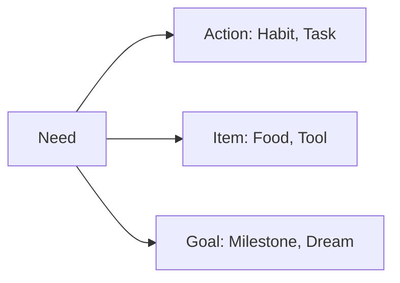
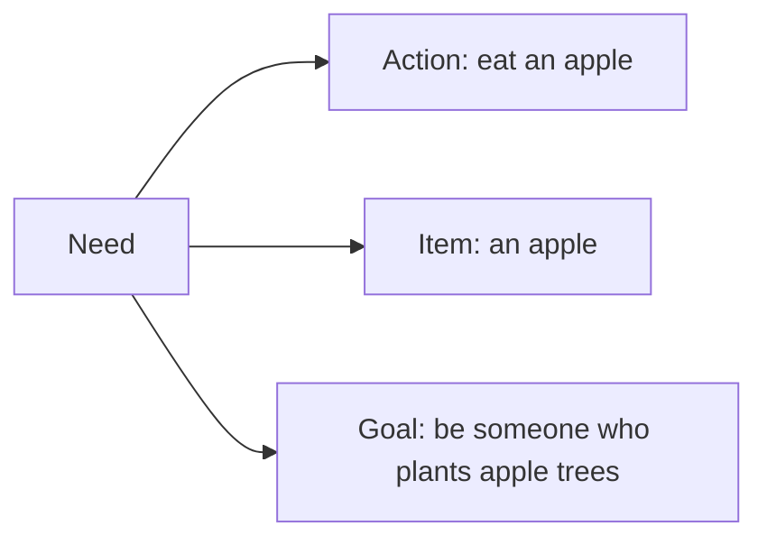
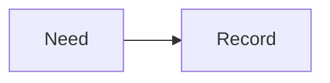
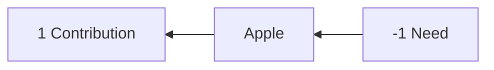
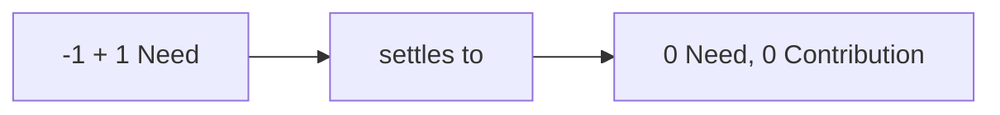
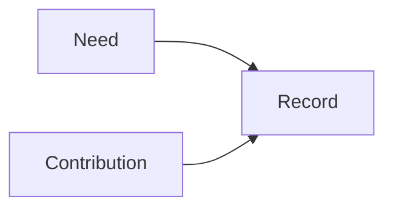
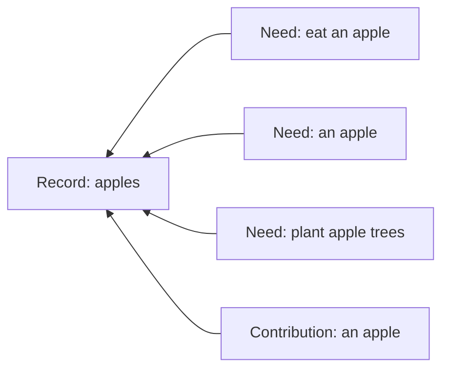
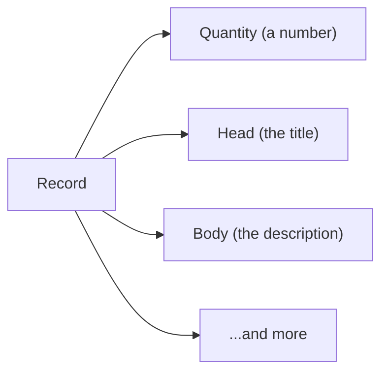
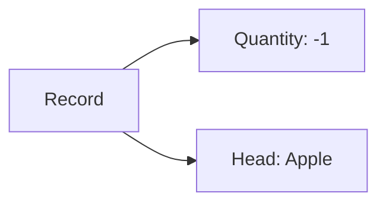

Record (@record: 0, is #chapter, #instinct, #part-of @ontology, #done) { r_5JKQH7BM9ZQ474YF869AFE4T2N

# Record

A **Record** is one thing that matters to you: a task, a project, a person, a message, a tool, a place, a transfer, a rule, a note, a saved query. Lince has no table for tasks and another for invoices and a third for contacts. It has this. What makes one Record a task and another an invoice is what has been said about it — never a column, and never a schema you had to choose correctly before you knew what you were doing.

Giving up the schema sounds like giving up too much, and it is the opposite. A fixed shape is precisely what makes software refuse the thing you actually want to track. Once every thing is the same kind of thing, a rule that watches your pantry and a rule that watches your workload are one rule pointed at two subjects; a board of chores and a board of purchases are one board pointed somewhere else. The variety moves out of the database and into your hands, which is where it was always going to end up anyway.

A Record carries a **head** and a **body** for you to read, and a **quantity** for the machine to work with. The quantity is the part that moves — the part rules read, transfers change, and history remembers — and its sign is meaning rather than bookkeeping: negative is a Need, positive is a Contribution, zero is neither.

The parts below take those in turn: why a Need is where the model starts, why a Need and a Contribution are the same number, and what a Record is actually made of underneath.

## Every Need is one Record

Lince starts from a claim that sounds too simple to be useful: everything you might want software to help you with is a **Need**. And a Need always shows up in one of three shapes.



Take one apple and all three appear at once:



_A habit, a thing, and a life direction — the same subject at three scales._

Most software picks one shape and builds an app around it: a to-do app for actions, an inventory app for items, a goal tracker for goals. Then your apples live in three places that cannot talk to each other. Lince refuses the split. Every Need becomes one thing:



## The other half: contribution

A Need on its own does nothing. Something has to meet it — and whatever meets it is a **Contribution**. Between the two sits the thing being moved.



_Before: someone is short one apple, someone else has one spare._

Watch the numbers. A Need is a **negative** quantity — something missing. A Contribution is a **positive** one — something available. Meeting the Need is just the two moving toward each other:



_After: both sides are zero. Nothing is missing and nothing is spare._

Which means Need and Contribution are not two different concepts at all. They are the same concept with opposite signs — two sides of one coin:



So instead of an app about apples, you get a record that everything about apples hangs off:



## What a Record actually holds



The **head** and **body** are for you — they carry the human meaning. The
**quantity** is for the machine: it is the state, and it is the part rules can
read and change.



_"I am one apple short." That is a complete, working record._

A number is deliberately unopinionated. The same field can mean stock, debt,
need, budget, progress, votes, hours, or responsibility. That is what lets one
kind of record carry every workflow you have, instead of a new table per
feature.

Every change to a quantity is recorded as a **fact** — who changed it, when,
and why. Nothing moves invisibly. Turn on "history (facts)" in a Protein and a
sand can show you the whole trail.

### The whole of it

The three fields above are the ones you handle. This is everything a Record
carries:

```text
Record
    uid                 stable global identity; never inferred from a title
    slug?               optional local, human-friendly alias
    kind                small operational shape; `plain` by default
    head                short title
    body                canonical Markdown content
    quantity            exact cached current level
    unit?               Concept naming the quantity's unit
    place?              place reference
    origin Organ?       where this Record originated
    created_at, updated_at
```

The **uid** is the identity and nothing else is. A slug is a local convenience
you can rename or drop without consequence, and a title is not identity at all
— two people will name the same thing differently and one person will rename it
twice.

**Kind is operational only, not a category.** It is not how you'd tell a task
from an invoice — that split lives in Concepts and assertions, the same way
everything else about what a Record *means* does. A new kind earns its
existence only when a Record needs code to behave differently for it: a
distinct state machine, extra tables it joins to, or validation nothing else
needs. If the only thing you'd gain from a new kind is an easier filter, it
isn't one — tag it with a Concept instead.

A Transfer is the clearest example. It isn't a different concept from an
ordinary Record — Record.md's own opening line lists "a transfer" alongside
task, project, and note as one of the things a Record can be. What makes it
earn `kind = transfer` is that a Transfer's proposal → agreement → settlement
lifecycle needs its own sidecar tables (`transfer`, `promise`,
`transfer_occurrence`, and friends) and its own validation on creation — real
distinct machinery, not a label. Concretely, creating a Transfer inserts one
`record` row with `kind = "transfer"` and then a matching `transfer` row
alongside it (`crates/store/src/transfers.rs`).

The full list of kinds today (`crates/nucleus/src/record.rs`), each earned the
same way:

```text
plain          the default — no special behavior
rule           a Rule's condition/action machinery
signal
transfer       Transfer's proposal/agreement/settlement lifecycle
decision
device
organ
person
protein
sand
conversation   one relationship, one grant — Threads/Messages live inside it
thread
message
thread-invite  a pending conversation request, before anyone has agreed to
               one; deliberately NOT a conversation, so it can be declined
               without ever having synced anything
program
frequency
grant
call-session   one occupancy of a conversation's audio/video room
```

Most things you'll ever create — a chore, a grocery item, a goal, a saved
query — never need a kind of their own. They stay `plain` forever, and
everything that makes them distinct from each other lives in their head, body,
and Concepts, exactly as the sections above describe.

The operations that touch a Record directly are deliberately few — create it,
edit its text, set its slug, unit or place, set or add to its quantity, attach
an extension, deactivate or delete it. Everything about what a Record *means*
— its identity, its tags, its relationships — happens through assertions
instead, so meaning never becomes a column somebody has to migrate.

**Facts are the ground truth and the quantity is their fold.** It is an exact
decimal sum of a hash-chained series of signed deltas, not a float and not a
SQL `SUM()` computed on demand, so two Organs replaying the same history reach
the same number to the last digit. Undo is therefore never an erasure: it
appends the inverse Fact and lets both movements stand in the record. Editing
metadata appends a zero-delta annotation so the trail still shows a hand
passing through, and replaying a Fact that has already been seen does nothing
at all — which is what lets sync be careless about delivering something twice.

Deactivating a Record sets its quantity to zero and leaves everything visible:
it is finished, not hidden. Deleting is a hard tombstone — gone from ordinary
reads, its slug released for reuse — but the row and its chain of Facts stay,
because a history with a hole in it cannot be verified by anyone who was not
there.

When a workflow needs a shape Lince has no word for, a Record can carry a
**namespaced extension**: a small JSON sidecar, one per namespace, versioned so
a reader can refuse a version it does not understand. Task work data lives here
— `{ start, due, estimate_min, logs: [...] }` — because those are properties of
the task rather than movements of its quantity. It is an escape hatch and it is
meant to be temporary: a shape that many people end up using is a shape that
should be promoted into something shared, and an extension that never gets
promoted is a private vocabulary nobody else can read.
} r_5JKQH7BM9ZQ474YF869AFE4T2N

Ledger Facts (@ledger-facts: 0, is #chapter, #instinct, #part-of @ontology, #done) { r_9NQJ2VK53ZSRT0NXV11V3VB19G
Facts are an append-only log of what happened to a Record. We save in the Fact what made the Record change, who did it.

- [x] Example: a flour Record has identity `@flour` (what the Record is)
  while one `-500 g` Fact is classified `@bread` (what that movement was),
  using the same Concept vocabulary.

## Exact numbers

**Purpose:** Fix the small vocabulary every other section spends, so a number
means one thing everywhere.

**How it works:** One decimal type on every durable path and no binary floats in
any decision. Probability and confidence are different types, because a
likelihood that something recurs and a confidence in an estimate are different
claims. Time atoms are signed integer milliseconds. There is no money type: a
currency is a Unit Record, so `12.50 @brl` is a `Quantity`.

**Interacts:** Rule arithmetic, this Ledger and replay all depend on these being
exact and canonical.

**Implementation:** `nucleus::DecimalValue` stored as `(mantissa TEXT, scale
INTEGER)`, summed in Rust as `i128` at a common scale and never in SQL.
`fact.delta` and `record.quantity` are an exact pair with `REAL` removed. One
named lossy inbound door, `NewFact::quantity_f64`.

- [x] **Declared precision survives sync**, and the exact pair is inside the
      hash preimage, so two Cells agree on the bytes and not merely the value.

} r_9NQJ2VK53ZSRT0NXV11V3VB19G
