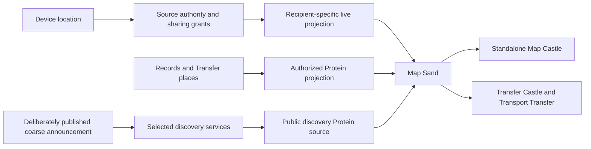

# Maps, location sharing, and Transport Transfer

Research begun 7 October 2026; location implementation and delivery priorities updated 8 October 2026. The accepted location scope and implementation status are described first. The next sequence is generic location and desktop workflows, desktop maps, then mobile completion. Map implementation has not started. External links support the research. Performance figures below remain acceptance targets, not measured results.

## Accepted location decisions and current scope

The initial location increment is implemented. Finish its generic reliability and desktop workflow gaps first, deliver the desktop map and its Transfer integration next, and complete mobile last. Mobile toolchain setup, target validation, acquisition lifecycle work, touch presentation, and device measurements must not block the desktop map increment. Preserve the existing mobile implementation while its remaining work waits. Geocoding, routes, and multi-stop journeys remain optional later extensions.

The human selected these decisions:

- Choose a source device for each Record, defaulting to the current device. Another device in the Organ must approve acquisition locally.
- Attach live location to any selected Record, normally its Need/Contribution. Keep it separate from the Record's saved place and Transfer meeting-point snapshots.
- Before sharing, only the starting Person's authorized sessions may view the live location. Organ membership alone grants no access.
- Maintain one active source per Record. Different people's locations belong to separate Records, which a Transfer can bring together.
- Clear live coordinates when tracking stops or expires. Retain configuration; saving a location as a place is a separate action. Do not retain a journey history.
- Default a session to one hour, editable by its controller. If linked to a Transfer, completion or cancellation also ends the session.

Provide native Record controls for choosing the source, starting/stopping, duration, selected recipients, and viewing the latest coordinates, accuracy, capture age, and source status. Transfer details currently bring together the permitted locations of their linked Records without a map. An outside recipient receives a narrow location view, not access to the Record's other fields or Transfer terms. Exact sharing is explicit; public/coarse discovery remains unimplemented and can be developed as a general discovery capability before its map presentation.

Implementation should reuse device identity, Person authentication, Record authorization, and encrypted peer communication. Keep observations ephemeral and bounded, control messages reliable, and authorization checks ahead of every delivery. Retained configuration must never restart sensor acquisition without source-device confirmation after a restart.

## Accepted visibility and Record capability refinement

The human approved implementation of the generic location and desktop work and requested a reusable **Visibility Castle**. Saved location and live location sharing are two independent capabilities of an ordinary Record. They are available to any Transfer kind without a map, including Ride, Delivery, donation, exchange, lending, visits, and plain agreements. A saved place is retained context; a live observation expires and never silently replaces that place or the agreed Transfer terms.

Visibility policies select the Record and the data being controlled: ordinary Record data, its saved place, or its live location. Compose an allowlist and an excludelist from any number of bounded conditions within implementation limits. Each condition can select specific Organs, a lower/upper proximity bound, or both. Proximity means the owner's existing Organ contact proximity, where lower values are closer; it is not geographic distance. Bounds can be strict or inclusive so “below 3”, “at least 2”, and closed/open ranges are unambiguous.

The human confirmed the composition rules: criteria within one condition combine with AND; include conditions combine with OR; exclude conditions combine with OR; any matching exclusion wins. An empty include list grants no additional Organ access. Named Person grants remain available for live sharing, but an applicable Organ exclusion also prevents those deliveries. The controller retains access to manage and stop their own capability. Missing or unauthenticated Organ identities cannot satisfy proximity rules. Contact proximity is read at delivery time, so changing it changes future access without restarting acquisition.

The Castle previews the effective decision for known Organs and explains the matching conditions. Editing uses revision checks, requires authority over the selected data, and must not expose private policy contents to observers. Changing visibility affects future delivery; previously delivered data cannot be erased from another person's knowledge. Ordinary replication remains bounded by existing grants and sync policy. An explicit Organ policy also authorizes a narrow direct projection of the selected data, without private configuration, unrelated Records, or an unapproved saved place. Withholding a saved place must also prevent it leaking through ordinary Record replication or references; do not redact or rewrite signed history to disguise that leak.

Implement the shared evaluator and backend before the Castle, reuse the same editor from Record location controls, and verify the complete feature in a deterministic topology of three or four Lince instances. Cover both static and live location, included/excluded Organs and overlapping ranges, changed proximity, observer-only views, stop/expiry, replay, Transfer termination, and absent maps. Exercise more than a Ride preset to prove that the capabilities are generic. Map implementation remains the next phase and mobile completion remains last.

## Location implementation

The location increment uses ordinary Records, Persons, Cells, Record permissions, and encrypted Iroh communication. It introduces no ride-specific backend. The shared [location model](../crates/nucleus/src/location.rs), [location engine](../crates/engine/src/location.rs), and [native controls](../crates/interface/src/location.rs) support both device acquisition and a labelled manually reported position.

Record controls choose the controlling Person, one authorized source device, explicit Person recipients, a duration from one minute to one day, and an optional Transfer end condition. The default is this device, no additional recipients, and one hour. Desktop Record cards, Protein rows, and Transfer details open the same controls; Transfer details also expose their linked promise Records. Mobile Record details open the same shared controls. A separately opened observer panel accepts a private location reference with the Record and authority endpoint together. Diagnostic fields remain available. Copying or loading the reference grants no access and does not start acquisition. An Organ allowed by the current live policy can view without creating another Person at the sharing Organ; a named recipient can instead authenticate through the existing encrypted login.

Selecting a remote source creates a pending request there. It cannot start acquisition. The starting Person must authenticate that source device with the sharing Organ and approve locally. The authentication button reuses Lince's existing encrypted live login; it does not put a password in a Record action. For an outside observer, create or use the intended Person identity at the sharing Organ and explicitly select that Person as a recipient. They authenticate through the observer panel. This grants a latest-location view without granting Record access or making them a Transfer party. Arbitrary bearer links and anonymous viewers are not implemented.

Settings are retained in the new append-only `0002_location.sql` migration. Sessions, source approvals, observer identity mappings, and coordinates stay in memory. Restart requires a new start and source approval. Routine location actions skip durable action-intent storage while retaining signed-session checks and replay rejection. Fixes never update the Record place, Transfer terms, ordinary sync, or a durable outbox. **Set saved place** works without starting tracking. **Save current position as Record place** is a separate explicit action using `SetPlace`. Both retain the coordinate under the saved-place policy; the first saved place creates a private policy. Agreed Transfer meeting points continue to use revision-checked Transfer terms.

Each Record has one active source session with a fresh session identity. Incoming fixes must match that source and session, increase the sequence, have valid finite coordinates, and have a recent capture time after approval. Only the latest fix is retained. The view shows reported coordinates, accuracy when supplied, and elapsed capture age; it marks a fix stale after fifteen seconds and removes it after sixty seconds. A missing or denied provider is visible. Neither viewing nor reconnecting resets a fix's age.

The first authority is the Cell with the smallest endpoint identifier among the valid signed Organ roster's write-capable Cells; a standalone device is its own authority. Configuration stays at that authority. There is no automatic failover or replicated location settings yet. The authority must be reachable to start, approve, or view remote sharing. Source leases renew every five seconds and stop authorizing acquisition after thirty seconds without renewal. Stop clears local acquisition immediately even when the authority cannot be reached; an already delivered recipient view can remain visible until its short fix expiry. The controller's standing, Record authority, device admission, roster, and Transfer end condition are rechecked during the session.

The [Linux adapter](../crates/desktop/src/location/portal.rs) uses the XDG Location portal and closes its session when acquisition ends. A supporting portal backend is required. The [Android service](../crates/mobile/android/app/src/main/java/social/lince/mobile/LocationService.java) uses platform LocationManager, respects coarse/fine permission, and runs bounded active sharing with a foreground notification and Stop action. It has no Google Play Services dependency and does not restart automatically. Manual reporting remains available where a native provider is unavailable; Windows and Apple acquisition adapters are deferred.

Location traffic has its own narrow encrypted connection, limited to location requests. Named-recipient delivery checks current Person/device admission and its explicit audience. Organ delivery checks the authenticated Organ, current contact proximity, and composed include/exclude rules. Exclusions override named-recipient grants, with a controller exception. A previously authenticated outside recipient does not need Organ membership or general discovery acceptance. Limits include 32 additional recipients, 64 active source/session entries per runtime, a 16 KiB incoming request, and a maximum one-day session. There is no public or approximate publication in this increment; a grant shares the reported coordinates at the provider's actual accuracy.

Remaining operational limits are platform permission/device testing, battery measurements, and clock skew: source and authority wall clocks must be sufficiently aligned because future timestamps and captures predating approval are rejected. Authority changes intentionally end existing sessions. Previously delivered coordinates cannot be erased from another person's knowledge. Map rendering, geographic search, public announcements, geocoding, routes, and the composed Transport Transfer map are not implemented. Desktop map delivery now precedes the remaining mobile work.

### Visibility implementation refinement

The shared [visibility model](../crates/nucleus/src/visibility.rs) evaluates strict/inclusive proximity ranges and Organ lists with the confirmed composition rules. The [Visibility Castle](../crates/desktop/src/visibility_castle.rs) reuses the [native editor](../crates/interface/src/visibility.rs) for ordinary Record data, saved place, and live location. It includes Record selection, range editing, multiple inclusions/exclusions, and a preview showing matching condition numbers for each known Organ. Saves compare the revision; rejected saves preserve edited rules. Limits are 64 conditions, 64 Organ identities per condition, and 12 KiB serialized policy data.

Append-only migration `0003_data_visibility.sql` stores independent policies and revisions. Policy contents sync only between the owning Organ's authorized Cells. Outside readers receive a narrow permitted projection. Live policy edits from another authorized Cell are sent to the designated sharing authority before success is reported. Editing requires Record read/update and permission-assignment authority; when acting as a Person, live policy management also requires the location controller.

For saved places, private means no additional outside-Organ disclosure; local Record permissions still govern readers and the owning Organ's authorized Cells retain their normal replication authority. Live coordinates have the narrower starting-Person default. Choosing an Organ for live sharing authorizes that Organ's authenticated endpoint; it is an intentional broader audience than a named Person. Policies and the Castle's selected Record/scope persist, while unsaved rules, live observations, and acquisition consent do not become workspace state. The Castle includes the embedded accessibility dependency's license and credits.

A withheld saved place conservatively withholds ordinary replication of the Record and its signed history, because history may contain exact coordinates. Allowing that replication can disclose earlier saved places in retained history; the Castle explains this. Narrow direct projections return current permitted data, and the Record-data projection can return text without its saved place. This does not recall data already delivered. Transfer delivery projections, queued envelope preparation, and hosted pulls also check current Organ visibility before sending. Transfer meeting-point disclosure remains a separate agreed-terms capability; live sharing never rewrites it.

The four-Cell simulation adapts the existing sale fixture into a single-promise bike handoff through agreement, occurrence activation, confirmations, settlement, delivery, and restart. It adds independent subject and passenger Need location sources, a family observer, and an excluded Organ. Assertions cover static/live separation, ranges and explicit Organs, changed proximity, blocked contacts, stale saves, 500 latest-only fixes without new facts, queued Transfer delivery after visibility changes, automatic Transfer-bound stopping, and restart without reacquiring the passenger source. Focused engine and native editor tests cover excluded named recipients, source-side policy routing, private configuration sync, permission checks, preview, and explicit saved-place actions. Saved-place controls remain available while the sharing authority is unreachable.

### Visibility refinement verification on 8 October 2026

- `cargo test -p lince-simulation --test location_visibility` passed the complete four-Cell handoff scenario described above. This uses isolated Cells and real Transfer actions with an authenticated simulated location network; the separate Cell test exercises actual encrypted loopback connections.
- The combined `location::tests` run passed thirteen engine tests, one Cell encrypted-loopback test, and eight shared native UI tests. This adds source-side visibility routing, excluded named recipients, current Organ proximity, separate saved-place controls available before authority loading, and private reference loading without acquisition to the initial coverage below.
- The visibility test harnesses compiled by that run were executed in the interface Nix shell: two policy tests, one editor preview/revision test, and four desktop tests passed, including restoration of the Visibility Castle's Record/scope without policy contents or coordinates.
- `cargo test -p engine --lib visibility::tests` passed the private-sync test with its Cell signing key initialized. It checks saved-place default denial, own-Organ policy replication, explicitly allowed place replication, withheld policy contents, and rejection of foreign policy injection. Together with the topology and focused runs above, 31 tests passed for this refinement.
- `cargo check -p lince-desktop -p lince-mobile` passed for the native Linux hosts during this refinement. The latest shared controls and desktop changes also compiled in the focused test run. Rust warnings are denied; this does not establish Android target or device support.
- `cargo check -p store` and all seven `migration_guard` tests passed immediately after appending `0003_data_visibility.sql` and its exact SHA-384 entry. No earlier migration or checksum was changed.

Map rendering, native permission prompts, portal lifecycle, battery use, and sustained-device performance remain unmeasured here. The generic visibility/Record-capability increment is implemented; clock-skew handling, explicit authority handoff, coarse discovery, and the broader guided Transport Transfer flow remain open in the ordered desktop plan below. Desktop maps follow that work, and mobile completion remains last.

### Initial location verification on 8 October 2026

- Twelve engine location tests passed. They cover private defaults, explicit recipients, signed identity, selected-device approval, source/session replay, invalid native fixes, concurrent starts, permission loss, Transfer termination, expiry/restart, and offline source stopping. A 2,000-update test retains one latest observation without adding Record facts or a saved place. Signed manual updates also leave no durable action-intent payload.
- The Cell test uses real encrypted loopback connections and the existing live password/session handshake. An outside recipient with no contact relationship or Record read permission can view the granted location. An incorrect password fails, and revoking its Person/device admission blocks further views.
- Six shared native UI tests passed: expired coordinates disappear, stopping ignores earlier replies, saving requires a fresh fix and explicit request, observer authentication preserves identity, successful polls wait before polling again, and recipient controls cannot display an uncommitted change during a live session.
- `cargo check -p lince-interface -p lince-desktop -p lince-mobile` passed in the interface Nix shell, with Rust warnings denied by the workspace. This checks the native Linux desktop and mobile host; it does not substitute for the Android target check below.
- `cargo check -p store` and all seven `migration_guard` tests passed after appending the new migration and SHA-384 entry. The existing migration and checksum were left unchanged.
- All Android Java host classes passed `javac -Xlint:all -Werror` against the official Android 35 platform. A full Android Rust cross-check could not complete because the local SDK/NDK toolchain is absent; its native dependency compilation attempts to use the host C compiler. APK installation, device permission prompts, portal behavior, and battery use have not been validated here.

## What we want

Give the default Transfer Castle a map and the ability to share the current location of a person or another Record. Make the same map available as a standalone Castle, with its source and filters configured through Protein. Build **Transport Transfer** as a workflow that combines these general capabilities with ordinary Needs, Contributions, parties, promises, reservations, time windows, and confirmations.

A driver can share their location with selected passengers. A passenger can share theirs with the driver, selected other passengers, or a family member outside the Transfer. Each person decides independently. A public transport announcement can appear on a discovery map while its author's profile, exact pickup, exact destination, and live movement remain private.

The intended result is useful beyond ride sharing: deliveries, visits, lending equipment, moving goods, meeting someone, and coordinating field work can use the same pieces. The transport-specific layer should mostly supply names, defaults, filters, and a convenient screen.

## What Lince already has

Before this location increment, the repository provided these foundations. The implementation above adds live location; the map remains deferred.

| Existing foundation | What it gives us | What still needs work |
| --- | --- | --- |
| [Place and geographic helpers](../crates/nucleus/src/place.rs), [Place storage](../crates/store/src/places.rs) | Coordinates, Record place references, distance and proximity calculations | Validated geographic attachments with audience rules, accuracy, and multiple purposes; a device source and map |
| [Transfer snapshots](../crates/nucleus/src/transfer.rs) | A default place, promise and occurrence locations, time windows, parties, dependencies, and child Transfers | Distinguish agreed places from changing observations; ordered stops and their workflow presentation |
| [Transfer field disclosure](../crates/nucleus/src/transfer/disclosure.rs) | Audiences for location, parties, quantities, text, and source Records; recipient projections | Exact location needs a private default, precision choices, expiring grants, and independently authorized live streams |
| [Transfer Castle](../crates/desktop/src/transfer_castle.rs), [existing presets](../crates/desktop/src/transfer_castle/model.rs) | Native Bevy Transfer UI, including Ride and Delivery presets | Map composition and a guided Transport Transfer flow; existing presets do not establish a full transport implementation |
| [Protein](../crates/protein/src/lib.rs), [shared query editor model](../crates/interface/src/queries.rs) | Record and Transfer queries, proximity to a Record, classification, and time filters | Viewport queries, geographic output, and a source for authorized discovery announcements |
| [Public social protocol](../crates/nucleus/src/social.rs), [discovery search](../crates/store/src/social.rs) | Anonymous or identified Need/Contribution announcements, signatures, expiry, server selection, and private reply routes | Structured coarse geography and machine-readable availability; current `area` and `availability` are text |
| [Discovery service](../crates/engine/src/social/service.rs), [private reply sessions](../crates/engine/src/social/session.rs) | Directory infrastructure and encrypted private conversations | Geographic indexing and a narrow handoff from discovery to a Transfer |
| [Wire](../crates/engine/src/wire.rs), [editor presence](../crates/engine/src/presence.rs) | Iroh connectivity and an example of bounded, expiring, in-memory updates | Geographic updates with their own consent and recipient rules; editor presence is not location authorization |
| [Shared interface](../crates/interface/Cargo.toml), [mobile host](../crates/mobile/Cargo.toml) | Shared Rust UI infrastructure and native Bevy desktop/mobile hosts | Shared map and permission models with desktop and mobile presentation |

Two details affect the design. `ItemDisclosure::default()` gives ordinary Transfer location and parties the default `Everyone` audience. `ItemAccess` also has an owner/privileged path. Neither authorizes a person's live position: this increment enforces an independent private audience. The [Android manifest](../crates/mobile/android/app/src/main/AndroidManifest.xml) now declares location permissions and a non-exported location foreground service.

## Shared feature families

These are the proposed families to review before implementation. Introduce concrete location and map capabilities first; avoid a general telemetry framework until another actual use requires it.

| Family | Members | Shared responsibility |
| --- | --- | --- |
| Geographic attachments | Record place, agreed meeting point, service area, ordered stop, planned route | Valid geographic data, purpose, precision, and disclosure |
| Live location | My device, another authorized device representing an asset, a selected remote person's shared position | Source authority, current observation, expiry, audience, and transport |
| Map | Standalone Map Castle, Transfer map, discovery map, family viewer | One Map Sand, camera, layers, picking, clustering, attribution, and source configuration |
| Transfer coordination | Ride, delivery, visit, equipment handoff, group trip | Time windows, resource capacity, stops, progress, confirmation, cancellation, and ordinary Transfer accounting |
| Discovery | All public Need/Contribution announcements, including transport | Signed public projection, geographic/time search, private replies, expiry, and selectable services |

Keep **Transport Transfer** distinct from the repository's `crates/transport`, which handles application communication. A ride should not require a second agreement engine, a separate passenger identity system, or ride-only location permissions.

## Location and visibility

### Four independent decisions

The UI and backend must distinguish:

1. **Acquire:** may this Lince device ask the operating system for location?
2. **Represent:** whose location does this source represent: me, a vehicle, a parcel, or another Record I may operate?
3. **Disclose:** who may receive it, at what precision, for how long?
4. **Publish:** which deliberately selected details may enter public discovery?

Operating system permission answers only the first question. Transfer membership, a public Record, a contact relationship, and permission to edit a Transfer do not answer the others. An asset operator must have explicit authority to attach its source; selecting another person never grants authority to track them. One participant cannot turn on another participant's device source.

### Defaults and controls

Saved exact coordinates start withheld from outside Organs, subject to existing local Record permissions. Live position starts private to its controlling Person. Transport publication starts anonymous and coarse. Named recipients and explicit Organ policies are independent sharing controls; a shortcut such as “selected Transfer participants” resolves to a reviewed recipient list. Adding a passenger later does not silently add them to an existing grant.

Each sharing card states the subject, source device, recipients, precision, and end condition. Offer “Share once,” “Share during this Transfer,” and “Share for a duration.” The selected default is one hour, editable, with completion/cancellation additionally ending a Transfer-linked session. A separately chosen personal grant can continue for a bounded duration after a ride, for example to let family see the walk home.

Opening a map or activating a Transfer does not start sharing. The user may approve a preset's suggested recipients in the same flow used to start sharing. Exactness and the recipient list stay visible, with a global **Stop all location sharing** action. Changing or restarting the source device requires a fresh binding and local confirmation.

| Detail | Public discovery | Driver | Another passenger | Family observer |
| --- | --- | --- | --- | --- |
| Passenger's profile | Hidden by default | Separately disclosed | Separately disclosed | Existing contact information only |
| Passenger's pickup/destination | Coarse area only | Exact if explicitly granted | Hidden unless selected | Hidden unless selected |
| Passenger's live location | Never through the default discovery projection | Only if selected | Only if selected | Only if selected |
| Driver's live location | Never through the default discovery projection | Own location | Only passengers the driver selects | Only with the driver's grant |
| Private Transfer terms and accounting | Hidden | Existing Transfer permissions | Existing Transfer permissions | Hidden |

An outside observer receives permission to view a location stream and any explicitly included context. They do not become a Transfer party, gain settlement powers, receive the passenger list, or inherit access to messages and private Records. A family member's grant to see the passenger does not grant access to the driver's source, even when the passenger is travelling in that vehicle.

Reuse existing audience concepts, but enforce geographic grants separately where necessary. Check access before serialization, delivery, subscription updates, and rendering. Protein is a query tool; selecting a broader filter cannot enlarge permission. Hiding a marker after sending its exact coordinates is insufficient.

### Precision and honest privacy

Support hidden, area, and exact disclosure. Area disclosure returns an area geometry or cell and its size, rather than an exact point with a vague visual circle. Do not include a hidden address, geocoder result, source Record UID, precise time, route, heading, speed, or accuracy metadata that would reconstruct the protected position.

Use a consistent coarse representation for an announcement's lifetime. Refreshing random offsets or publishing increasingly precise areas can expose the original location through repeated observations. Precision must also cover destination, route, time, identity, and free text. Warn during publication if the user has written an address into text that will be public.

Describe this as **anonymous publication with approximate geography**, not guaranteed anonymity. Mobility research demonstrates that sparse time/place observations can identify people in a particular dataset. A coarse cell or an omitted name alone does not solve that problem. [Research: Unique in the Crowd](https://www.nature.com/articles/srep01376).

## The location model

Separate stable geographic information from short-lived observations.

**Geographic attachment:** a Record or Transfer term referring to a point, area, route, or ordered stop, with a purpose such as meeting point or destination. Agreed pickup and delivery places belong in versioned Transfer terms. Live movement must not rewrite an agreement or generate a revision for every fix.

**Location source:** an authorized binding from a subject to a publishing device or manual source. Store its controller, device authority, status, and source kind. A desktop may display a phone's permitted stream, but must label it as the phone's source. A manually placed point is a declared position, not a GPS observation.

**Location observation:** source/session identifier, increasing sequence, coordinates or authorized area, capture time, reception age, horizontal accuracy when available, and a short validity period. Include heading and speed only where the workflow needs them and the recipient is allowed to receive them. Validate finite coordinates, geographic ranges, time bounds, source authority, and packet size.

A valid signature identifies the authorized publisher; it does not prove physical presence or make GPS immune to spoofing. Treat observations as reported location with visible source and uncertainty. They must not independently trigger settlement, identity verification, or proof of delivery.

**Location grant:** subject, issuer, source, recipient identities/device bindings, precision, optional Transfer context, start/end conditions, expiry, and authorization generation. Reuse Lince's established authority and identity machinery. A device endpoint key must be bound to the person or private conversation receiving the grant; possession of an Iroh endpoint alone does not establish that authority.

**Current-location projection:** a bounded latest observation per source and permitted viewer, normally in memory. Persist grants and their changes where necessary for restart/revocation, but do not put routine positions in Record history, Transfer evidence, ordinary sync, an outbox, logs, analytics, or crash reports. Explicitly saving a place or a journey is a separate action with a retention policy. Storing such data does not make it public.

Proposed initial timing: publish about every three seconds while moving and every fifteen seconds while stationary; mark moving observations stale after fifteen seconds and stationary observations after forty-five seconds, and remove positions after sixty seconds without a fresh fix. These are tuning starting points. A heartbeat reports source availability without resetting the observation's capture age. Carry capture age across reconnections, reject replayed/out-of-order samples, and cap the accepted age using local elapsed time. Receiving a cached observation must not make it fresh again. A paused or offline source visibly reports its state; interpolation must not invent continued movement.

Use one selected publishing device per source session. A handoff creates a new authorized session; observations from the old device cannot race the new one. Stop acquisition when no approved local use or sharing session needs it. A map viewer subscribes to remote data without starting its own sensor.

### Network and revocation

Reuse Iroh for authenticated direct connections and relay fallback. Lince pins Iroh 1.2.0, whose API supports reliable streams and datagrams. Use reliable control messages for grants, stop, and revocation; begin with bounded, coalesced latest-position delivery, then consider datagrams if measurements justify them. Do not queue a ride's positions for later bulk delivery. [Iroh architecture](https://docs.iroh.computer/), [pinned connection API](https://docs.rs/iroh/1.2.0/iroh/endpoint/struct.Connection.html).

Authorize and generate a precision-limited payload independently for each recipient. Different audiences must not share an exact-coordinate group key. For direct endpoint-to-endpoint delivery, Iroh protects the connection; a relay still observes connection metadata. If an application mailbox or other intermediary forwards payloads, use application end-to-end encryption through the established private-session implementation. The ordinary social mailbox's durable history and retention should not become the default carrier for frequent location samples.

Revocation stops future publication to the removed recipient, invalidates the grant generation, terminates affected subscriptions, and clears local viewer caches. Reconnection rechecks current authorization. Use bounded authorization leases and sample expiry so disconnected clients cannot retain an indefinitely active view. Persist the necessary revocation state before acknowledging a stop, and fail closed when current authority cannot be established.

An already authorized recipient can keep screenshots or previously received coordinates. Lince can stop future disclosure and delete its own caches; it cannot remotely erase another person's knowledge. This limit should appear in the sharing explanation.

## Device support

Expose a small shared provider interface: capability/status, request permission, begin updates with an accuracy/rate policy, and stop. Keep platform acquisition in the platform host and policy in the engine. Permission denial, approximate access, no sensor, an old fix, and suspension are normal visible states.

| Platform | Proposed acquisition | Constraints |
| --- | --- | --- |
| Android | Start with platform `LocationManager` through the existing native bridge; leave a fused provider optional | Respect approximate permission. Active sharing started by a visible user action can use a correctly declared location foreground service with a persistent notification and Stop action. Do not depend on Google Play Services being installed. [LocationManager](https://developer.android.com/reference/android/location/LocationManager), [runtime permissions](https://developer.android.com/develop/sensors-and-location/location/permissions/runtime), [foreground service rules](https://developer.android.com/develop/background-work/services/fgs/service-types) |
| Linux desktop | XDG Location portal where an available backend supports it; manual position and explicitly connected external source otherwise | Portal availability and accuracy vary. The portal exposes sessions, accuracy requests, and update thresholds. Do not silently infer position through an IP lookup. [XDG Location API](https://flatpak.github.io/xdg-desktop-portal/docs/doc-org.freedesktop.portal.Location.html) |
| Apple platforms | Core Location in the relevant host when that platform is implemented | Handle authorization, reduced accuracy, and background lifecycle explicitly. Permission and background support do not guarantee uninterrupted sampling. [Authorization](https://developer.apple.com/documentation/corelocation/requesting-authorization-to-use-location-services), [background updates](https://developer.apple.com/documentation/corelocation/handling-location-updates-in-the-background) |
| Windows desktop | Windows geolocation provider, with manual/external-source alternatives | Request access and handle disabled or unavailable location. [Windows location API](https://learn.microsoft.com/en-us/windows/apps/develop/maps-and-location/get-location) |

Finish Linux acquisition and manual-source validation first. Complete the existing Android host after desktop maps and workflows work. Do not present a future Apple or Windows adapter as already available. A desktop with no reliable location can still use maps, select an area manually, and view permitted remote locations.

Foreground services, background permission, and background network execution are distinct. On Android, start an active location service from the permitted visible state; requesting background location merely because the user locks the screen is not the default design. Any later need to start/restart tracking while already in the background requires a separate platform-policy review and clear user intent. Test locked-screen operation, service termination, permission changes, network changes, and battery restrictions on actual devices.

## Map rendering without a JavaScript frontend

The map backend has several parts: geographic datasets, tiles, cartographic rendering, address search, and road routing. Reuse existing projects for these. Lince should own the Bevy controls, permission-aware overlays, and workflow composition.

### Renderer research and recommendation

The latest preference is a Rust renderer that can be shipped with Lince, a Bevy interface with full theme-token control, and no mandatory runtime installation. This changes the experiment order to **Galileo first**, with MapLibre Native as the established cartography alternative. Renderer code and required small assets belong in the release; geographic datasets have a separate size and update policy. Neither a Rust crate nor Bevy includes a detailed map of the world by itself.

| Option | Evidence | Assessment for Lince |
| --- | --- | --- |
| **MapLibre Native through its Rust FFI** | Native vector/raster rendering; documented Rust bindings and host-owned texture targets. The FFI explicitly states its ABI is pre-1.0 and unstable. [Native engine](https://github.com/maplibre/maplibre-native), [FFI status](https://maplibre.org/maplibre-native-ffi/), [texture integration](https://maplibre.org/maplibre-native-ffi/guides/attach-a-render-target/) | Established cartography alternative if the Rust candidates fail the labelled-map gate. Its renderer is C++, even though Lince can call it through Rust. Ship the pinned native library with Lince rather than downloading it on a user's first launch. Requires proven graphics synchronization. |
| **Galileo** | Rust GIS renderer with raster/vector layers and explicit wgpu device/queue and texture rendering APIs; its project describes itself as work in progress. Its current main manifest uses wgpu 29, matching the major version in Lince's lockfile. [Project](https://github.com/galileo-map/galileo), [manifest](https://github.com/galileo-map/galileo/blob/main/Cargo.toml), [texture renderer API](https://docs.rs/galileo/latest/galileo/render/struct.WgpuRenderer.html) | First experiment under the Rust preference. The version alignment makes a shared-device experiment more promising, but does not establish integration. Pin and test one revision for text, road labels, styles, resource ownership, and later touch controls. Keep the Bevy UI independent of Galileo's example GUI. |
| **MapLibre Rust** | Rust/WebGPU map renderer. Its README describes a proof of concept; feature descriptions across README and generated docs differ. Platform docs list mobile limitations. [Project status](https://github.com/maplibre/maplibre-rs), [platform notes](https://maplibre.org/maplibre-rs/docs/book/supported-platforms.html) | Research candidate, not the default commitment. Evaluate an exact revision and real map scenes instead of relying on a platform list or an old missing-features list. |
| **Raster tiles displayed by Bevy** | Existing Bevy slippy-tile plugin supports fetching/displaying tiles. Published 0.11.0 depends on Bevy 0.18, whereas this repository pins 0.19.1. [Published API and dependencies](https://docs.rs/crate/bevy_slippy_tiles/latest) | Bounded fallback: a small native viewport using an existing compatible plugin or a narrow tile adapter, with Bevy overlays. It does not provide vector cartography; obtain rendered tiles from an established source that permits the required use. |
| **bevy_geo_tiles** | Rust/Bevy raster-map plugin with WGS84/Web Mercator conversion, local origins, camera controls, marker/polyline/polygon support, and asynchronous tile loading. Published 0.2 targets Bevy 0.18 and supports 256-pixel raster tiles. [API and compatibility](https://docs.rs/bevy_geo_tiles/latest/bevy_geo_tiles/) | Useful existing ergonomics to evaluate or adapt for Bevy 0.19.1. Its built-in camera must be scoped to each Castle instead of controlling the whole workspace. Raster map labels/colors are baked into the provider's images. |
| **Rust geographic data helpers plus Bevy** | `geo` supplies geographic types/algorithms, `geozero` reads common geographic formats, and `pmtiles-rs` reads existing tile archives. [geo](https://github.com/georust/geo), [geozero](https://github.com/georust/geozero), [PMTiles reader](https://github.com/stadiamaps/pmtiles-rs) | Good for Record geometry, projection boundaries, simple bundled polygons, and overlays. These are not street-map renderers. Do not expand their use into implementing road-label placement, vector styles, or a replacement cartographic engine. |

**Recommended decision:** test Galileo first in a bounded desktop experiment, then MapLibre Native FFI if it cannot provide the needed cartography. Bevy owns Lince's controls, markers, and cards in either case. MapLibre's Rust binding is currently snapshot-only and its C ABI is unstable: pin both the binding revision and native artifact, using an explicit native install prefix rather than a floating build-script download. [Rust installation](https://maplibre.org/maplibre-native-ffi/install/#rust).

Select the initial renderer after it renders a real labelled map inside the existing Linux Bevy host with measured interaction and bounded resources. Review the eventual Android backend and packaging path from upstream documentation now, but leave Android integration and device acceptance to the final mobile phase. This is a desktop selection, not a claim of verified mobile support. If neither vector candidate meets the desktop gate without a large fork or new cartographic engine, deliver the first Map Sand with raster tiles. Keep the provider/renderer boundary so vector rendering can replace that implementation later.

The desktop integration gate must demonstrate viewport clipping, map-to-screen conversion, pan/zoom, resize, scale-factor changes, multiple Castles, and correct texture teardown. A shared GPU path must prove resource ownership, queue synchronization, texture formats, and backend compatibility. Do not use per-frame GPU readback followed by a Bevy texture upload as the performance design. A static-image path is useful for snapshots, not evidence of a fast interactive map. Pinch/touch handling, Android pause/resume, and mobile resource measurements are final-phase gates.

Keep all Lince markers and permission-aware cards in Bevy where practical. Reuse the map renderer's geographic projection/conversion API so basemap and overlays agree. A hidden or settled map should stop rendering until camera, tiles, style, or overlays change. The same Map Sand must work in Transfer and independently.

### Native UI, themes, and a complete binary

Bevy supplies cameras, textures, meshes, pointer events, UI layout, and render-to-texture composition; the existing Lince Castle framework supplies placement and theme tokens. These are enough for a custom map viewport, toolbar, Record cards, selection, and overlays. Existing Bevy map plugins add geographic conversion and tile/camera behavior, but still need compatibility checks and integration with per-Castle input and clipping. [Bevy render-to-texture/UI example](https://bevy.org/examples-webgpu/ui-user-interface/render-ui-to-texture/), [bevy_geo_tiles](https://docs.rs/bevy_geo_tiles/latest/bevy_geo_tiles/).

Resolve Lince's theme tokens into a map palette for land, water, road classes, label ink/halo, selected Record, and accuracy area. Rebuild or update renderer style state when the resolved theme changes. Vector styles can use those resolved values; raster basemap pixels cannot be recolored reliably while preserving labels and geographic semantics. Lince's surrounding controls and overlays remain fully themed with either source. The renderer's support for style/text changes must be demonstrated rather than inferred from a texture API.

Ship the renderer, its licenses/credits, chosen default style, required fonts/glyphs/sprites, and a small useful overview with the Lince release. The first launch must not download an SDK, JavaScript frontend, native library, or mandatory asset pack. Normal optional fetching of map data is a separate network choice. If release-size measurements show that the renderer itself is too large, an explicitly installed map plugin is an alternative, but opening ordinary Records and Transfers never depends on it.

A practical offline baseline is a bundled low-resolution Natural Earth land/country overview plus permitted Record markers. Natural Earth data is public domain; the published 1:110m land archive is about 68 KB compressed. That number covers one coarse land layer, not countries, cities, fonts, or a street map. Pin and measure the actual selected assets and preprocessing output. Use existing geometry readers/tessellation rather than building a new GIS backend. [Terms](https://www.naturalearthdata.com/about/terms-of-use/), [land dataset](https://www.naturalearthdata.com/downloads/110m-physical-vectors/110m-land/).

Street-level coverage is a regional data choice: use an allowed online tile provider or an optional offline PMTiles/MBTiles package with matching style resources and credits. Size depends on region, detail, and format, so measure a named regional sample before deciding whether it ships in the binary, a companion release asset, or an optional plugin/data pack. A basic bundled overview is usable without any later download, but must not pretend to include local roads or addresses. Route computation and address search remain separate optional provider capabilities.

### Map data and hosting

Use OpenStreetMap-derived data with an existing tile schema and matching style. The preferred vector deployment is a **regional Protomaps PMTiles archive**, hosted by a selected provider or the institute, plus the required style, sprites, glyphs, and attribution. Protomaps provides regional extraction tooling and discourages hotlinking its build-download URLs. Do not make downloading an entire planet a prerequisite. [Basemap downloads](https://docs.protomaps.com/basemaps/downloads).

PMTiles lets a reader fetch archive sections using HTTP Range requests; it is a tile container, not a renderer or routing graph. It can contain raster or vector tiles. Reuse a Rust reader for local/archive access, or expose ordinary vector tile URLs using Martin. Do not assume every native renderer accepts `pmtiles://` directly: test support or supply tile bytes through a resource provider. [PMTiles format and access](https://docs.protomaps.com/pmtiles/), [Rust reader](https://docs.rs/pmtiles/latest/pmtiles/), [Martin](https://maplibre.org/martin/), [MapLibre resource interception](https://maplibre.org/maplibre-native-ffi/guides/intercept-network-requests/).

A raster fallback needs actual PNG/JPEG/WebP tiles or a raster archive. The vector Protomaps archive cannot be displayed as an image without an existing cartographic renderer. Use an allowed raster provider or an established raster-rendering deployment; do not write that backend in Lince.

Offer explicit regional offline packages containing everything needed to render: tiles, matching style, glyphs, sprites, source version, hashes, and credits. Use immutable archive versions and bounded caches. Renderer-specific offline regions can also work where the provider permits them. [PMTiles cloud hosting](https://docs.protomaps.com/pmtiles/cloud-storage), [MapLibre offline resources](https://maplibre.org/maplibre-native-ffi/guides/work-offline/).

Do not use OSM Foundation's public raster or vector tile endpoints for bulk downloads or offline packages. Both policies prohibit bulk downloading; interactive use has identification, attribution, and caching requirements. Their map data being open does not imply unlimited service capacity. [Raster tile policy](https://operations.osmfoundation.org/policies/tiles/), [vector tile policy](https://operations.osmfoundation.org/policies/vector/).

Display visible OpenStreetMap attribution on the map and package the licenses and credits of embedded dependencies in the Sand. Verify the selected basemap, style, fonts, sprites, and derived data independently; they do not necessarily share one license. [OSM copyright and attribution](https://www.openstreetmap.org/copyright), [Protomaps licenses](https://github.com/protomaps/basemaps/blob/main/LICENSE.md).

### Address search and routing

Define replaceable geocoding and routing providers. Start with manual map placement and saved places. Add a self-hosted or explicitly contracted geocoder for address search; do not make public Nominatim an implicit dependency. Its public service has an application-wide maximum of one request per second, forbids client autocomplete, and asks users not to submit personal/confidential input. [Public Nominatim policy](https://operations.osmfoundation.org/policies/nominatim/).

For road routes and travel-time estimates, evaluate **Valhalla** first because its existing APIs cover routes, matrices, and multiple travel modes; **OSRM** is an alternative for a narrower road-routing deployment. Keep this work independent of drawing the map. Lince's small `MapGraph` helper is not a production street database. [Valhalla API](https://valhalla.github.io/valhalla/api/), [OSRM API](https://project-osrm.org/docs/v5.24.0/api/).

Route results are proposals/estimates, not proof that a ride occurred. Show provider, mode, estimate age, and uncertainty; do not imply live traffic without a source. A straight line is a geographic connection, not a navigable route. Exact endpoints sent to a remote router/geocoder are disclosures to that service, even if the final map hides them. Prefer local or selected trusted services and explain that disclosure before the request.

## Map Castle and Protein

Opening the standalone Map Castle shows permitted geographic attachments from its selected Protein, with an editable source, layer choices, search, and a list alongside the map. Records without a location remain visible in the list. Clicking a marker opens its Record or Transfer; choosing a place can fill an ordinary authorized geographic field.

Separate three layer types: stable Record/Transfer places, public discovery areas, and live streams granted to the viewer. Public areas appear as areas, exact observations as points with measurement accuracy where allowed, and stale observations with their age. Distinguish Need and Contribution by shape or labels as well as color.

Add bounded geographic output and viewport filtering to Protein where its sources support them. Existing `Near { of, meters }` is a useful foundation, but it does not provide a viewport query or remote-directory access. Reuse the existing discovery service client, and expose its validated announcement projection as a Protein source. Do not execute arbitrary local Protein expressions at a directory server; translate only supported public filters and apply remaining filters locally.

Queries must evaluate what the viewer may see. A distance predicate, ordering, cluster count, bounding box, route, or filter result must not reveal an exact location the viewer cannot otherwise read. Never build public clusters or heatmaps from hidden exact coordinates. Deduplicate discovery results before clustering, and label aggregates as counts of visible announcements rather than counts of people.

Use a spatial index for stable geographic projections where benchmarks justify it. SQLite R*Tree provides bounding-box candidate lookup, after which authorized geometry/distance checks still apply. Confirm the packaged SQLite has the required module. H3 is an alternative for public coarse cells and regional queries; it is an index, not an anonymity guarantee. [SQLite R*Tree](https://sqlite.org/rtree.html), [H3 indexing](https://h3geo.org/docs/highlights/indexing/).

## Transport Transfer ergonomics

### Opening the workflow

“Transport Transfer” opens the shared map with a saved Protein selecting transport-related Needs and Contributions. Show public announcements in the chosen area/time window, the user's own relevant Records, and active Transfers in separately labelled layers. Let the user change area manually without granting device location. Avoid publishing continuous driver availability as a trail of precise moving pins.

Offer **Need transport** and **Offer transport**. A short composer asks for origin area, destination area, departure/arrival window, amount of capacity, and optional conditions. Exact meeting points stay private until deliberately shared. A signed announcement contains only its reviewed public projection.

Use concepts/assertions for transport classification and units for capacity; do not encode the workflow as a separate database kind. Local Need quantities retain Lince's existing sign convention. Public announcement quantities use the existing positive amount plus separate Need/Contribution direction. Labels such as driver and passenger describe the selected workflow roles; they are not hardcoded meanings of party A or B.

### From discovery to completion

1. **Discover:** see approximate origin/destination areas, availability, declared capacity, and an anonymous alias. A map/list switch and filters remain available.
2. **Request:** open the established private reply flow. Each side controls any identity reveal and exact-place disclosure. A contact relationship is not a prerequisite for sending an allowed introduction.
3. **Agree:** create or select an ordinary Transfer, bind the private conversation to the correct counterpart, reserve capacity, agree on stops and time windows, and review who sees which details.
4. **Approach:** offer the driver a reviewed “Share with these passengers” action. Offer each passenger independent choices for the driver and outside observers. Display fresh positions, the meeting point, and an estimated arrival if a route provider is available.
5. **Meet and travel:** provide explicit actions for arrived, met/boarded, departed, and reached a stop. Treat these as reusable checkpoint/progress observations. Location can suggest an action but cannot automatically confirm boarding, receipt, or fulfillment.
6. **Complete:** use ordinary fulfillment, receipt, settlement, and dispute behavior. Stop Transfer-bound sharing, retain only approved durable evidence, and withdraw/adjust discovery availability. Personal grants follow their separately selected end condition.

Use a map with a small action card showing the next useful step. Keep the relevant location-sharing summary accessible throughout the ride. Driver presentation should minimize necessary interaction. Mobile can use a map and bottom sheet; desktop can use a map beside the Transfer detail. Both use shared models and the same Map Sand.

The visible progression “Finding → Agreed → Approaching → Travelling → Completed” is a workflow presentation over Transfer state and checkpoint observations. It must not become another settlement state machine. Cancelling, losing connectivity, or declining location sharing remains supported; agreed work can be confirmed manually.

### Capacity, stops, and multiple passengers

A generic itinerary is an ordered collection of stops with purpose, permitted place, time window, linked obligation, and optional confirmation requirement. A checkpoint observation refers to that agreed itinerary/version. It should not silently change Transfer terms or create another accounting effect for the same work.

Model occupied capacity using existing exact quantities and reservations. For a direct trip, reserving one seat uses one unit of the shared resource. If a journey later supports passengers boarding/alighting at different stops, capacity must be checked on every overlapping segment; summing passengers for the entire journey either overbooks it or rejects valid reuse. Keep that extension generic for seats, parcel volume, weight, equipment, or other limited resources.

For multiple passengers, choose between individual linked child Transfers and a group Transfer according to the existing disclosure model. Default to independently private passenger obligations where needed. Sharing a vehicle does not imply sharing passenger identities, home addresses, destinations, or messages. Admission must reserve capacity atomically on the authoritative resource; a directory's availability is only an advertisement and cannot enforce reservations.

The initial complete workflow can support one origin, one destination, and directly reserved capacity. Additional stops and segment-aware reuse are a later complete increment, with explicit limits in the UI until implemented. Payment or reciprocity, when selected, remains an ordinary linked Transfer obligation.

## Discovery and an institute node

Extend Lince's existing general Need/Contribution discovery. The Lince institute can operate one directory and optional connectivity services while users can choose other operators, query multiple sources, or work directly with peers. Discovery services locate announcements; peers retain authority over agreements and grants.

Add a bounded signed geographic/time projection to announcements: classification, direction, coarse origin/service area, optional coarse destination/corridor, structured availability window, declared capacity, revision, expiry, and private reply route. Do not export raw Records, profile links in anonymous mode, exact source/subject/device identifiers, or location streams. Give transport availability a shorter explicit expiry where appropriate; current publication lifetime is expressed in days and needs a general extension for time-sensitive work.

Search by chosen area, direction, concepts, units, and time overlap. Validate geometry sizes and supported filters; bound result counts and query work. H3 cells or another documented coarse-area representation can support neighbor queries without sending the user's exact fix. Broad area/time queries still reveal interests to the server, so offer manual area selection and avoid high-frequency polling tied to motion.

Keep results signed and deduplicate by announcement identity/revision. Validate author authority, expiry, withdrawal, and declared redistribution permissions. Short leases, refresh rules, and local cache expiry matter even if a server omits a withdrawal. A stale advertisement must never be treated as proof that a person is currently available or has spare capacity.

Anonymous signing keys, reply routes, revisions, text, and origin/destination combinations can still link activity. Review key/route reuse across announcements before promising unlinkability. The operator also sees request timing and network metadata. Use Lince's existing publication, private conversation, block, report, moderation, budget, and retention mechanisms rather than making transport-specific copies.

Keep the institute's roles independently configurable:

| Service | May receive | Authority |
| --- | --- | --- |
| Need/Contribution directory | Reviewed public announcements and public search areas | Index and moderate its own service |
| Iroh relay | Encrypted connection traffic and routing metadata | Forward traffic |
| Private introduction/mailbox service | Narrow encrypted envelopes and delivery metadata | Relay permitted introductions/control |
| Basemap tile hosting | Basemap requests or downloaded regional packages | Serve public map data |
| Optional geocoding/routing | The input deliberately sent to that provider | Return place/route estimates |

Running these services on one institute host does not merge their permissions. It must not receive live location plaintext simply because it performs discovery. A basemap service also does not need Lince profile identifiers or private markers. Prefer offline maps where privacy matters; remote tile/resource requests reveal viewed areas to that provider. [Map hosting privacy considerations](https://docs.protomaps.com/guide/security-privacy).

The institute is replaceable infrastructure, but a configured single directory is still a discovery dependency. Show source reachability and incomplete results honestly. Directly connected active Transfers and cached/offline maps should continue when the directory fails. Peer-to-peer location still requires a usable direct path or relay; offline maps do not provide offline remote tracking.

## Performance and correctness gates

Fetch only visible tiles and a bounded adjacent margin permitted by the provider. Cache by provider, source version, tile coordinates, style, and relevant render settings; cancel obsolete requests and cap decoding, decompression, CPU work, and GPU allocations. Validate archive ranges and resource URLs. Keep private overlays out of shared basemap caches and off remote map servers.

Process geographic queries and tile decoding outside the UI update path. Use camera-relative rendering coordinates to avoid precision loss from world-scale floats. Handle the antimeridian, projection limits, zoom extremes, and low accuracy explicitly. Update only changed markers; cluster authorized visible data and preserve stable picking targets. Coalesce frequent location samples while letting revocation bypass sample backlog.

| Proposed initial gate | Target to validate |
| --- | --- |
| Interactive rendering | p95 frame time within 16.7 ms on the reference desktop and 33.3 ms on the reference Android device during pan/zoom |
| Dense geographic results | Fixture with 10,000 located Records and 50 live sources; bounded viewport results/clustering; no full-store scan for every sample |
| Incremental map memory | Initial budget of 256 MiB desktop and 100 MiB Android above the host baseline; bounded independently of trip duration |
| Delivery under a controlled connected network | p95 capture-to-display under five seconds with a three-second moving publication interval; separately measure direct and relay paths |
| Settled/hidden maps | No continuous map rendering, polling, or sensor activation caused only by an inactive Castle |
| Sustained mobile sharing | Thirty-minute device test with battery, thermal, bandwidth, memory, and screen-lock measurements |

Choose and record reference hardware before enforcing these targets. A target is not a promise across every device/network. Benchmark rendering, geographic queries, sensor acquisition, and live delivery separately so improvements address the actual bottleneck.

Required correctness/security scenarios include recipient-by-recipient denial, changed membership, outside observers, coarse payloads with no exact data, denied/approximate permission, replay/out-of-order samples, source handoff, restart, expired/revoked grants, clock skew, locked screen, network loss, malformed geometry/tile data, and no coordinates in routine logs/history. Test queries, sort order, counts, previews, exports, and nested Transfer history for geographic disclosure.

Transport checks include concurrent reservations, cancellation releasing capacity, independent passenger privacy, confirmation without location, and exactly one accounting result for a fulfilled obligation. Later segment capacity tests must cover overlapping and disjoint journeys. Native visual checks must cover map picking, touch gestures, resize, accuracy areas, stale markers, stop controls, and the family viewer's restricted context.

## Sequential implementation plan

The initial location model, ephemeral sessions, private peer delivery, source approval, native controls, Linux provider, and Android service are implemented. Verification above records their actual coverage. The remaining work proceeds sequentially: shared/backend and desktop work first, desktop maps second, mobile completion last. Each feature increment includes its backend, native presentation, and meaningful verification.

### First: generic location and desktop workflows

Current progress: step 1 is implemented. Step 4 has selection controls and private references; step 5 has reusable map-free Record/Transfer controls; step 7 has automated topology, wire, engine, and native UI coverage. Their broader workflow/device gates remain open. Steps 2, 3, and 6 still require implementation; begin with clock handling before expanding the workflow.

1. **Shared visibility and Record capabilities — implemented.** The bounded include/exclude evaluator, explicit Organ and strict/inclusive proximity ranges, private defaults, condition preview, and revision-safe policy storage are shared capabilities. The Visibility Castle opens from saved-place and live-location Record controls. Policies apply before delivery and replication, with exclusions winning over named recipient grants. Transfers remain independent of maps.
2. **Handle clock differences safely.** Replace reliance on closely aligned device wall clocks with a bounded observation-age protocol and local elapsed-time accounting. Preserve source approval, session identity, increasing sequence, replay rejection, and maximum freshness. Test clock changes, delayed packets, reconnects, and samples captured before approval.
3. **Make authority availability usable.** Show the designated sharing authority and its reachability. Define an explicit authorized handoff of private configuration if another Cell must take over; changing authority ends the old session and requires fresh local source approval. Keep observations and acquisition consent ephemeral. Automatic failover is a separate decision, not a prerequisite for making this limitation visible.
4. **Finish desktop sharing ergonomics.** Replace manual Record/endpoint entry in the normal workflow with Record, Person, and device selection plus a private invitation. An invitation identifies the intended view; it never grants access by possession alone. Reuse authenticated named recipients, show the effective audience/source/end condition, and retain a diagnostic manual entry path if useful.
5. **Compose a desktop Transport Transfer without a map.** Reuse Needs, Contributions, requests, agreement/reservation, parties, time windows, confirmations, and cancellation. Bring the participants' separate location Records together in a list with independent driver, passenger, and outside-observer consent. Add generic Transfer capabilities only where the workflow exposes a real gap, and check reuse in Delivery.
6. **Prepare general discovery without rendering.** Review static exact-coordinate disclosure paths, then add explicit coarse publication, time/availability filters, signed expiring announcements, private replies, and Protein list results. An institute directory is one selectable discovery source; maps later consume the same permitted results. Identity/profile disclosure and coordinate precision need separate controls.
7. **Validate the desktop flow.** Exercise Linux portal/manual sources and a driver/passenger/family-observer scenario across three or four Lince instances. Cover composed visibility ranges, excluded named recipients, changed proximity, static/live separation, offline stop, expiry, revocation, changed device admission, source handoff, restart, and Transfer termination. Measure bounded update traffic and memory without writing journey history. Reuse the simulation's isolated Cells and actual Transfer actions.

### Second: desktop maps and their workflow integration

1. **Select the renderer with a native integration experiment.** Test Galileo first under the Rust preference, then MapLibre Native FFI if necessary, against the desktop gate. Evaluate existing Bevy raster-map ergonomics as the bounded fallback. Pin revisions/artifacts, package dependencies/credits, and record measured results, complete release size, and limits. Ship a small offline overview and the required renderer/style resources. Review mobile feasibility without making mobile implementation a dependency.
2. **Build static maps and the standalone Map Castle.** Implement shared Map Sand/model, authorized Record/Transfer geographic output, source editor, viewport filtering, marker/list selection, manual place selection, attribution, and bounded caching. Reuse it inside the default Transfer Castle. This increment works without sensor permission or live sharing.
3. **Integrate permitted live positions.** Reuse Linux/manual acquisition, source approvals, private grants, recipient views, expiry, and replay protection. Add explicitly requested local “locate me”, accuracy/status presentation, and reviewed approximate projections where needed. Verify that overlays, map caches, and subscriptions respect recipient revocation.
4. **Complete the desktop Transport Transfer map.** Present the existing Protein discovery results and Transfer workflow on the shared map. Keep public coarse announcements, private exact meeting places, and each participant's live grants separate. Preserve the list workflow when the basemap is unavailable.
5. **Finish desktop offline and performance coverage.** Package a regional map with styles/fonts/credits, test tile and directory failure, stale data, malformed tiles, multiple Castles, and bounded caches. Run the defined dense-map desktop benchmarks and verify keyboard interaction and accessibility. No mobile validation is required to complete this desktop increment.

### Last: mobile completion

1. **Complete the Android toolchain and target check.** Install the missing SDK/NDK components and run `cargo check` for the actual Android target through the supported Nix/xtask workflow. Validate the application through that workflow on a real device.
2. **Integrate the completed shared map and workflow.** Adapt the desktop-tested Map Sand, filters, cards, private invitations, and consent controls to the mobile host. Verify touch/pinch, density, accessibility, surface recreation, pause/resume, and texture teardown.
3. **Validate acquisition and sharing on devices.** Test approximate/denied/revoked permissions, screen locking, foreground notification Stop, process termination, network changes, source approvals, observer access, and Transfer end conditions. Retained configuration never restarts acquisition automatically.
4. **Measure sustained mobile behavior.** Run the defined battery, thermal, bandwidth, memory, map-interaction, and offline-package tests. Tune sampling and redraw policies from measurements, and report any device coverage that remains unavailable.

Ordered multi-stop journeys, segment capacity, linked Transfers, routing, and geocoding remain later extensions outside this first complete workflow. They should extend generic itinerary/reservation capabilities and use existing providers, with explicit disclosure of any private places sent to a service.

Any schema work uses a new migration numbered above every existing migration. Append its exact SHA-384 entry without changing any existing migration or checksum, then run `cargo check -p store` and migration_guard tests before continuing. Use `cargo check` with warnings treated as errors; run applications through the repository's xtask or Nix workflow. Put shared UI work in `crates/interface` and the native hosts; the unplugged web crate is only a reference.

## Decisions remaining after research

The recommended defaults are private exact location, anonymous coarse publication, explicit named recipients, bounded sharing, shared Bevy presentation, an existing cartographic engine, and selectable general discovery services.

The native renderer and GPU-sharing path remain experimentally unverified. The initial geographic area size and timing defaults need usability/privacy tests, especially in sparse areas. Outside observers should use authenticated Lince identities or the established private conversation identities in the first release; a web viewer or bearer link would be a separate product with its own access/expiry design. Institute hosting region, resource budget, basemap refresh cadence, and routing/geocoding operation need deployment decisions after those capabilities are concrete.

No new ride-specific backend is needed for the first workflow. New backend work belongs to geographic attachments, selective live location, generic coordination where gaps exist, and general discovery. Transport Transfer supplies the ergonomics that bring them together.
