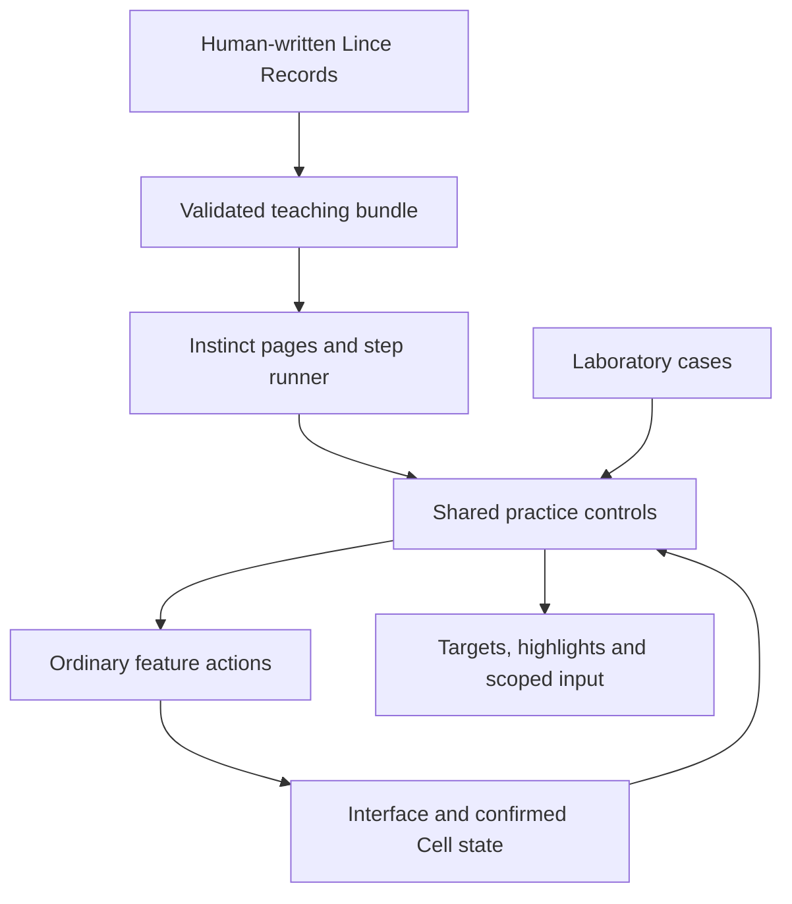

# Instinct: tutorial coverage and architecture proposal

Status: proposed for human review. No implementation is authorized by this document. Written on 2026-10-03 against the current working tree, which includes unfinished changes by other contributors.

The recommendation is to make Instinct a small, progressive handbook with optional practice. Teach the shared ideas once, then show what each tool adds. Give every chapter an independent starting point, and make assisted practice a convenience the person can always leave, skip or turn into free practice.

This file contains agent reasoning and implementation tasks. The explanatory Records and step instructions remain human-written in [Lince.lingua](Lince.lingua). None of the proposed page or step slugs below have been added to that file.

## Scope and evidence

Lince.lingua is the authority for meaning and scope. Its `#done` chapters include the tool, Interface, Ontology, Organ, Trail, Transfer and Karma. Records without `#done`, such as Record, Assertion, Lingua and Areas of Influence, also describe existing capabilities; the absence of that assertion alone does not mean a feature is absent. Open tasks and explicitly deferred behavior are excluded from the tutorial inventory.

The native interface was inspected to identify the concrete tools inside those broad Records. This is an inventory of visible implementation, not a claim that every feature passed acceptance testing. The Sand store currently lives in the desktop crate, with shared models in the interface crate. The old web implementation is excluded.

| Evidence | What it establishes |
| --- | --- |
| [Lince.lingua](Lince.lingua) | Human meaning, existing conceptual chapters, explicit open work and deferred ideas. |
| [Sand store](../../crates/desktop/src/sand_store.rs), [Edit mode](../../crates/desktop/src/edit_mode.rs) | Built-in Sands, Castles and their visible creation entries. |
| [Workspace](../../crates/desktop/src/workspace.rs), [layout controls](../../crates/desktop/src/layout/panel.rs), [selection](../../crates/desktop/src/canvas_selection.rs) | Navigation, placement, grouping, composition and first-workspace Instinct seeding. |
| [Protein](../../crates/desktop/src/protein_castle.rs), [Protein Areas](../../crates/desktop/src/protein_area/model.rs) | Querying, live results, fields, row templates and specialized presentations. |
| [Instinct](../../crates/desktop/src/instinct.rs), [current tutorial](../../crates/desktop/src/tutorial.rs), [guide](../../crates/desktop/src/tutorial/guide.rs), [highlights](../../crates/desktop/src/tutorial/highlight.rs) | Existing reader and the current five-lesson Areas walkthrough. |
| [Laboratory](../../crates/desktop/src/laboratory/mod.rs), [workspace isolation](../../crates/desktop/src/laboratory/workspace.rs), [actions](../../crates/desktop/src/actions.rs) | Existing behavior catalogue, isolated checks and reusable action dispatch. |
| [Bundle build script](../../crates/engine/build.rs), [bundle projection](../../crates/engine/src/instinct.rs), [import action](../../crates/engine/src/actions/dispatch/part_2.rs) | Current embedding, Record selection and database import behavior. |

## Teaching philosophy

Each page should answer three questions in a small amount of human-written text: what is this, when would I use it, and what is the first useful thing I can do with it? Aim for one useful outcome and roughly two to four practice steps. Use fewer steps when highlighting and reading are sufficient. Put advanced options behind related pages or ordinary reference documentation.

The first path is suggested, never locked:

1. Why Lince exists: Needs and Contributions.
2. Interface: find controls, navigate, place Sands and compose a Castle without Protein.
3. Areas of Influence: shape, reach and a visible effect without Protein.
4. Records and meaning: quantity, slug, Assertion and Vocabulary.
5. Protein: choose data, inspect results and choose how to present properties.
6. Optional chapters: work, automation, sharing, Transfers, Trails, files and creative tools.

Areas have an early page about spatial behavior and a later page about Record changes. The later page introduces the new connection to data; it refers back to spatial behavior instead of explaining it again. Kanban can subsequently say “these columns are Areas that change a task's state” and concentrate on moving one task.

A chapter is a group of subjects. A page teaches one subject. A step is one small instruction or action within a page's practice. A suggested prerequisite is a link, not an access restriction. A specialized Castle can have its own short page without becoming another long chapter.

The hub should show the suggested basics path and optional chapters. Each page offers reading, Free and Assisted, plus related pages. Returning users can search for a tool or concept and start there immediately. The human chooses the chapter names and order; the route below is a proposal.

If somebody starts a later chapter, show a short “Uses Records, Protein and Areas” link list. Offer a prepared example that already contains those foundations. Do not force them to complete previous chapters or silently mark those chapters understood.

## Free and Assisted

| Behavior | Free | Assisted |
| --- | --- | --- |
| Instructions and highlights | Suggestions; ordinary interaction remains available. | Highlight the current target and guide the useful action. |
| Required interaction | None. | The requested interaction satisfies the step; the person can also ask Next to perform it. |
| Next | Performs the displayed sample action and advances after its result is known. Reading-only steps advance directly. | Performs the same displayed action and advances after its result is known. |
| Skip | Advances without the action. | Advances without the action and releases the current restriction. |
| Other controls | All ordinary controls. | Restrict unrelated user actions only within the practice scope. Keep navigation needed to reach the target and tutorial recovery available. |
| Start elsewhere | Any page or chapter. | Any page or chapter, with independent example setup. |
| Change mode | Available throughout. | Available throughout, including while an action is waiting or failed. |
| Close | Immediately returns ordinary interaction. | Immediately releases restrictions and returns ordinary interaction. |

Use distinct Next and Skip controls. Otherwise “advance however I like” conflicts with “Next must do the action.” Indicate the sample action Next will perform. A completed action must not execute again when Next is pressed.

Close, Skip, the chapter picker and switching to Free must remain visible and usable during setup, errors, missing targets and pending responses. Assisted mode can restrict practice actions, but must not lock the person into a chapter. Provide keyboard access and a reserved emergency exit that ordinary shortcut configuration cannot remove.

Do not wait for a network response before releasing restrictions. Leaving a pending step invalidates that session's ability to advance or modify the tutorial UI later. A response that arrives afterward must not reopen the overlay or restore restrictions. If an underlying action already committed, show its actual result in the change summary.

Track progress as visited, practiced, skipped or unavailable. Do not report skipped steps as verified practice. Tutorial progress should be separate from the canonical Record's quantity and `#done` assertion; those already have other meanings. Importing the handbook into the database is optional and distinct from saving learning progress.

## Feature inventory and corresponding tutorial tasks

Every row is a proposed task to add or revise a short page and its basic practice. These are unchecked tutorial tasks, not unchecked feature requests. A row can group closely related controls; it does not require a step for every control.

Existing `@slugs` below refer to Records already in Lince.lingua. All other slugs are proposed human content requirements. A page can remain a navigable subject within a chapter; the human does not have to turn every tool into an `is #chapter` Record.

### 1. Welcome and finding help

Canonical basis: `@philosophy`, `@tool`, `@installation`, `@trail`. Confirmed surface: Instinct reader, navigation and embedded daily-task helper.

| Task | Page / feature | Minimal teaching task | Earlier ideas to reference |
| --- | --- | --- | --- |
| [ ] T01 | Why Lince — `@philosophy`, `@tool` | Explain Needs, Contributions and one local Cell with one everyday example. Reading and highlights are enough; no action requirement. | None. |
| [ ] T02 | Starting Lince — `@installation` | Explain where personal data lives, offline use and where to find the running Cell's information. Keep repository, container and server installation as optional reference material. | T01. |
| [ ] T03 | Instinct itself — proposed `@instinct` | Find a page, choose Free or Assisted, Skip, Close and restart a different chapter. Briefly point to optional Record import; teach the import itself in T48. | T01. |

### 2. Interface foundations, without Protein

Canonical basis: `@interface`. Confirmed surfaces: canvas controls, workspace menu, Sand store, selection, placement, layout and customization.

| Task | Page / feature | Minimal teaching task | Earlier ideas to reference |
| --- | --- | --- | --- |
| [ ] T04 | Workspaces — proposed `@workspaces` | Create or select a practice workspace and switch back. Explain what a workspace contains. Distinguish workspace context from Organ context and an Area shape. | T01. |
| [ ] T05 | Canvas navigation — proposed `@canvas` | Pan, zoom and recover the view of a sample Sand. Highlight home/fit, selection and Bring Sands here without requiring every control. | T04. |
| [ ] T06 | Edit mode and store — proposed `@edit-mode` | Reveal controls, open Edit mode, find an item in the store and return to normal interaction. | T05. |
| [ ] T07 | Sands and placement — proposed `@sands` | Add an empty Square and a text Sand; move, resize and pin a sample. Mention selection and removal, distinguishing a presentation from a database Record. | T06. |
| [ ] T08 | Plain and editable text — proposed `@text-sands` | Change a sample label and write a short note. Mention text size, overflow and scrolling as optional choices. | T07. |
| [ ] T09 | Castle composition — proposed `@castles` | Compose two sample pieces, then group/ungroup them. Show enclosing layout and one row or column arrangement, with fit/fill and clipping or scrolling mentioned briefly. No Protein properties. | T07–T08. |
| [ ] T10 | Appearance — proposed `@appearance` | Change one sample's appearance and reset it. Point to themes, canvas background and pattern, per-kind and workspace overrides, and theme export; do not tour every token. | T07. |
| [ ] T11 | Keyboard and accessible navigation — proposed `@shortcuts` | Locate shortcuts and use keyboard focus to activate a sample control. Mention remapping and text-editor scope. The tutorial must work without a mouse. | T06. |

### 3. Areas of Influence, without Protein

Canonical basis: `@areas-of-influence`, under `@interface`. Confirmed surfaces: Area editor, forces, reach, sorting, immunity, size and physics settings. Sound is introduced later with the audio tools.

| Task | Page / feature | Minimal teaching task | Earlier ideas to reference |
| --- | --- | --- | --- |
| [ ] T12 | Area shape and reach — existing `@areas-of-influence` | Add and position one Area around an ordinary sample Sand. Teach shape, enable/disable and reach using one square or circle; mention polygon shapes without requiring drawing one. | T07. |
| [ ] T13 | Attraction and repulsion — proposed `@area-forces` | Enable sample workspace physics, observe attraction, then change to repulsion. Mention strength, target and simple/Newtonian choices; avoid equations. | T12. |
| [ ] T14 | Area presentation effects — proposed `@area-effects` | Show one visible size or immunity effect on ordinary sample Sands, then disable it. Introduce sorting and boundaries with highlights; data-driven order refers forward to Protein. | T12–T13. |
| [ ] T15 | Understanding an Area's effect — proposed `@area-inspection` | Inspect why one sample is affected or excluded: enabled state, reach, physics or immunity. Introduce a single useful influence explanation rather than all diagnostic controls. | T12–T14. |

Do not introduce query filters or Record mutations in these first Area pages. Keep the existing Area lesson's data-dependent portions for T23.

### 4. Records, Assertions and Vocabulary

Canonical basis: `@record`, `@assertion`, `@lingua`, `@ontology`. Confirmed surfaces: Record creation/search, Record Castle, Assertion Castle/editor, Relations and Ontology.

| Task | Page / feature | Minimal teaching task | Earlier ideas to reference |
| --- | --- | --- | --- |
| [ ] T16 | A Record — existing `@record` | Find or create one sample, edit its title/body and give it a slug. Explain quantity as Need, Contribution or neither, plus one unit. Introduce description links and rendered content through this sample. | T01, T06. |
| [ ] T17 | Assertions and identity — existing `@assertion` | Apply one concept and one relation to a sample; identify its main identity. Briefly distinguish a plain tag from a link to another Record. | T16. |
| [ ] T18 | Vocabulary and Ontology — existing `@lingua`, `@ontology` | Look up a concept's meaning and source Vocabulary. Show one concept hierarchy and alias/ambiguous-name example with highlights. Creating a whole Vocabulary is optional. | T17. |
| [ ] T19 | Full Record, Assertions and Relations Castles — proposed `@record-castles` | Open the same sample in these views and follow one relation. Explain that each presents the same data with a different focus; do not repeat Record or Assertion definitions. | T16–T18. |
| [ ] T20 | Facts and work metadata — proposed `@facts` | Inspect one confirmed change and show where dates, assignees, estimate and work log appear. Teach the history idea here; use Protein's optional Facts data in T22. | T16. |

### 5. Protein and data-backed Areas

Canonical basis: Protein is mentioned by Interface, Areas, Record and Organ, but has no dedicated `@protein` Record. Add that human-written subject before implementing this chapter. Confirmed surfaces: Protein Castle, saved queries, result previews, Area row templates, filters and property actions.

| Task | Page / feature | Minimal teaching task | Earlier ideas to reference |
| --- | --- | --- | --- |
| [ ] T21 | Protein — proposed `@protein` | Explain a live, authorized selection of data. In a Protein Spawn Area, choose a source, apply one filter and inspect what would appear before spawning. | T12, T16–T18. |
| [ ] T22 | Protein Castle and presentation — proposed `@protein-presentation` | Run and save a small query; choose title and quantity for a sample Sand/Castle template. Show that changing the presentation does not redefine the Record. Mention sorting, grouping, count/sum, selected fields and optional Facts as further choices. | T09, T20–T21. |
| [ ] T23 | Areas that change Records — proposed `@area-record-actions` | Match one sample Record, move its Sand into an Area and confirm one saved property change; exit to see the paired behavior. Mention quantity/Assertion/identity changes, failure status and enable/disable. | T12–T15, T17, T21–T22. |
| [ ] T24 | Protein arrangement and motion — proposed `@protein-arrangement` | Show one grouped or sorted presentation and one optional destination/motion choice. Concentrate on where matching data appears; refer to ordinary placement and Area forces. Highlights can be sufficient. | T09, T13, T22. |

Do not include the in-progress general “change presentation between Sands and Castles” workflow as a finished feature. T22 teaches the existing template controls. Add the transformation tutorial when that feature finishes.

### 6. Getting work done

Canonical basis: Records and the tool's work metadata, with Interface, Areas and Protein as shared foundations. Confirmed surfaces: Todo, Kanban, Time Castle, Calendar, Operation and notifications.

| Task | Page / feature | Minimal teaching task | Earlier ideas to reference |
| --- | --- | --- | --- |
| [ ] T25 | Todo — proposed `@todo` | Complete one sample task and undo it. Point to the live queue, saved Protein and selected-task details without repeating filtering. | T16, T21–T22. |
| [ ] T26 | Kanban — proposed `@kanban` | Move a sample task between two columns and observe its saved state. Mention assignees, dates and column counts. Explain only which state these Areas represent. | T20, T23. |
| [ ] T27 | Time Castle — proposed `@time` | Start and stop a sample timer, then inspect its work log. Distinguish a standalone stopwatch from a timer bound to a Record. | T20. |
| [ ] T28 | Calendar — proposed `@calendar` | Find a dated sample and open it. Highlight scheduled/projected changes and their source; teach Frequency and Karma in T31–T32. No date-editing marathon. | T20–T22. |
| [ ] T29 | Operation Sand — proposed `@operation` | Configure a sample button that sets a sample quantity to zero, activate it and confirm the change. Refer to Commands later rather than teaching shell execution here. | T07, T16, T20. |
| [ ] T30 | Notifications — proposed `@notifications` | Open and inspect a sample status/notification, then dismiss it. Explain waiting, success and failure feedback, with no forced system notification or permission prompt. | T20. |

### 7. Automation and trying outcomes

Canonical basis: `@karma`, `@rule` and the existing simulation description. Use implemented scenario controls; the open user-database simulation/versioning proposals are excluded.

| Task | Page / feature | Minimal teaching task | Earlier ideas to reference |
| --- | --- | --- | --- |
| [ ] T31 | Frequency and Cadence — proposed `@frequency` | Define one sample recurring time and inspect its next occurrence. Teach this clock once, then refer to it from habits, Karma and Calendar. | T16, T28. |
| [ ] T32 | Karma and Rule Castle — existing `@karma`, `@rule` | Build one small condition → threshold → consequence rule, preview it, enable it in practice and observe one Fact. Highlight how to pause it and inspect history before finishing. | T20, T31. |
| [ ] T33 | Daily habit helper — proposed `@habits` | Preview the Record, Frequency and Rule created by the existing Instinct daily-task helper; import a sample and mark its Need met. Explain conflicts and pause controls through references to T31–T32. | T25, T31–T32. |
| [ ] T34 | Commands and Signals — proposed `@commands` | Use a bundled harmless command in practice, inspect its output/history and identify the resulting Signal. Mention working directory and the distinction between a local Command Castle and Terminal. | T20, T32. |
| [ ] T35 | Simulation Castle — proposed `@simulation` | Open a built-in example, step one event and inspect a change or timeline. Point to pause, stop, replay, comparisons and checks; no requirement to author a scenario format or simulate the person's database. | T20, T32. |
| [ ] T36 | Fiote — proposed `@fiote` | Explain the optional assistant; inspect provider/model settings and a sample thread with a proposed action, question or progress message. Show stop and authority controls. Credentials, provider calls and Karma activation are optional live use, not progression requirements. | T19, T32, and T44 for conversational controls. |

### 8. Cells, Organs and sharing

Canonical basis: `@organ`, `@ontology`, the tool's Cell/Organ description and file/network boundaries. Confirmed surfaces: Organ and Configuration, Access Control, devices, contacts, sharing, discovery and mail. Use prepared Cells and peers for practice; no real account or second device is required to progress.

| Task | Page / feature | Minimal teaching task | Earlier ideas to reference |
| --- | --- | --- | --- |
| [ ] T37 | Cell and Organ — existing `@organ` | Inspect local identity, then switch between prepared personal and shared contexts. Teach that the contexts remain separate and a Protein can select an Organ. | T01, T04, T21. |
| [ ] T38 | Contacts, nearby discovery and pairing — proposed `@contacts` | Inspect a sample nearby peer/contact and a pairing code or QR. Show known/unknown/blocked and Proximity. Practice pairing only against a local prepared peer. | T37. |
| [ ] T39 | Users, Roles and Access Control — proposed `@access-control` | Inspect a sample user's Roles and one allowed/refused operation. Show how authorization affects visible data; avoid teaching the entire permission catalogue. | T21, T37. |
| [ ] T40 | Sharing and synchronization between Cells — proposed `@organ-sync` | Share a small prepared selection and inspect arrival on a prepared peer. Highlight visibility, permissions, sync status, hiding/refusal and revoke/stop controls. | T21, T37–T39. |
| [ ] T41 | My devices and Karma authority — proposed `@devices` | Inspect a prepared device roster and the owner/execution controls. Explain that synchronized rule definitions and permission to execute them are separate. Do not rotate real keys as a tutorial action. | T32, T37–T40. |
| [ ] T42 | Mail and delivery — proposed `@mail` | Inspect a prepared outgoing item and its status. Teach that mailbox storage is different from recipient receipt. Highlight held/expired states and retry/cancel without requiring a live relay. | T40–T41. |
| [ ] T43 | Public Needs/Contributions and discovery — proposed `@discovery` | Search prepared announcements, inspect a profile, prepare a post and open a request. Highlight subscriptions, chosen services, publication/withdrawal, block/report and operator moderation as optional controls. Practice publishes only to prepared local services. | T01, T17–T18, T38, T42. |
| [ ] T44 | Conversations, Threads and Messages — proposed `@conversations` | Open a prepared conversation, send one sample Message and inspect delivery. Mention thread tabs, mentions, replies, attachments and requests without requiring each one. | T37, T42–T43. |
| [ ] T45 | Calls and screen sharing — proposed `@calls` | Highlight call, mute, video/share and leave controls in a prepared conversation. Text/highlights suffice when devices or capture are unavailable; no microphone, camera or screen capture is required. | T44. |

Configuration is covered by T02 and T37–T43: identity, discovery/reach, contacts, relay/mailbox choices and storage. Keep advanced service-hosting/moderation help as an optional subsection of T43 rather than part of the basic route. Distinguish an announcement/request from a Transfer agreement before T46.

### 9. Transfers

Canonical basis: `@transfer`. Confirmed surfaces: Transfer Castle detail/forms/runtime and its Karma integration.

| Task | Page / feature | Minimal teaching task | Earlier ideas to reference |
| --- | --- | --- | --- |
| [ ] T46 | Transfer Castle — existing `@transfer` | Prepare a simple exchange or donation between prepared parties; follow proposal, agreement and one confirmed action. Show which quantities are promised and which changes occurred. | T01, T16, T20, T37–T40. |
| [ ] T47 | Transfer with Karma — proposed `@transfer-automation` | Inspect a small prepared automation that proposes a Transfer when a threshold is reached. Highlight approvals and where to pause it; do not repeat rule authoring or invent a public trust-history view. | T32, T46. |

### 10. Trails and data on disk

Canonical basis: `@trail`, `@lingua`, `@sync`, existing file interoperability in `@blood`. The `@sync` body is currently empty and needs human text.

| Task | Page / feature | Minimal teaching task | Earlier ideas to reference |
| --- | --- | --- | --- |
| [ ] T48 | Trail and Instinct Record import — existing `@trail`, proposed `@instinct-import` | Preview importing the handbook as ordinary Records, including preserved slugs and Assertions. Demonstrate one conflict and cancellation, then an independent conflict-free import. Explain that importing Records does not execute tutorials or automations. | T03, T16–T18. |
| [ ] T49 | Sync Castle and Lingua files — existing `@sync`, `@lingua` | Select a small Protein and a temporary folder, observe a `.lingua` or Markdown export and a supported incoming edit. Distinguish continuous Record sync, one-time import and editing an unrelated file. Mention status/conflicts and stopping the sync. | T18, T21, T48. |
| [ ] T50 | File/blob transfers — proposed `@blob-sync` | Send a bundled file between prepared Cells and inspect the transfer's status. Highlight accept, cancel and the file list; explain that file bytes travel separately from synchronized Record text. No real recipient is required. | T40, T42, T49. |
| [ ] T51 | Storage and owner backup — proposed `@backup` | Inspect storage information and the encrypted owner-backup form. Explain what it includes/excludes and where local layouts, attachments and custom Castle files need separate care. Point to sync history and retention controls without deleting anything. Opening/reading is sufficient; never require shutdown, restore or replacement of personal data. | T02, T37, T49–T50. |

Trail is the broad import/export idea. Do not turn the unimplemented themed Trails into available course chapters. Blood gets a brief concept/reference link for the integrations that actually exist; it does not imply that Nostr, Matrix, ActivityPub or `.ics` export are implemented.

### 11. Local files and developer tools

Canonical basis: the implemented IDE description inside `@interface`, plus ordinary local command and file boundaries. Confirmed surfaces: File Explorer, IDE, document viewer, Terminal and external file/paste handling.

| Task | Page / feature | Minimal teaching task | Earlier ideas to reference |
| --- | --- | --- | --- |
| [ ] T52 | File Explorer and IDE — proposed `@ide` | Open a prepared project folder/file, edit it and explicitly save. Mention tabs, search, autosave/recovery and disk conflicts. Explain that opening a folder creates no database copies or File Records. | T08, T49. |
| [ ] T53 | IDE language tools — proposed `@language-tools` | Highlight installed server/formatter/linter settings and Connect/Disconnect. If tools are available, show one diagnostic or undoable format operation on a prepared file. Missing programs must not block progress. | T52. |
| [ ] T54 | Document Viewer — proposed `@documents` | Open a bundled PDF or EPUB and navigate to another page/location. Highlight the basic reading controls; no imported personal document is necessary. | T05, T52. |
| [ ] T55 | Terminal — proposed `@terminal` | Open a practice shell and run a harmless bundled example, or simply inspect the controls. Explain shell input, output and the difference from saved Commands. | T34, T52. |
| [ ] T56 | Dropping/pasting files, images and links — proposed `@external-files` | Use a bundled local example to show the existing file/image/link choices and cancellation. Refer to image/link Sands, documents and editable files rather than reteaching their viewers. Remote downloads are optional. | T07, T52, T54. |

External-drop/media controls are present in uncommitted working-tree changes. Recheck their entry points and acceptance status before implementing T56; their listing here does not close the ongoing feature work.

### 12. Audio, spatial and reusable tools

Canonical basis: the broad completed `@interface` abstraction. These tools have visible native implementations, but need their own human-written subjects. They are optional chapters; the basic user path does not depend on hardware or a 3D scene.

| Task | Page / feature | Minimal teaching task | Earlier ideas to reference |
| --- | --- | --- | --- |
| [ ] T57 | Recorder Castle — proposed `@recorder` | Play a bundled sample and inspect recordings and track effects. Highlight record, stop, save and refresh; recording with a microphone is optional. | T07, T20. |
| [ ] T58 | Sound on Area crossing — proposed `@area-sound` | Assign a bundled sound to a sample Area and preview it. Mention entry/exit and reusable saved effects, then refer to Area crossing behavior. | T12, T23, T57. |
| [ ] T59 | Shader Castle — proposed `@shaders` | Open a prepared shader Record and inspect a visible sample such as the glowing ball. Teach where the effect is authored, without a shader-language course. | T16, T19. |
| [ ] T60 | Spatial view and Topology — proposed `@topology` | Switch a prepared workspace between 2D and 3D and move or frame one sample. Mention depth, rotation, world pinning and imported models/splats. Reuse navigation, placement and Areas instead of explaining them again. | T05, T07, T12. |
| [ ] T61 | Custom Castles and component library — proposed `@custom-castles` | Save a small selection as a reusable Castle/component and add another instance. Mention local files, Organ library, rename/replace/delete and pushing selected composition. Sharing is an optional continuation. | T09, T22, T40, T49. |
| [ ] T62 | Freedoom — proposed `@freedoom` | Highlight how to start, focus its keyboard controls and leave. A short reading page is sufficient; playing or completing the game is not a tutorial requirement. | T07, T11. |

### 13. Inspecting and maintaining Lince

Canonical basis: Interface and Ontology. Confirmed surfaces: inspection connections, Information, update controls, licenses/credits and Laboratory. This is optional help for curious users and maintainers.

| Task | Page / feature | Minimal teaching task | Earlier ideas to reference |
| --- | --- | --- | --- |
| [ ] T63 | Inspection — proposed `@inspection` | Inspect one sample control's action, connection or group. Mention click/hover/events/hidden views without exposing implementation details in basic pages. | T09, T15, T20. |
| [ ] T64 | Information, updates and credits — proposed `@information` | Find version, directory and update status, then one Sand's license/credits. Explain available restart/update controls without requiring an update or restart. | T02, T07. |
| [ ] T65 | Laboratory — proposed `@laboratory` | Open Laboratory, inspect a prepared behavior/resource result and Close. Explain temporary data, suspended normal workspaces and Stop; performance/stress runs are optional, never a progression requirement. | T15, T35, T63. |

## Excluded from current feature coverage

Do not select these as available feature tutorials merely because they occur in a large completed Record or carry `#instinct`:

- Ailuros/CAD/hardware research, the v2 Interfaceless world/map/voxel vision, camera-driven world modeling and hand gestures.
- Website embedding, portals, live shared workspace topology, drawing-in-description workflows, custom dropdown columns and the proposed spiral clock.
- Public Transfer trust/history portfolio, general scenario proposals/Record versions, and the open user-database simulation walkthrough.
- Deferred authenticated HTTP inputs, new Blood protocol/plugin integrations, `.ics` Karma export and unfinished Karma suggestions/presentation routing.
- Ride-sharing, reservation, grocery, farming, meal-preparation and other planned themed Trails. Nutrient data marked done does not establish a completed native nutrition/optimizer interface; do not revive an old web-only UI as part of this proposal.
- LoRa transport and validation claims for real phones, screen readers, public relays/mailboxes or power loss that the Records explicitly leave open.

The exclusion concerns teaching those capabilities as currently usable. Existing generic Transfer, Simulation, Calendar, command, sync and topology controls still receive the short pages listed above. A future feature gets its corresponding tutorial when its user-facing behavior is finished and approved.

## Current Instinct gaps

| Area | Observed today | Proposed work |
| --- | --- | --- |
| Canonical source | The engine build script embeds every `.lingua` file in `institute/anicca`; `#instinct` filtering and projection happen when Records are loaded. | Make the source policy explicit: canonical teaching content from Lince.lingua, validated during the enabled build. Do not present planning-file content as explanation. |
| Pages | The reader groups Records by root/chapter and can navigate to individual Records. Only `areas-of-influence` currently gets the special tutorial launch. | Give approved subjects independent page/practice entries and an explicit suggested learning route. |
| Practice | One hard-coded five-lesson walkthrough: Protein Spawn, attraction, repulsion, property on entry, property on exit. Its instruction text is in Rust. | Split early interface/Area basics from Protein-dependent lessons; move displayed teaching text into human-authored step Records. |
| Targeting | Edit targets use typed actions; many buttons, menus and fields are found by tooltip/accessibility text. | Share semantic targets with Laboratory and inspection. Wording and visual rearrangement should not change target identity. |
| Next | It verifies the current state and advances only when ready; it does not enact the missing action. Later tabs are locked by an unlocked-step counter. | Share an action/completion contract; Next acts, Skip does not, and all chapters can be started independently. |
| Restrictions | Highlights exist. The inspected tutorial does not provide the general shared action restriction system described by the request. | Add scoped Assisted interaction control, with separate emergency recovery. Do not assume a dimmed overlay blocks keyboard or direct input. |
| Close | It hides the session and clears highlights. Sample Records, Areas and workspace-setting changes can remain. | Immediately release control and disclose practice changes; support isolated practice and explicit keep/discard behavior. |
| First workspace | A seed marker places Instinct in workspace 1 on first initialization, with a test for restoring/deleting the reader. | Preserve and verify this for the enabled feature; avoid repeatedly adding a reader after the person deletes it. |
| Build flag / slugs | No `instinct` feature or required tutorial-step manifest was found in the inspected Cargo/build definitions. No `@step-…` Records were found in Lince.lingua. | Add the default-off flag and enabled-build validation after the human supplies the approved content. |
| Import | The import action preserves new Records' UID/slug and applies quantities/Assertions, but skips a Record when its UID already exists. | Compare existing content and identity before writing; report differing UID/slug/Assertion cases instead of silently treating existing UID as equivalent. Verify whole-import failure behavior. |

Protein's subject Record is missing, Sync's explanation is empty, and IDE is prose inside Interface rather than its own Record. Most concrete tools also lack their own subject and step Records. These are human content tasks, not text for an agent to silently insert into Lince.lingua.

## Architecture recommendation

Keep the reusable part small: semantic actions, target resolution, observations, highlights, interaction policy and practice setup. Instinct owns teaching order and text references; Laboratory owns checks and stress runs; features own their ordinary behavior and permissions.

### Human text and typed step definitions

A typed tutorial definition references a subject Record UID/slug and a sequence of step Record slugs. Each step declares the sample fixture, semantic target, action with parameters, completion observation and recovery behavior. Reading-only steps have no action. Keep pedagogical prerequisites in the route metadata; `#part-of` expresses the human chapter structure.

The executable definition chooses behavior, never writes an explanation. Its displayed instruction comes from the human's Record. Content checks can establish that the instruction exists and is connected; humans still need to review whether the words accurately describe the action. Do not generate runtime prose as a substitute for missing step Records.

Use a small typed Rust contract initially, rather than designing a new tutorial scripting language or exposing arbitrary executable behavior through imported Records. Third-party Record imports remain data. A public Trail cannot grant itself command execution, control of personal UI or permission to write data by describing a step.

### Actions and observations

Build on existing `Action`, `ActionSequence` and dispatch instead of creating another feature implementation. Share higher-level practice operations with Laboratory, such as open Edit mode, add a Sand of a selected kind, configure a sample Area, apply a query and move a sample across a boundary.

Both the person's ordinary action and Next execute the same feature action with the same parameters, validation and authorization. For dragging, share the intended movement operation and its normal constraints; Laboratory can additionally exercise real pointer input to test hit testing. Directly positioning a fixture alone must not be accepted as a test of drag interaction.

Completion observes the feature's result, not “a button was clicked.” A Record change waits for the Cell's acknowledgement and resulting projection. A query waits for current results with the expected sample identity. A placement step waits for the created item in the correct workspace. Reject unavailable capabilities, malformed parameters and permission failures normally; Next gains no special authority.

Check completion before executing Next, correlate requests with the current session/step, allow only one pending action, and prevent retries from duplicating non-idempotent writes. Bound every wait. A timeout exposes Retry, Skip, Free and Close; it never invents success.

### Semantic targets that survive rearrangement

Give teachable controls a meaning shared by the feature, Laboratory and inspection, such as `edit.open`, `store.add(kind)`, `area.enabled(area-id)` or `protein.run(query-owner)`. The names are examples, not a required implementation format.

Resolve by capability plus context: window, workspace, source Area/Castle, sample Record UID and control role. A button caption, screen coordinate, sibling index or persisted Bevy Entity is not its identity. Multiple copies of a Castle must never produce a “first matching button wins” result.

Resolve a fresh entity when UI is recreated. Obtain bounds from the current layout/topology after layout, so movement, zoom, resizing, scrolling and switching view do not detach the highlight. Revealing a target can open its owning panel or scroll it into view through ordinary UI operations. Highlights do not steal pointer events.

A missing or ambiguous target must immediately release the current restriction and show recovery. If the owning capability still exists, offer to recreate/reveal the sample or Retry. If the feature/control was removed, mark the step unavailable and let the person Skip or choose another chapter. Do not silently choose a similarly named unrelated control.

### Assisted input policy and independent escape

Restrictions belong to one tutorial session and practice scope. Allow the intended action, its field editing/scrolling/dragging, and the navigation required to expose it. Cover mouse, touch, keyboard shortcuts, focused text editing, accessibility activation, canvas gestures and relevant direct handlers. Checking only ActionButtons leaves alternate input paths open.

The policy controls user-originated interaction. It does not freeze physics, stop rule execution or suppress ordinary backend confirmations. Tutorial observations should understand normal feature behavior. Reusing Laboratory primitives does not mean copying its suspension of normal workspaces into all tutorials.

Use a separate Close/emergency-exit handler that bypasses the tutorial policy and does not depend on the current target, fixture or pending request. Release policy first, clear overlays/focus changes second, then do any asynchronous cleanup. When a session/owner disappears or becomes invalid, its restriction expires. Nested overlays, workspace switches and native dialogs must not cover or disable recovery.

### Practice ownership and Close

Default to a disposable practice workspace with explicitly owned sample objects. For lessons that write Records, synchronize, run commands or communicate, use an isolated temporary Cell/peer fixture through the ordinary runtime. A separate workspace alone does not isolate database changes or network side effects.

Record which sample Records, Areas, Castles, files, rules and settings the tutorial created or changed. Make that visible while practicing. Close releases control immediately and reports what was created, kept, removed or is still completing. Discard should clean only session-owned resources; Keep should be an explicit choice that identifies the destination and any rule/sync left enabled.

Restore temporary UI settings only where the tutorial still owns the change. Do not overwrite an independent user edit with an old snapshot. Discarding practice is not wholesale rollback of someone's database. Committed Facts remain truthful; deleting a sample presentation does not undo a saved data change. A sandbox permits safe disposal without erasing personal history.

Credentials, hardware capture, real publication/Transfers, destructive file operations, restarting Lince and external commands are never required for progression. Next uses a prepared safe example for those pages, or advances a reading-only explanation. Optional live use remains an ordinary feature interaction with its ordinary consent and permissions.

### Performance and maintenance

No inactive tutorial should scan Sands/Castles, evaluate all step predicates, create overlays, duplicate queries or keep an update timer alive. Gate the runner on an active session and observe only the current step's relevant events. Maintain scoped semantic lookup with entity lifecycle changes; avoid global searches by text every frame.

Use the existing live Protein result/subscription when the tutorial is teaching that Protein. Update the step card when its state or text changes, and highlight geometry when the current target's geometry changes. Idle practice should preserve the app's ability to sleep. Small semantic metadata is reasonable; a promise of literally zero overhead should be replaced with measured acceptance limits.

Feature changes should carry a tutorial decision: update an affected action/step, add a basic page for a new visible idea, or record why that feature needs only reference text. A moved control keeps its semantic identity. A removed action should fail the shared contract/checks until the tutorial is revised or explicitly retired. Do not automatically retarget stale lessons to whatever UI still exists.

## Required content, build flag and import contract

### Initial step slugs for the three requested walkthroughs

These are proposed exact requirements for the first implementation. All are absent from the inspected Lince.lingua. The human should approve/change these names and write their text before enabling the strict build. Additional inventory pages can declare their own short step sets as they are implemented.

| Walkthrough | Required human step Records | Sample actions and observations |
| --- | --- | --- |
| Sand/Castle placement and composing | `@step-interface-open-edit`, `@step-interface-place-sand`, `@step-interface-compose-castle` | Open editing; add/place ordinary text/Square pieces; compose/group them and observe the layout. No Protein. |
| Areas without Protein | `@step-area-place`, `@step-area-attract`, `@step-area-repel` | Place an Area; enable sample physics and configure attraction; configure repulsion and observe its effect on ordinary Sands. |
| Protein Spawn and property presentation | `@step-protein-create-spawn-area`, `@step-protein-filter-preview`, `@step-protein-present-properties` | Create an Area with Protein; select/filter prepared data and inspect current results; bind chosen properties to the sample presentation. |
| Revision of existing data-dependent Area practice | `@step-area-match-record`, `@step-area-change-on-entry`, `@step-area-change-on-exit` | Match one sample; perform its boundary crossings through ordinary movement; wait for confirmed entry/exit Record changes. |

Each required step needs its own human-written instruction Record, `#instinct`, the approved subject relationship, and a unique slug. Each tutorial's subject needs a nonempty explanation, including the proposed `@protein`, `@sands` and `@castles` pages. Stable UIDs should identify canonical Records; slugs make the expected content easy to find and diagnose.

### Build behavior

- [ ] B01 — Add a Cargo `instinct` flag, default off, forwarded to the crates that embed/validate the content and seed the reader. With it off, missing source files must not prevent an ordinary build, and an empty reader must not be automatically seeded.
- [ ] B02 — With it on, parse canonical Lince.lingua using Anicca's actual grammar. Validate unique UIDs/slugs, required subject and step Records, nonempty text, `#instinct`, subject relationships, reference resolution, chapter cycles/order and the typed step manifest. Report all detected missing slugs with the source location where possible; refuse the build on failure.
- [ ] B03 — Enable it in the applicable GitHub Actions checks/packages and `mise dev`. Establish where `mise dev` is defined before editing it; no repository mise definition was found during this review. Ensure source/package/container/Nix contexts include the canonical file. Verify the off and on paths with `cargo check`, with warnings as errors.
- [ ] B04 — Seed Instinct once in the first workspace when enabled; verify fresh initialization, restore, deleted reader, source error, and subsequent workspace creation. Offline reading must use the validated embedded content.
- [ ] B05 — Require only the approved, shipped tutorial manifest during each rollout. Do not claim complete inventory coverage until the remaining approved pages are present. Optional future research text does not satisfy an implemented feature's explanation.

The build checks structural availability; Laboratory checks whether registered actions/targets still work. Neither check can prove the human instructions remain understandable, so content review remains necessary. Enabling CI without first supplying the required human text should fail deliberately, not fall back to generated instructions.

### Importing the handbook into the person's database

- [ ] I01 — Present a preview of the exact embedded Records, their UIDs/slugs, quantities, identity and Assertions, including referenced concepts/units/objects. Reading and practicing require no database import.
- [ ] I02 — Report UID conflicts, slug owned by another UID, differing canonical content, and concept/Vocabulary/Assertion-reference conflicts using understandable titles/slugs. Never silently overwrite or pretend a mismatched existing UID is equivalent. Identical existing imports should be reusable; user learning progress should remain separate and preserved.
- [ ] I03 — Cancel leaves the database untouched. Revalidate the preview at commit to catch changes made meanwhile, and make the import atomic or provide an equally explicit tested failure contract; default to no partial import on conflicts. Test refusal, failure during creation/Assertions, repeat import and permission denial.
- [ ] I04 — Preserve the canonical slugs, UIDs, quantities, identity and Assertions for newly imported Records. Show created/reused/conflicting counts and a way to inspect the imported Records. Importing text never starts a tutorial, activates rules or executes a command.

## Criticisms and recommendations

| Concern | Recommendation |
| --- | --- |
| A full guided tour of every button becomes another application to maintain. | Cover each visible feature's basic outcome with a short page. Add further interactions only when a user need justifies them. |
| Putting every concept into one linear course discourages both beginners and returning users. | Keep a short basics path and optional chapters with direct starts. Prerequisite links and prepared examples provide continuity without locks. |
| Free advancement and action-performing Next mean different things. | Keep Next and Skip separate. State what Next will do, then run the same action the person was asked to perform. |
| Matching button text survives movement but breaks on renaming, localization and duplicate tools. | Use semantic action/target identity scoped to the owning instance. Test relocation and recreation, not just current coordinates. |
| Sharing an entire Laboratory runner could import test suspension, heavy fixtures and stress work into normal use. | Share the small control/observation layer. Keep stress execution and full test isolation out of the tutorial's ordinary update path. |
| “Never stuck” cannot be achieved by merely adding a Close button to the normal step UI. | Make escape independent of target resolution, network waits and cleanup; expire stale restrictions and test every failure path. |
| A workspace protects the layout, but not the person's database or external systems. | Use isolated sample Cells/peers for mutating and social practice; disclose all created resources and make Keep explicit. |
| Human-written text alone does not make a stale executable step safe. | Validate content at build time, exercise semantic contracts in Laboratory and fail open during practice. Humans review wording and meaning. |
| A broad `#done` chapter or `#instinct` tag can contain unfinished ideas. | Teach only the implemented approved manifest. Ask the human to separate missing explanations and future research; do not edit their Records automatically. |
| Import can collide with personal Records or silently skip modified ones. | Preflight, show the conflict, preserve canonical identity, recheck at commit and verify no partial writes. |

The strongest part of the proposal is teaching Lince's reusable ideas before its specialized tools. The main change I recommend is treating assisted practice as a recoverable adapter over ordinary features, with shared contracts for Laboratory, rather than embedding another workflow implementation inside each lesson.

## Sequential implementation plan, after approval

1. [ ] P01 — Review the inventory and route; confirm proposed page/step slugs. The human writes or splits the required Records in Lince.lingua. This proposal does not modify AGENTS.md, README.md or any `.lingua` file.
2. [ ] P02 — Define the small shared action, observation and semantic-target contract. Adapt the initial requested interface actions and Laboratory checks first; establish measurements before changing the tutorial runner.
3. [ ] P03 — Build the recoverable runner, independent exit, scoped Assisted input and owned practice setup. Add Free/Assisted, Next/Skip, direct chapter starts and progress distinctions to the Instinct hub.
4. [ ] P04 — Implement B01–B05 and I01–I04, once their human content exists. Verify strict build/source availability, first-workspace placement and imports before extending course coverage.
5. [ ] P05 — Implement T07–T09 first: placement and composition without Protein. Add the short prerequisite interface pages needed to reach them. Finish their contracts, content review and checks before starting the next group.
6. [ ] P06 — Implement T12–T15 next: Areas without Protein. Finish their checks before moving to data-dependent behavior.
7. [ ] P07 — Implement the Record foundations and T21–T24: Protein Spawn, filters/results, property presentation and the revised entry/exit lessons. Preserve the useful confirmed-state checks from the existing tutorial.
8. [ ] P08 — Extend the remaining approved pages chapter by chapter in the inventory's listed order. Revise each tutorial when its feature work finishes; use reading/highlights where a practice action adds little value. Reconfirm entries from unfinished working-tree changes before teaching them.
9. [ ] P09 — Assemble the complete suggested walkthrough after its individual pages work. Exercise starting at every chapter in both modes, closing midway and restarting elsewhere. The complete route links the short lessons rather than duplicating them.
10. [ ] P10 — Record the maintenance requirement in the human-approved development workflow: a finished UI feature includes a tutorial decision and the relevant checks. If the human later wants this in AGENTS.md, they must authorize that separate edit; this task leaves it untouched.

## Acceptance checks

These are implementation acceptance tasks, not tests run for this Markdown proposal.

- [ ] Start each approved chapter directly in both modes, including with missing earlier progress. Switching mode/chapter never requires completion of the current step.
- [ ] Compare user action and Next from the same fixture: same feature action, authorized result, saved state and observation. Repeated Next/retry does not duplicate effects; Skip produces no action.
- [ ] Move/rename/recreate a control, add another Castle of the same kind, scroll/zoom/resize and switch 2D/3D. Resolve the correct instance and keep the highlight attached. Delete the control or owner and verify immediate recovery.
- [ ] Exercise pointer, touch, keyboard, focus, text input, accessibility activation, shortcuts and canvas movement. Assisted blocks unrelated practice input while allowing the instructed action and all escape paths. Free leaves normal interaction available.
- [ ] Inject failed setup, refused permissions, stale results, disconnect, full queues, timeout, unavailable hardware/provider/program and responses arriving after Close. Release restrictions; never mark an unconfirmed action successful.
- [ ] Close during every step and during pending/failed work. Ordinary interaction returns before cleanup; no overlay, focus trap or stale restriction remains. The summary accounts for all practice changes, with Keep/Discard respecting ownership.
- [ ] Check isolation of sample Records/files/commands/peers and normal permission enforcement. Importing arbitrary text cannot execute steps, commands or automations. Tutorial observation cannot read data the user is not authorized to see.
- [ ] Run the source/slug/flag/package, first-workspace and import checks in B01–B05 and I01–I04, including mid-import failures and repeat import.
- [ ] Use Laboratory to compare inactive, active-idle, advancing and closed tutorials on the same scenes. Require no continuing tutorial work after Close and no inactive scans/subscriptions. Set a measured acceptance budget against the baseline before implementation; do not hide a frame-time regression behind a broad stress allowance.
- [ ] Have the human review the explanatory/step Records and the visible basic route. Automated checks establish behavior and recovery; they do not substitute for a readable progression.

## Bevy assessment

The repository currently pins Bevy 0.19.1. I did not find a ready-made first-party end-user tour runner in the documentation and examples checked. That is a limited assessment, not an exhaustive claim about every community plugin. Bevy's existing primitives are a better starting point here because Lince already has actions, highlights and Laboratory behavior checks.

Bevy supports replaceable/mockable pointer input, useful for sharing interaction exercises with Laboratory. Its input-focus crate supplies focus/input routing, with widget integration left to the application. These support a shared control layer but do not define Lince's tutorial steps or permissions. Sources: [pointer input](https://docs.rs/bevy/latest/bevy/picking/input/index.html), [input focus](https://docs.rs/bevy/latest/bevy/input_focus/index.html).

`InteractionDisabled` can prevent widget interaction while leaving it rendered and able to acquire keyboard focus. Therefore adding that component or drawing a dimmed overlay is not a complete Assisted policy; keyboard/focus and direct handlers need their own integration. Source: [InteractionDisabled](https://docs.rs/bevy/latest/bevy/ui/struct.InteractionDisabled.html).

State/run conditions are a suitable basis for an inactive runner doing no step work; Bevy's menu example demonstrates conditional systems and state-bound UI cleanup. Reuse that mechanism without coupling every Sand's behavior to a tutorial state. Source: [Bevy game menu example](https://bevy.org/examples/games/game-menu/).

## Implementation pause — 2026-10-04

Implementation was authorized after this proposal and is now paused at the owner's request. The handbook, typed runner, isolated sample Cells, build flag and atomic import have been partially implemented. The 65 pages are present as explanations; that does not mean all 65 feature practices or acceptance checks are complete.

The owner authorized additive explanations and instructions in institute/anicca/Lince.lingua; original text was retained. Ordinary mise dev keeps the unfinished Instinct feature disabled, and mise dev-instinct enables it explicitly.

See [the pause handoff](../plans/instinct-pause.md) for the implemented behavior, remaining gaps, validation results and the sequential resume plan. The unchecked proposal tasks above remain an acceptance checklist.
